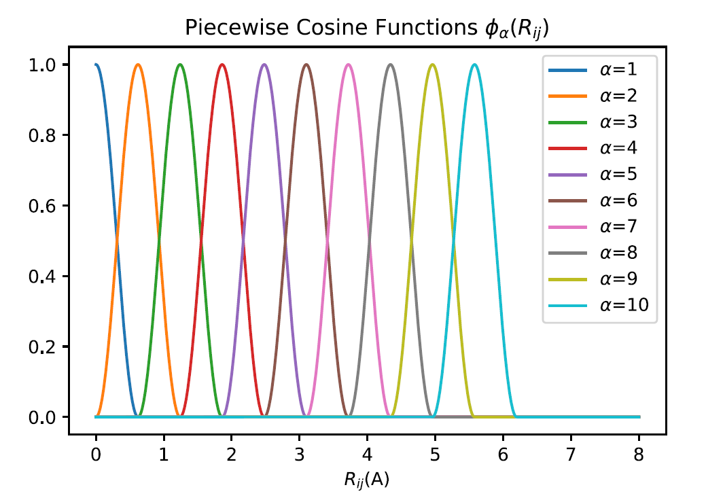

# Appendix I: features Wiki

This section provides a brief introduction on the features used in PWMatMLFF. The related literature is also listed, for readers' reference.  

## What are features? 

Features (or descriptors) are quantities that describe the local atomic environment of an atom. They are required preserve the translational, rotational, and permutational symmetries. Features are usually used as the input of various regressors(linear model, NN, .etc), which output atomic energies and forces. 

Features are differentiable functions of the spatial coordinates, so that force can be calculated as

$$
    \mathbf{F_i} = - \frac{d E_{tot}}{d \mathbf{R_i}} = - \sum_{j,\alpha} \frac{\partial E_j}{\partial G_{j,\alpha}} \frac{\partial G_{j,\alpha}}{ \partial \mathbf{R_i}}
$$

where :$j$ is the index of neighbor atom within the cutoff radius, and :$\alpha$ the index of feature. 

Additionally, features are required to be rotionally, translationally, and permutaionally invariant. 

## 2-b and 3-b features with piecewise cosine functions (feature 1 & 2)

Given a center atom, the piecewise cosine functions are used as the basis to describe its local environment. The praph below gives you an idea of how they look like.  

We now define the pieceswise cosine functions, in both 2-body and 3-body feaures. Given the inner and outer cut $R_{inner}$ and $R_{outer}$, the degree of the basis $M$, the width of piecewise function $h$, and the interatomic distance between the center atom $i$ and the neighbor $j$ $R_{ij}$, one defines the basis function as 

$$ 
    \phi_\alpha (R_{ij}) = 
    \begin{cases}    
        \frac{1}{2}\cos(\frac{R_{ij}-R_{\alpha}}{h}\pi) + \frac{1}{2} &, |R_{ij} - R_{\alpha}| < h \\
                                                                        0 &, \text{otherwise} \\ 
    \end{cases}
$$
with 

$$
    R_{\alpha} = R_{inner} + (\alpha - 1) h,\ \alpha = 1,2,...,M
$$
The expression of **2-b feature** with center atom $i$ is thus 

$$
    G_{\alpha,i} = \sum_{m} \phi_{\alpha}(R_{ij})
$$
and **3-b feature**

$$
    G_{\alpha\beta\gamma,i} = \sum_{j,k} \phi_{\alpha}(R_{ij}) \phi_{\beta}(R_{ik})  \phi_{\gamma}(R_{jk}) 
$$
where $\sum_{m}$ and $\sum_{m,n}$ sum over all atoms within cutoff $R_{outer}$ of atom $i$ 

In practice, these two features are usually used in pair. 

*Reference*: 

Huang, Y., Kang, J., Goddard, W. A. & Wang, L.-W. Density functional theory based neural network force fields from energy decompositions. Phys. Rev. B 99, 064103 (2019) 

## 2-b and 3-b Gaussian feature (feature 3 & 4)

These two are the features first used in Behler-Parrinello Neural Network. Given the cutoff radius $R_c$, and the interatomic distance $R_{ij}$ with center atom $i$, define cutoff function $f_c$

$$
    f_c(R_{ij}) = 
    \begin{cases}    
        \frac{1}{2}\cos(\frac{\pi R_{ij}}{R_c}) + \frac{1}{2} &, R_{ij} < R_c \\
                                                                        0 &, \text{otherwise} \\ 
    \end{cases}
$$

The **2-b Gaussian** feature of atom $i$ is defined as

$$
    G_i = \sum_{j \neq i} e^{(-\eta(R_{ij} - R_s)^2)} f_c (R_{ij})
$$
   
where $\eta$ and $R_s$ are parameters defined by user. 

The **3-b Gaussian** feature of atom $i$ is defined as

$$
    G_i = 2^{1-\zeta} \sum_{j,k \neq i} (1+\lambda \cos \theta_{ijk} )^\zeta\ e^{-\eta(R_{ij}^2 + R_{ik}^2 + R_{jk}^2)} f_c (R_{ij}) f_c (R_{ik}) f_c (R_{jk})
$$

where 

$$
    \cos \theta_{ijk} = \frac{\mathbf{R_{ij}} \cdot \mathbf{R_{ik}}}{|\mathbf{R_{ij}}||\mathbf{R_{ik}}|} 
$$

and $\eta$, $\zeta$, and $\lambda = \pm1$ are parameters defined by user. 

In practice, these two features are usually used in pair. 

*Reference*: 

J. Behler and M. Parrinello, Generalized Neural-Network Representation of High Dimensional Potential-Energy Surfaces. Phys. Rev. Lett. 98, 146401 (2007)

## Moment Tensor Potential (feature 5) 

In MTP, the local environment of the center atom :math:`i` is characterized by 

$$
    \mathbf{n_i} = (z_i, z_j, \mathbf{r_{ij}})
$$

where $z_i$ is the atom type of the center atom, $z_j$ atom type of the neighbor $j$, and $\mathbf{r_{ij}}$ the relative coordinates of neighbors. Next, energy contribution of each atom is expanded as

$$
    E_i(\mathbf{n_i}) = \sum_\alpha c_\alpha B_\alpha(\mathbf{n_i})
$$

where $B_\alpha$ are the basis functions of choice and $c_\alpha$ the parameters to be fitted. 

We now introduce moment tensors $M_{\mu\nu}$ to define the basis functions

$$
    M_{\mu\nu} (\mathbf{n_i}) = \sum_j f_\mu (|\mathbf{r_{ij}}|,z_i,z_j) \bigotimes_\nu \mathbf{r_{ij}}
$$

These moments contain both radial and angular parts. The radial parts can be expanded as 

$$
    f_\mu (|\mathbf{r_{ij}}|,z_i,z_j) = \sum_\beta c^{(\beta)}_{\mu,z_i,z_j} Q^{(\beta)}(|\mathbf{r_{ij}}|)
$$

where $Q^{(\beta)}(|\mathbf{r_{ij}}|)$ are the radial basis funtions. Specifically, 

$$
    Q^{(\beta)}(|\mathbf{r_{ij}}|) = 
    \begin{cases}   
        \phi^{(\beta)}(|\mathbf{r_{ij}}|) (R_{cut} - (|\mathbf{r_{ij}}|))^2 &, (|\mathbf{r_{ij}}|) < R_{cut} \\
        0 &,\text{otherwise}
    \end{cases}
$$

where $\phi^{(\beta)}$ are polynomials (e.g. Chebyshev polynomials) defined on the interval [$R_{min},R_{cut}$] 

The angular part $\bigotimes_\nu \mathbf{r_{ij}}$, which means taking tensor product of $\mathbf{r_{ij}}$ $\nu$ times, contains the angular information of the neighborhood $\mathbf{n_i}$. $\nu$ determines the rank of moment tensor. With $\nu=0$ one gets a constant scalar, $\nu=1$ a vector (rank-1 tensor), $\nu=2$ a matrix (rank-2 tensor), .etc.  

Define further the *level* of moments as

$$
    lev(M_{\mu \nu}) = 2 + 4\mu + \nu
$$

This is an empirical formula. 

*Reference*

I.S. Novikov, etal, The MLIP package: moment tensor potential with MPI and active learning. Mach. Learn.: Sci. Technol, 2, 025002 (2021)

## Spectral Neighbor Analysis Potential (feature 6) 
## DP-Chebyshev (feature 7) 
This feature attempts to mimic the behavior of DP's embedding network. It uses the Chebyshev polynomial as the basis. 

## DP-Gaussian (feature 8) 
This feature attempts to mimic the behavior of DP's embedding network. 