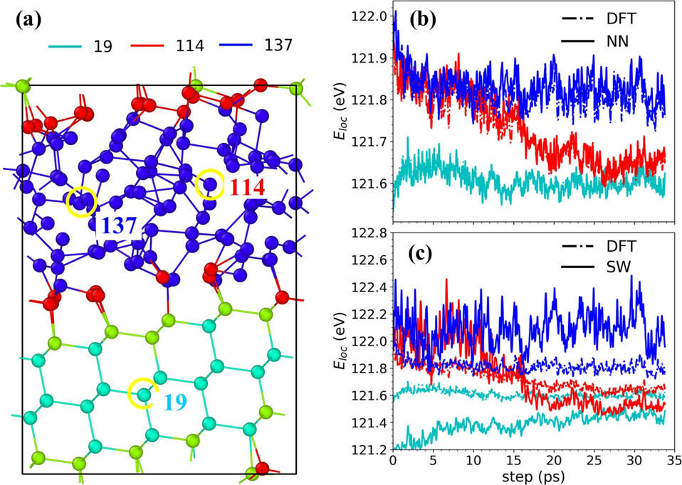

# 5. Liquid-to-crystal-Si-growth

[[文献 Si-growth]](https://pubs.aip.org/aip/jcp/article/153/7/074501/1064762/Liquid-to-crystal-Si-growth-simulation-using) 

案例 使用PMLFF模拟了远离平衡态的硅熔体生长过程，发现基于第一性原理分解的原子能量 (`PWmat 特性`) 构建的 MLFF 可以准确再现第一性原理模拟的生长过程。实验结果表明，MLFF 可以准确模拟硅熔体生长过程，为使用 MLFF 进行远离平衡态模拟提供了证据。
#

### 

NN 和 DFT 的总能量对比，其中(a)没有偏差，(b)有偏差。x轴对应于不同温度下的晶体生长分子动力学（MD）模拟图像。(b)的插图中是1500 K下液体相的均方位移；在950 K 的晶体相（c）和1500 K的液体相（d）的配对分布函数。

### 

(a) 具有面心立方(111)表面的晶体硅薄片超胞结构，局部能量Eloc(t)的DFT与(b)神经网络和 SW势能（Stillinger-Weber经典力场）的比较。

###

用DFT和 NN 模型（[feature 1、2](../models/nn/README.md#spectral-neighbor-analysis-potential-feature-6)）计算Z长度随时间的增长。

###

生长曲线（带误差棒）显示不同ΔT下的晶体原子数量：(a)神经网络，(b)SW势能。