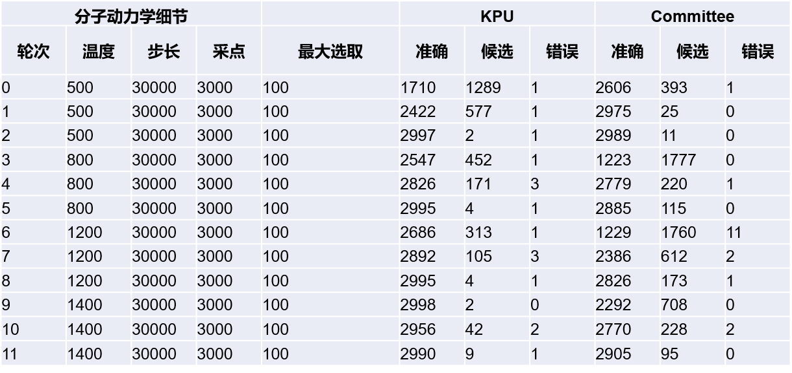

# Active Learning

[PWact](../active%20learning/README.md) (Active learning based on PWMLFF) 是我们开发的一款开源的基于 PWMLFF 的一套自动化主动学习平台，用于高效的数据采样。在PWact中实现了常用的基于多模型委员会查询（Committee Query）的主动学习策略，以及我们基于卡尔曼滤波算法提出的不确定性度量算法（Kalman Prediction Uncertainty， KPU）。基于 KPU 的主动学习还在内测阶段，暂未开放给用户访问。在本例中，我们做了两种主动学习采样的对比。

## 铜结构的两种主动学习

使用如下铜晶胞，经过 `3 3 3` 阔胞之后，分别基于 KPU 和 Committee 方法做主动学习采样。

  <tr>
    <td>
      
      
铜的原胞

    </td>
  </tr>

主动学习轮次数据采集细节

