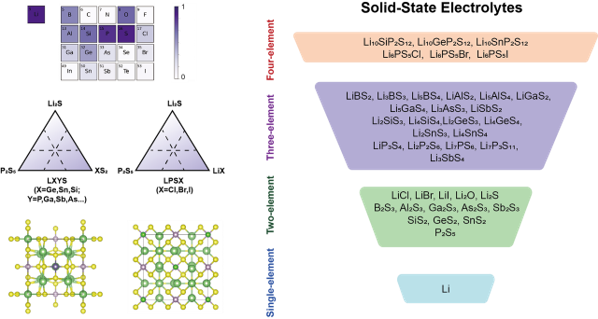

# 4. GNN (MACE)

基于 GNN 的各类通用模型正在快速涌现，这类通用模型可以“开箱即用”，也可以做作为“基础模型”，通过微调、蒸馏、主动学习等手段，快速应用到各个专业领域内，极大降低力场构建代价。我们对最近开源的 [[MACE]](https://arxiv.org/abs/2401.00096) 做了一些微调测试。

### 固态电解质

### 电解液

LiPF6, EC, PC, DEC, EMC, DMC systems

CP2K  PBE+D3

### 钙钛矿铁电材料

structure-to-energy-force-virial labels for 19 ABO3 type perovskite oxides,namely PbTiO3, SrTiO3, BaTiO3, CaTiO3, BaxCa(1-x)TiO3, BaxSr(1-x)TiO3, CaxSr(1-x)TiO3, BiO.5NaO.5TiO3, KO.5NaO.5NbO3, BaxPb(1-x)TiO3, CaxPb(1-x)TiO3, PbxSr(1-x)TiO3, Pb(Zr1-xTix)O3, Pb(Mg1/3Nb2/3)O3, Pb(Zn1/3Nb2/3)O3, Pb(ln1/2Nb1/2)O3, xBiO.5NaO.5TiO3-(1-x)BaTiO3, xBa(ZrO,2TiO.8)O3-(1-x)BaO.7CaO,3TiO3, and xBa(HfO.2TiO.8)O3-(1-x)BaO.7CaO.3TiO3

总结构数量 11724

### 半导体

