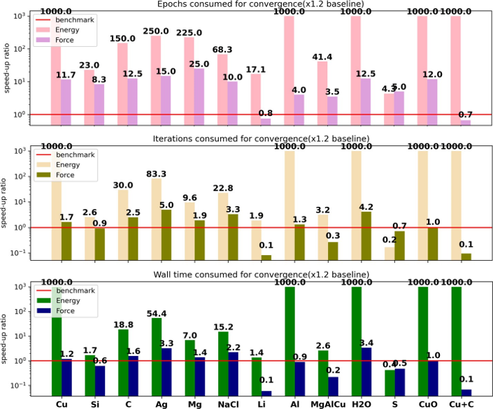

# 2. LKF And ADAM

[文章](https://arxiv.org/abs/2212.06989)

文章提出了一种 `重组层扩展卡尔曼滤波（RLEKF）` 优化器，旨在加速训练神经网络力场。RLEKF是全局扩展卡尔曼滤波（GEKF）的改进版本，通过采用分割大层和聚集小层的策略来降低计算成本。该策略利用稀疏对角块矩阵逼近密集权重误差协方差矩阵，从而提高了计算效率。作者在`13`个常见体系上进行了数值实验，并与 ADAM 优化器进行了比较。实验结果表明，RLEKF 相对于 ADAM `收敛更快且精度稍高`。此外，作者还从理论上证明了权值的更新是收敛的，从而克服了梯度爆炸问题。总体而言，RLEKF对权值初始化不敏感，对神经网络力场的训练具有较好的效果。

## 部分实验结果

### 拟合精度

在多种系统中，RLEKF 性能与 DFT 在每个结构上的能量(meV)和力(meV/˚A)进行对比（点越接近对角线，性能越好）。Etot的RMSE;测试集上的Eatom和F，每个子图的右下角处显示了体系的结构。

### 训练时间（ VS ADAM）

根据epochs、iterations (权重更新)和wall-clock时间，RLEKF在能量和力方面达到精度基线与 Adam 的速度比，其中1000表示Adam无法达到基线。
