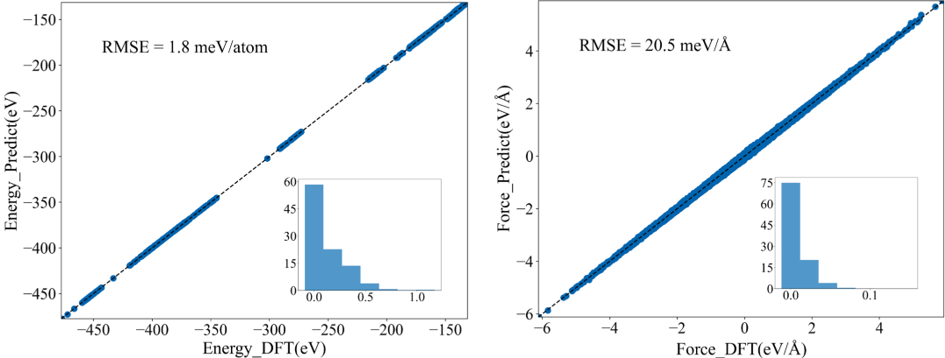
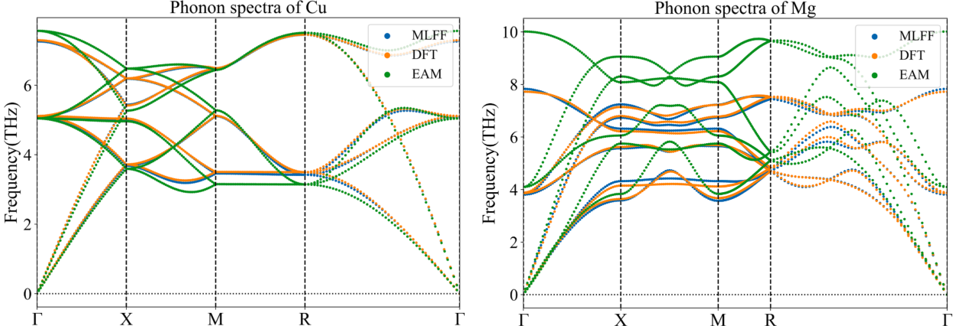
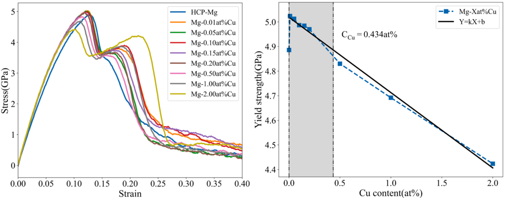
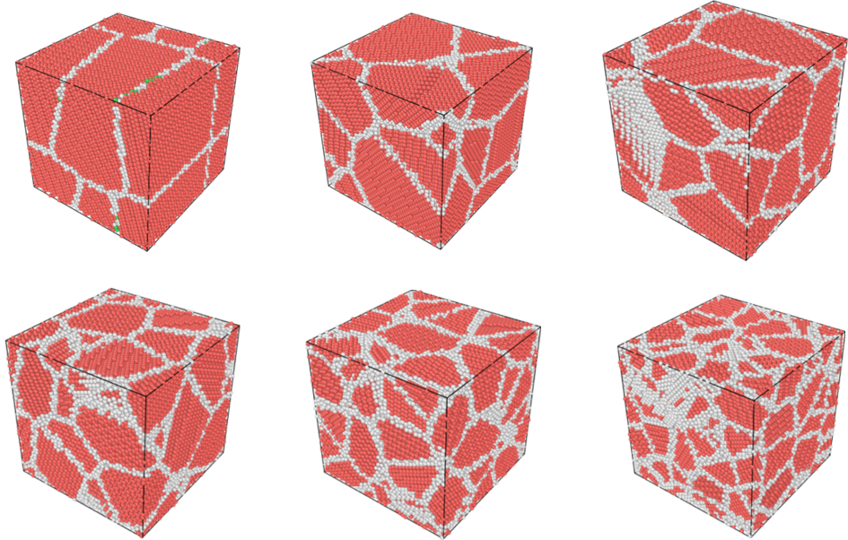
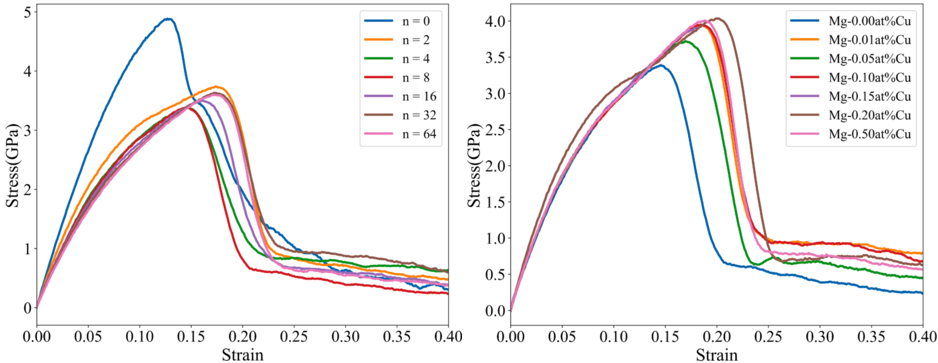

# Mg-Cu合金力场训练与强度模拟
Xingze Gen, Lin-Wang Wang, and Xiangying Meng. Comput. Mat. Sci. 246 (2025) 113486

## 拟合精度

## Mg、Cu声子谱测试

## 屈服强度

少量Cu含量可以提高合金的屈服强度，Cu含量越高合金屈服强度越低

## Mg-Cu合金晶粒数对强度的影响

### 不同晶粒数结构建模

### 晶粒细化对合金强度影响较小

