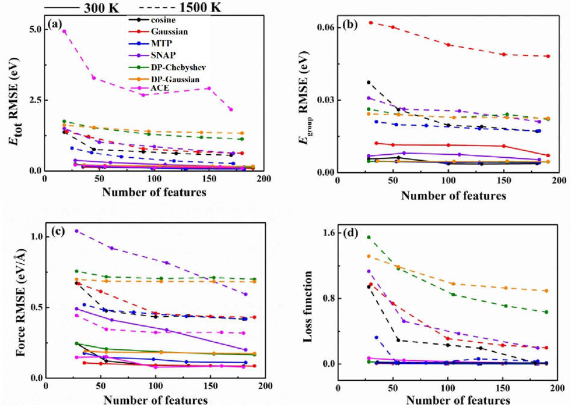

# Comparison of Features

#
[文章 Accuracy evaluation of different machine learning force field features](https://iopscience.iop.org/article/10.1088/1367-2630/acf2bb/pdf)

#
这项工作比较了 `PWMLFF 中的特征类型` 在描述物理系统能力方面的差异。这些特征类型包括`余弦特征`、`高斯特征`、`矩张量势(MTP)特征`、`光谱邻域分析势特征`、具有`切比雪夫多项式特征`和`高斯多项式特征`的简化光滑深势以及原子簇展开特征。特征的详细介绍请参考[Feature Wiki](../Appendix-1.md)。

#
### DFT数据

对于硫系统，在300K和1500K下进行了NVT AIMD模拟，并在300K进行了2 ps的分子动力学模拟。通过这些模拟获得了2000个300K下的结构。对于1500K，进行了3 ps的分子动力学模拟，然后进行了2 ps的AIMD模拟，获得了1500K的训练数据集。硫环在模拟过程中破裂，呈现出了破裂键的系统结构。

对于碳系统，选择了4种不同的碳结构相，进行了从300K到3500K的NVT AIMD模拟。为了覆盖更广泛的构型空间，还在训练数据集中添加了3500K的高温模拟结果。每种碳相进行了1000步的模拟，共获得了4000个结构作为训练数据集。

|    System     | Description   | Temperature (K) | Steps (fs) |
|:-------------:|:-------------:|:----------------:|:----------:|
|  Sulfur-300 K | α-S 128 atoms |        300       |    2000    |
| Sulfur-1500 K |   128 atoms   |       1500       |    2000    |
|    Diamond    |    64 atoms   |      300–3500    |    1000    |
|   Graphene    |    64 atoms   |      300–3500    |    1000    |
|  Graphenylene |    64 atoms   |      300–3500    |    1000    |
|    M-carbon   |    64 atoms   |      300–3500    |    1000    |

 **硫和碳系统的细节及其AIMD步骤**
#
 ### 部分实验结果

不同特征类型的硫-300 K数据集(实线)和硫-1500 K数据集(虚线)对(a)总能量、(b)原子能量、(c)力、(d)损失函数的训练误差。

<!-- 

硫-300 K和硫-1500 K组合数据集和不同特征类型对(a)总能量、(b)原子能量、(c)力、(d)损失函数的训练误差。 -->

碳系统与不同特征类型组合数据集对(a)总能量、(b)原子能量、(c)力、(d)损失函数的训练误差。