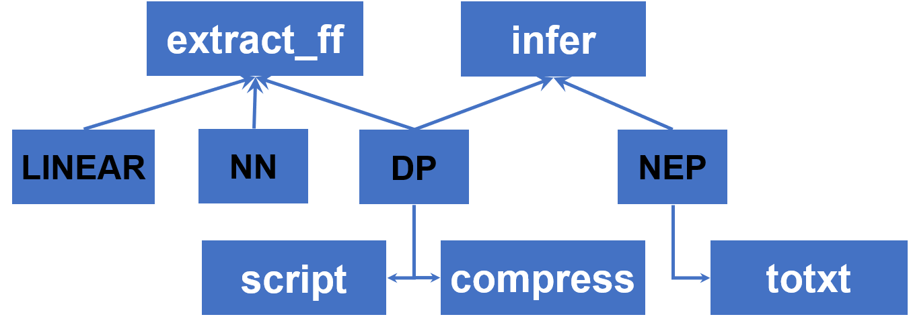

# MatPL 操作命令

在MatPL中，您可以使用 `matpl`、`MatPL`、`MATPL`或者 `PWMLFF` 作为起始命令。其中 `PWMLFF` 为 MatPL-2025.3 之前的版本，新版本兼容该命令。

MatPL 命令包括做训练 `train` 命令、做推理测试的 `test` 命令以及一些不同模型独有的`功能性命令`。您可以通过 `matpl -h` 命令输出 MatPL 的所有支持命令列表。

```bash
matpl -h
或者 matpl --help
```

## 1. train 训练

train 命令是 MatPL 的训练命令，使用该命令需要用户提前准备好训练设置的 json 文件。
``` bash
MatPL train input.json
```
 - NEP 的训练请参考 NEP 训练
 - DP的训练请参考 DP 训练
 - NN的训练请参考 NN 训练
 - LINEAR训练请参考 LINEAR 训练

## 2. test 推理

test 命令是 MatPL 的测试命令，使用该命令需要用户提前准备好推理设置的 json 文件。执行成功后，该命令将输出力场对测试数据的能量和受力信息。
``` bash
MatPL test input.json
```
 - NEP 的测试请参考 NEP 测试
 - DP的测试请参考 DP 测试
 - NN的测试请参考 NN 测试
 - LINEAR测试请参考 LINEAR 测试

## 其他功能性命令

MatPL 对不同的模型提供了不同的功能性命令



## 3. extract_ff

该命令用于提取 DP、NN力场的ckpt文件为txt格式，提取后的力场文件可以用于 [fortran语言 实现的 lammps 接口](https://github.com/LonxunQuantum/lammps-MatPL/tree/fortran#)。

```bash
# 提取dp力场模型
MatPL extract_ff dp_model.ckpt
# 提取nn力场模型
MatPL extract_ff nn_model.ckpt
```
细节的操作使用请参考 
- 提取 DP 力场
- 提取 NN 力场

## 4. infer

该命令用于使用 NEP 或 DP 模型对单结构文件做能量和受力推理。

``` bash
# nep 模型推理 pwmat atom.config 结构
MatPL infer gpumd_nep.txt atom.config pwmat/config
MatPL infer nep_to_lmps.txt atom.config pwmat/config
MatPL infer nep_modek.ckpt atom.config pwmat/config
# dp 模型推理lammps dump 结构
MatPL infer dp_model.ckpt 0.lammpstrj lammps/dump Hf O
```

细节的操作使用请参考
- NEP力场 单结构推理
- DP力场 单结构推理

## 5. toneplmps

该命令为 NEP 力场独有，用于将 NEP 的 ckpt 力场文件转换为 lammps 中使用的txt格式力场。
``` bash
MatPL toneplmps nep_model.ckpt
```
细节的操作请参考 
- NEP 力场转为 lammps 格式

## 6. togpumd
该命令为 NEP 力场独有，用于将 NEP 的 ckpt 力场文件转换为 GPUMD 中使用的txt格式力场。
``` bash
MatPL togpumd nep_model.ckpt
```
细节的操作请参考 
- NEP 力场转为 GPUMD 格式

## 7. compress
该命令为 DP 力场独有，用于DP模型的推理加速，原理是将 DP 模型中的 embedding net 网络拟合为多项式，在训练集的原子类型较多时有明显的加速效果。
``` bash
MatPL compress dp_model.ckpt -d 0.01 -o 3 -s cmp_dp_model
```
细节的操作请参考 
- DP 力场多项式压缩

## 8. script
该命令为 DP 力场独有，用于将 DP 的ckpt 力场文件转换为 libtorch 格式，之后该该文件可用于 lammps 模拟。

```bash
MatPL script dp_model.ckpt
```
细节的操作请参考 
- DP 力场转 libtorch格式
- DP 力场的 MD 模拟

## 9. Lammps 力场推理

对于 DP 和 NEP 力场在 Lammps 中的设置，请参考
 - NEP lammps MD 
 - DP lammps MD 

 对于 NN 和 LINEAR 力场在 Lammps 中的设置，请参考
 - NN lammps MD 
 - LINEAR lammps MD 