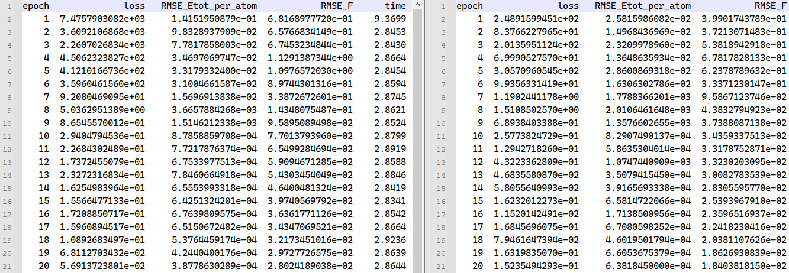

# DP 操作演示

这里，我们以 MatPL [[源码根目录/example/Cu]](https://github.com/LonxunQuantum/PWMLFF/blob/master/example/Cu) 为例（数据源为 pwmat 生成的aimd轨迹），详细介绍 DP 模型的训练、测试、lammps模拟以及其他功能。

## train 训练

``` bash
PWMLFF train train.json
# 该目录下提供了slurm脚本提交的例子，替换相应的环境变量即可
```
train.json 中的内容如下所示，关于 DP 的参数解释，请参考 [DP 参数手册](../../Parameter%20details.md#dp-model)：

```json
{   
    "format":"pwmat/movement",
    "train_data":["0_300_MOVEMENT", "1_500_MOVEMENT"],
    "valid_data":["valid_movement"],
    "model_type": "DP",
    "atom_type":[29]
}
```

训练结束后产生如下目录如下所示
``` txt
├── model_record
│   ├── epoch_train.dat
│   ├── epoch_valid.dat
│   └── dp_model.ckpt
├── forcefield
│   ├── embeding.net
│   ├── fitting.net
│   ├── fittingNet.resnet
│   ├── forcefield.ff
│   ├── gen_dp.in
│   └── type_physical_properties.in
├── std_input.json
└── train.json
```
- std_input.json 为模型训练中使用的所有设置参数（用户自定义参数以及默认参数）；
- model_record/epoch_train.dat 为训练过程中"train_data"中，每个 epoch 的训练集的 loss 信息汇总
- model_record/epoch_valid.dat 为训练过程中"valid_data"中，每个 epoch训练结束时验证集的 loss 信息汇总，如果不设置验证集则不输出改文件
- model_record/dp_model.ckpt 为最近一个epoch训练结束后的力场文件，.ckpt 为pytorch可读的文件格式
- forcefield 目录为dp_model.ckpt 提取出的txt格式力场文件目录，用于[fortran 版本的lammps接口](https://github.com/LonxunQuantum/lammps-MatPL/tree/fortran#)

## test 测试 


### 2.2 输入文件

当前目录下，力场训练输入控制文件包含一系列需要传入的参数。

输入文件示例 ([输入文件其他参数说明](#4-输入文件其他参数说明))：

```json
{
  "raw_files": ["/Cu/PWdata/Cu72", "/Cu/PWdata/Cu72_1"],
  "model_type": "DP",
  "atom_type": [29]
}
```

- `datasets_path`: 标签文件存放路径。可以设置同时多个路径，路径下包含训练集和验证集子目录。请根据实际情况进行修改。
- `model_type`：模型类型，现在训练所使用的模型。其他模型类型的训练及参数配置参考[参数细节](/next/PWMLFF/Parameter%20details)
- `atom_type`：原子类型，Cu 的原子序数为 29。

### 2.3 运行

以下 slurm 示例脚本适用于 Mcloud,提交任务时确保已经加载必要的环境和模块。

```bash
#!/bin/sh
#SBATCH --partition=3090
#SBATCH --job-name=mlff
#SBATCH --nodes=1
#SBATCH --ntasks-per-node=1
#SBATCH --gres=gpu:1
#SBATCH --gpus-per-task=1
# mcloud 已安装环境加载
# 加载conda 环境
# 这里推荐
source /share/app/PWMLFF/PWMLFF2024.5/env.sh

# 或者采用以下方式分步加载
# source /share/app/anaconda3/etc/profile.d/conda.sh
# module load conda/3-2020.07
# conda deactivate
# conda activate PWMLFF
# module load pwmlff/2024.5
PWMLFF train dp_cu.json > log
```

交互式运行：

```bash
$ srun -p 3090 --pty /bin/bash
# mcloud 已安装环境加载
$ source /share/app/PWMLFF/PWMLFF2024.5/env.sh
$ module load pwmlff/2024.5

$ PWMLFF train dp_cu.json
```

:::tip
大多数情况下，可以使用`raw_files`参数直接调用`pwdata`进行数据处理并进行训练：

这种情况下，可以跳过单独运行`pwdata extract.json`，直接运行`PWMLFF train dp_cu.json`。例如：

```json
{
  "raw_files": ["./MOVEMENT300", "./MOVEMENT1500"],
  "format": "pwmat/movement",
  "valid_shuffle": true,
  "train_valid_ratio": 0.8,
  "model_type": "DP",
  "atom_type": [29]
}
```

:::

---

在训练期间，可以通过检查训练模型文件存放的目录(`model_record`)的日志来查看训练情况。

该目录下存在以下三个文件:

- `dp_model.ckpt` 为模型文件，可用于继续训练或提取力场。对应于最后一次训练的模型。
- `epoch_train.dat` 和 `epoch_valid.dat` 日志文件中包含每个 epoch 的训练误差和验证误差。

:::info epoch_train.dat&epoch_valid.dat



- `loss` 对应训练总误差
- `RMSE_Etot_per_atom` 对应训练能量误差，建议达到 ~$10^{-3} eV/atom$ 数量级
- `RMSE_F` 对应训练力误差， 建议达到 ~$10^{-2} eV/\text{\AA}$ 数量级

<font color='red'>如果训练集的误差比验证集的误差明显偏小,表明训练过拟合,可适当增加训练集的大小或调整 batch_size 的数量。</font>

:::

### 2.4 提取力场

:::tip
推荐使用 Libtorch 版本的力场模型，该版本的力场模型在训练完成后手动执行`PWMLFF script dp_model.ckpt`命令生成`jit_dp_cpu.pt`文件或`jit_dp_gpu.pt`，该文件用于 lammps 模拟。
如果您的设备包含GPU环境，执行 `PWMLFF script`将会生成`jit_dp_gpu.pt`文件，否则为`jit_dp_cpu.pt`。

注意：`jit_dp_gpu.pt`只能在 GPU 环境下运行lammps；`jit_dp_cpu.pt`只能在 CPU 环境下运行lammps。
:::

训练完成后，默认会在当前目录下生成`forcefield`文件夹，包含`*.ff`力场文件。该力场文件需使用[该版本](https://github.com/LonxunQuantum/Lammps_for_PWMLFF/releases/tag/v0.1.0)，[编译](http://doc.lonxun.com/1.0/PWMLFF/Installation_v0.0.1#lammps_for_pwmlff%E5%AE%89%E8%A3%85)，[及使用](http://doc.lonxun.com/1.0/PWMLFF/Cu#3-lammps-%E6%A8%A1%E6%8B%9F)可查阅之前的手册教程。

## 3. Lammps 模拟

将训练完成后生成的`pt`力场文件用于 lammps 模拟。

为了使用 PWMLFF 生成的力场文件，lammps 的输入文件示例如下：

```bash
pair_style      pwmlff 1 ../model_record/jit_dp_gpu.pt
pair_coeff      * * 29
```

其中：

- `pair_style pwmlff 1` 表示使用 PWMLFF 生成的力场文件，`1`表示读取 1 个力场文件， `../model_record/jit_dp_gpu.pt` 为 PWMLFF 生成的力场文件，可以根据实际情况修改路径。
- `pair_coeff * * 29` 为 Cu 的原子序数。

以下是 lammps 输入文件示例(nvt 系综)：

```bash
units           metal
boundary        p p p
atom_style      atomic
processors      * * *
neighbor        2.0 bin
neigh_modify    every 10 delay 0 check no

read_data       lmp.init

pair_style      pwmlff 1 ../model_record/jit_dp_gpu.pt
pair_coeff      * * 29
velocity        all create 1500 206952 dist gaussian
timestep        0.001
fix             1 all nvt temp 1500 1500 0.1
thermo_style    custom step pe ke etotal temp vol press
thermo          1
dump            1 all custom 1 traj.xyz id type x y z  vx vy vz fx fy fz
run             1000 #1ps
```

:::info

1. 使用 GPU 运行 lammps 时，执行程序为`lmp_mpi_gpu`; 使用 CPU 运行 lammps 时，执行程序为`lmp_mpi`。

2. 如果有多个力场文件（如[主动学习](/next/PWMLFF/active%20learning/example_si_init_zh)时），(例如 4 个)可以修改为：

   ```bash
   pair_style      pwmlff 4 1.pt 2.pt 3.pt 4.pt
   pair_coeff      * * 29
   ```

:::

## 4. 输入文件其他参数说明

```json
{
  "recover_train": false,

  "raw_files": ["0_300_MOVEMENT", "1_500_MOVEMENT"],
  "format": "pwmat/movement",
  "valid_shuffle": true,
  "train_valid_ratio": 0.8,

  "model_load_file": "./model_record/dp_model.ckpt",
  "model_type": "DP",
  "atom_type": [29],
  "max_neigh_num": 100,
  "seed": 1234,
  "model": {
    "descriptor": {
      "Rmax": 6.0,
      "Rmin": 0.5,
      "M2": 16,
      "network_size": [25, 25, 25]
    },

    "fitting_net": {
      "network_size": [50, 50, 50, 1]
    }
  },

  "optimizer": {
    "optimizer": "LKF",
    "block_size": 5120,
    "kalman_lambda": 0.98,
    "kalman_nue": 0.9987,
    "nselect": 24,
    "groupsize": 6,

    "batch_size": 4,
    "epochs": 20,
    "start_epoch": 1,

    "print_freq": 10,

    "train_energy": true,
    "train_force": true,
    "train_ei": false,
    "train_virial": false,
    "train_egroup": false,

    "pre_fac_force": 2.0,
    "pre_fac_etot": 1.0,
    "pre_fac_ei": 1.0,
    "pre_fac_virial": 1.0,
    "pre_fac_egroup": 0.1
  }
}
```

- `recover_train`: 是否从上次训练中断/完成处继续训练。如果为`true`，读取默认`model_load_path`和`model_name`，程序则会从上次训练中断/完成处继续训练。见[参数细节](/next/PWMLFF/Parameter%20details)。
- `raw_files`: 分子动力学轨迹文件存放路径及名称。可以设置同时多个文件。请根据实际情况进行修改。
- `train_valid_ratio`: 训练集和验证集的比例。`0.8`表示训练集占`80%`，验证集占`20%`。
- `model_load_file`: 模型文件路径。则读取该路径下的模型文件，程序则会从该模型文件处继续训练/测试。见[参数细节](/next/PWMLFF/Parameter%20details)。
- `model_type`：模型类型，现在训练所使用的模型。其他模型类型的训练及参数配置参考[参数细节](/next/PWMLFF/Parameter%20details)。
- `atom_type`：原子类型，Cu 的原子序数为 29。
- `max_neigh_num`：最大近邻原子数。
- `seed`: 随机数种子。
- `model`: 模型参数，具体参数配置参考[参数细节](/next/PWMLFF/Parameter%20details)。
- `optimizer`：优化器参数，推荐使用`LKF`和`ADAM`。通常情况下，对于大体系大网络，使用`LKF`优化器可以加速训练。其他优化器及更多的参数配置参考[参数细节](/next/PWMLFF/Parameter%20details)。
- `batch_size`：每批次用于训练的数据大小。如 1, 2, 5, 10。
- `epochs`：训练迭代次数。根据总的动力学轨迹 images 数量修改,images 少时可适当增加,如 50。
