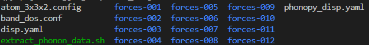
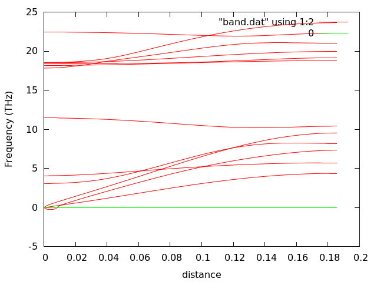
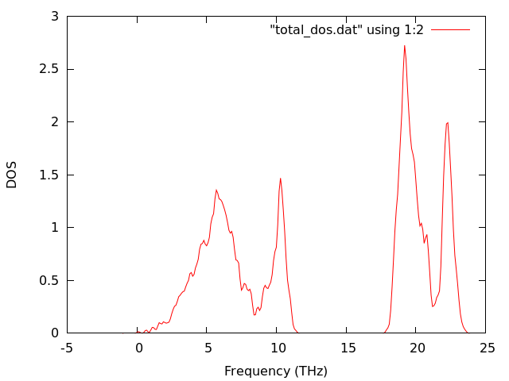
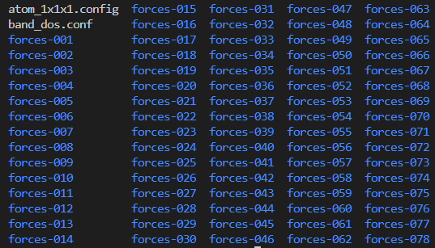
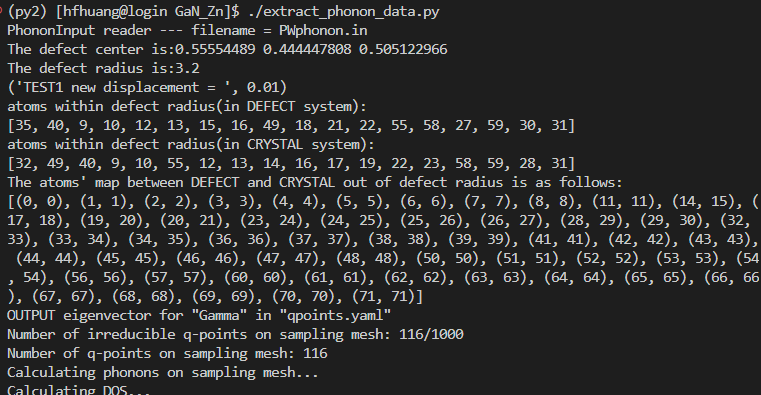
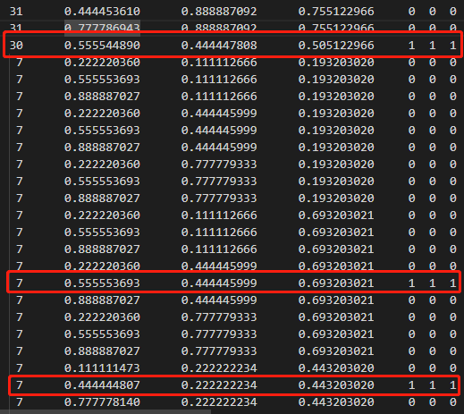
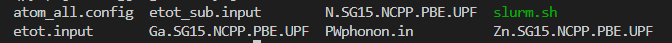
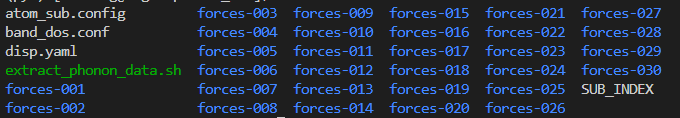
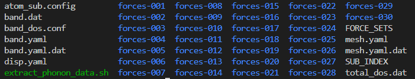
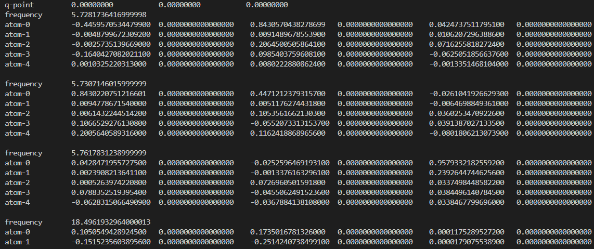

# 4. PyPWmat

## 简介

This module is the interface between PWmat and Phonopy. Phonopy is an open source package for phonon calculations at harmonic and quasi-harmonic levels. It can be used to calculate phonon band structures, phonon DOS and partial DOS, phonon thermal properties, etc. The most important thing is that this module can calculate the phonon of the defect system and the phonon modes of subsystem.（算声子谱，缺陷声子谱，部分原子声子谱）

## 下载/安装

1. 下载网站的PyPWmat安装包，上传到用户服务器 (Untar PyPWmat in user’s root directory: /home/user_name/)

可以使用该命令直接下载到服务器目录中：

```bash
wget http://modulefiles.pwmat.com/pwmat-resource/module-download7/file/PyPWmat-1.1.0.tar.gz
```

2. 下载Anaconda2，推荐使用Anaconda2-5.3.1-Linux-x86_64.sh版本（[历史版本](https://repo.continuum.io/archive/)），[安装教程](http://www.pwmat.com/pwmat-resource/course-download/PWmat/anaconda2.pdf) 。

可以使用该命令直接下载到服务器目录中：

```bash
wget https://repo.anaconda.com/archive/Anaconda2-5.3.1-Linux-x86_64.sh
```

3. 若已安装了anconda3，则可以通过以下方式安装anconda2

```bash
sh Anaconda2-5.3.1-Linux-x86_64.sh -b -p $HOME/anaconda3/envs/py2
rm -f $HOME/anaconda3/envs/py2/bin/conda*
rm -f $HOME/anaconda3/envs/py2/conda-meta/conda-*
rm -f $HOME/anaconda3/envs/py2/bin/activate
rm -f $HOME/anaconda3/envs/py2/bin/deactivate
cd $HOME/anaconda3/envs/py2/bin
ln -s ../../../bin/conda .
ln -s ../../../bin/activate .
ln -s ../../../bin/deactivate .
```

:::tip
通过命令`conda activate py2`激活anaconda2的环境，

通过命令`conda deactivate` 来返回anaconda3的环境

:::

4. 下载安装phonopy-1.12.8

* anaconda2环境下直接使用以下`pip install phonopy==1.12.8`安装

* 如果pip使用不了，可以手动[下载phonopy-1.12.8](https://pypi.org/project/phonopy/1.12.8/#files) (you must use this version, otherwise, it will not work).

  * 上传到服务器

  * 解压之后进入其中执行`pip install ./`

5. 配置环境变量

以PyPwmat安装在用户根目录，路径为`/home/user_name/PyPWmat-1.0.9`

* `vi ~/.bashrc`
* 在.bashrc中添加以下两行
    ```bash
    export PATH=/home/XXX/PyPWmat-1.0.9/bin:$PATH
    export PYTHONPATH=/home/XXX/PyPWmat-1.0.9:$PYTHONPATH
    ```
* 重新加载环境变量`source ~/.bashrc`
* 验证安装成功
    ```bash
    which PWmatPhonon.py
    >>> ~/PyPWmat-1.0.9/bin/PWmatPhonon.py  
    ```

## Three functions for PyPWmat

### Crystal phonon band structure calculations

To calculate the phonon band structure for <font color='red'>crystal (JOB=std in PWphonon.in)</font>.

(We recommend not to use PWmat2Phonony for crystal phonon calculation any more.

Instead, use PyPWmat package. The reason is that, these two packages uses different versions of Phonopy. The different versions are not compatible, with different internal parameter. So, if both versions of Phonopy are installed in the computer, they will confuse each other).

:::tip
计算流程如下：
1. mkdir GaN_Zn  # Set up a working directory: ~/your-path-to/GaN_Zn
2. prepare atom.config in GaN_Zn
3. prepare etot.input in GaN_Zn
4. prepare pseudopotential in GaN_Zn
5. type PWmatPhonon.py 
6. edit PWphonon.in and pbs/slurm script
7. type PWmatPhonon.py again 
8. ./extra_phonon_dash.sh
   
:::

#### Prepare atom.config 

* a bulk primary cell
* if the symmetry does not fix the atoms inside `atom.config`, do PWmat with `JOB = RELAX` to fully relax `atom.config` (**atomic position and lattice**).

---

#### Prepare etot.input

输入示例：

```bash
2 2
in.atom = atom.config
job = scf
XCFUNCTIONAL = PBE
ECUT = 60
ECUT2 = 240
ECUT2L = 240
WG_ERROR = 1E-6
E_ERROR = 0
RHO_ERROR = 1E-6
IN.PSP1 = Ga.SG15.NCPP.PBE.UPF
IN.PSP2 = N.SG15.NCPP.PBE.UPF
IN.PSP3 = Zn.SG15.NCPP.PBE.UPF
MP_N123 = 3 3 3 0 0 0
OUT.FORCE = T
OUT.WG = F
```

* this is for bulk atom.config
* this is used to get the info for PSP file and mp_n123, **mp_n123 is for supercell, not for thr primary cell!!** must set `OUT.FORCE = T`.
* The job=xxx does not matter here. Please use a higher precision for convergence rho_error, and perhaps Ecut2=4Ecut.
* If you are calculating defect, you can also set atom_defect.config
and etot_defect.input inside working path (to be discuss later). If you only calculate Crystal phonon band, you don’t need them.

---

#### Type PWmatPhonon.py

Type the command:

```bash
PWmatPhonon.py
>>> Generate the default file "PWphonon.in"
```

It will generate a file in working path: `PWphonon.in` with some default values.
You mostly likely need to edit `PWphonon.in`

:::caution
If there is already a `PWphonon.in`, and if you type PWmatPhonon.py, then the phonon calculation will begin. So PWmatPhonon.py can mean different things!!!.

:::

--- 

#### Edit PWphonon.in

You must edit “`PWphonon.in`”, It might look like this (after editing):

```bash
JOB = std                                                 # std:normal phonon, defect:defect system phonon, sub:subsystem phonon
NODES = 2    2                                            # node1 node2 for pwmat parallel configuration
WALL_TIME = 1000:00:00                                    # wall time for the queue system (torque): hours:minutes:seconds
MP_N123 = 3 3 3 0 0 0                                        # k-mesh for the supercell calculations; it is 3 3 3 0 0 0 for the unitcell calculation
DIM = 3 3 2                                               # supercell dimension which will be used to make displacements
PRIMITIVE_AXIS = 1.0 0.0 0.0  0.0 1.0 0.0  0.0 0.0 1.0    # the primitive cell for building the dynamical matrix
FC_SYMMETRY = .TRUE.                                      # This tag is used to symmetrize force constants partly
ACCELERATION = .TRUE.                                     # read in in.wg in.rho from forces-001 calculation
BAND = 0.0 0.0 0.0  0.5 0.0 0.0 # special q points in Brillioun zone
BAND_LABELS = $\Gamma$  X # labels of the special q points
BAND_POINTS = 101                                         # number of q-point along the high symmetry path
FREQUENCY_CONVERSION_FACTOR = THz                         # unit of the frequency:"THz", "cm^-1", "eV", "meV"
DOS = .TRUE.                                              # switch to the DOS calculation
FMIN = -1.0                                               # minimum of frequency DOS range
FMAX = 25.0                                               # maximum of frequency DOS range
MP = 10 10 10                                             # q-mesh for the DOS calculation
FPITCH = 0.1                                              # frequency interval for DOS calculation
PDOS = None                                                  # The atom indices
PROJECTION_DIRECTION = None                               # Eigenvectors are projected along the direction specified by this tag
XYZ_PROJECTION = .FALSE.                                  # PDOS is calculated using eigenvectors projected along x, y, and z Cartesian coordinates
SIGMA = 0.1                                               # smearing width for DOS calculation
EIGENVECTORS = .TRUE.                                     # output eigenvectors
DEFECT_CENTER = 0.0 0.0 0.0 # only useful with job:defect
DEFECT_RADIUS = 3                                         # only useful with job:defect
DISPLACEMENT = 0.01                                       # displament
SUBJOB = slurm                                           # slurm or torque
SUBJOB_FILENAME = slurm.sh                               # submit job filename
FC_MD = .FALSE.                                           # calculate the force constant from pwmat-MD result
```

1. **JOB=std** means for the crystal band structure calculation.

2. The supercell size for the dynamic matrix calculation is defined by **DIM=n1,n2,n3** (upon the primary cell defined in atom.config). <font color='red'>Note: if this is the first step for the defect calculation, this supercell must be in the same size as the atom_defect.config.</font>

3. **MP_N123** is for the super cell DFT k-points.

4. **Eigenvectors = .TRUE.** For phonon eigen mode output.

5. **MP=10,10,10** (please not be too large) for phonon k-point grid.

6. **Defect_center**, and **Defect_radius** are only for defect calculations (not used here).
   
7. **SUBJOB** and **SUBJOB_FILENAME** are the PBS system name and PBS submit filename, respectively. The default PBS system is TORQUE and another option is SLURM. The default filename is 'pwmat.pbs'. You have to edit and put the PBS file in the same directory of PWphonon.in and the filename must be exactly the same as with the “SUBJOB_FILENAME”.in PWphonon.in.

8. **DISPLACEMENT** (the default value is 0.01).
This is used to control the atomic displacement in the supercell, to calculate the dynamic matrix.
This can be useful, for example, if the SCF is hard to converge, so there are some noise, then Larger displacement can have the results above the noise.
But if the displacement is too large, the numerical derivative will not be accurate.

:::info Special note for HSE calculations
Although very expensive, one can use HSE to calculate the
phonon spectrum (e.g, for **nonradiative decay calculations**).

However, phonon calculation is very sensitive to the
accuracy of the force. So, it might be necessary to set the
parameters accurately. Otherwise, it might have imaginary
frequency.

To make sure one has converged results, one can set:
Ecut2=4*Ecut, EcutP=4*Ecut, Ecut2L=4*Ecut2

EcutP controls the grid used to calculate the Fock exchange integral (P123).
To be accurate, one has to set EcutP=4*Ecut.

The following is an example of input:
```bash
4 1
in.atom = atom.config
job = scf
XCFUNCTIONAL = HSE
ECUT = 60
ECUT2 = 240
ECUTP = 240
ECUT2L = 960
WG_ERROR = 1E-9
E_ERROR = 0
RHO_ERROR = 1E-7
IN.PSP1 = Ga.SG15.NCPP.PBE.UPF
IN.PSP2 = N.SG15.NCPP.PBE.UPF
IN.PSP3 = Zn.SG15.NCPP.PBE.UPF
MP_N123 = 2 2 2 0 0 0
OUT.FORCE = T
OUT.WG = F
```

To check the convergence, one can check :>grep update REPORT. And also check the total force in OUT.FORCE.BACK.
As a indication of the convergence, the total force should be almost zero (at least much smaller than the atomic forces
caused by the displacement).

:::

---

#### Forces calculations

After edit “`PWphonon.in`”, type `PWmatPhonon.py` again:
```bash
PWmatPhonon.py
>>> PhononInput reader --- filename = PWphonon.in
Read input from "PWphonon.in"
...
...                                                                   
        _
  _ __ | |__   ___  _ __   ___   _ __  _   _
 | '_ \| '_ \ / _ \| '_ \ / _ \ | '_ \| | | |
 | |_) | | | | (_) | | | | (_) || |_) | |_| |
 | .__/|_| |_|\___/|_| |_|\___(_) .__/ \__, |
 |_|                            |_|    |___/  interface to PWmat
                               PWmat version
...

disp.yaml and supercells have been created.
                 _
   ___ _ __   __| |
  / _ \ '_ \ / _` |
 |  __/ | | | (_| |
  \___|_| |_|\__,_|

 Please run  extract_phonon_data  to get the plot and data, when the forces calculations are finished!
```

* This will start the supercell calculations with different atomic displacements.

* It will generate a new directory: ./phonon_std/

* Within ./phonon_std, it will have force-00x subdirectories for supercell displacement calculations (you can check the files within those directories, just to see what kind of calculations you have). Each force-00x represents one atomic diplacement.

* There is an `extract_phonon_data.sh` file within ./phonon_std

* You can use `qstat` or `squeue`, to check whether your calculations are already finished.

---

After the PWmat supercell calculations have finished,
inside phonon_std, type:

```bash
./extract_phonon_data.sh
```

It will generate the following files: `band.dat`, `total_dos.dat`, `mesh.yaml.dat`, `FORCE_SETS`.

:::tip In particular
**band.dat**, **total_dos.dat** can be plotted by
Gnuplot to generate the phonon band and DOS.

**mesh.yaml.dat has all the q-point phonon modes (vector)**.

**FORCE_SETS** will be used for defect calculation
(if this is part of the defect calculation).

:::

以下是一个简易的`.sh`脚本，可以直接使用输出phonon band和phonon dos。
```bash
#!bin/bash

gnuplot << EOF
set terminal pngcairo
set output "band.png"
set xlabel "distance"
set ylabel "Frequency (THz)"
plot "band.dat" using 1:2 with lines, 0 with lines lt rgb "green"

set output "dos.png"
set xlabel "Frequency (THz)"
set ylabel "DOS"
plot "total_dos.dat" using 1:2 with lines
plot 'band.dat' using 1:2 with lines, 0 with lines lt rgb "green"
EOF
```

The phonon band structure plotted using gnuplot from band.dat in ./phonon_std/band.dat

The small negative near the Gamma point is because the system is not fully relaxed.



The phonon DOS plotted using gnuplot from total_dos.dat in ./phonon_std/total_dos.dat



If you only want the crystal phonon mode, then this is the end.


### Defect phonon mode calculations

To calculate the phonon modes for <font color='red'>a system with point defect</font>. (JOB=defect in PWphonon.in)

This will also use the crystal phonon mode calculation as the first step. So, the crystal phonon calculation will still be needed.

**参考文献**

[Lin Shi, Lin-Wang Wang. “Ab initio Calculations of Deep-Level Carrier Nonradiative Recombination Rates in Bulk Semiconductors”PRL 109, 245501 (2012)](https://journals.aps.org/prl/abstract/10.1103/PhysRevLett.109.245501)

---

:::tip
计算流程如下：
1. prepare Crystal supercell
2. prepare supercell with defect
3. make a new directory
4. relaxed supercell with defect
5. Go back to working directory: here is ./GaN_Zn 
6. prepare etot_defect.input
7. edit PWphonon.in and pbs/slurm script
8. type PWmatPhonon.py again 
9. ./extra_phonon_dash.sh
   
:::

#### Prepare atom_defect.config

for example: bulk GaN with Zn doping.

* This is a system with bulk crystal like atom.config, but with a point defect (or impurity) at (x1,x2,x3). The supercell size must equal to the `DIM=n1,n2,n3` of the crystal calculation, and the atomic positions must be the same.(对Crystal扩展得到的超胞atom_n1×n2×n3.config进行修改添加defect（替位或者空穴）)
* Fully relax atom_defect.config with PWmat, `JOB=RELAX`(对supercell进行atomic position优化，不再进行cell relax). This is important (usually this is for `neutral defect`).
* cp final.config back to crystal phonon working path (`cp final.config xxx/GaN_Zn/atom_defect.config`)

----

#### Prepare etot_defect.input

输入示例：

```bash
2 2
in.atom = atom.config
job = scf
XCFUNCTIONAL = PBE
ECUT = 60
ECUT2 = 240
ECUT2L = 240
WG_ERROR = 1E-6
E_ERROR = 0
RHO_ERROR = 1E-6
IN.PSP1 = Ga.SG15.NCPP.PBE.UPF
IN.PSP2 = N.SG15.NCPP.PBE.UPF
IN.PSP3 = Zn.SG15.NCPP.PBE.UPF
MP_N123 = 3 3 3 0 0 0
OUT.FORCE = T
OUT.WG = F
```

* Use the same mp_n123 as in the etot.input (for crystal calculations, they are both for the supercell, not the primary cell kpoints).
* The job=xxx does not matter here. Use the same Ecut, and Ecut2 as for crystal calculation.

:::info
we have used in.atom=atom.config, not
in.atom=atom_defect.config, but atom_defect.config
must exist in the directory.

:::

---

#### Edit PWphonon.in

Directly modify `PWphonon.in` in working directory, After editing, it might look like this:

```bash
JOB = defect                                                 # std:normal phonon, defect:defect system phonon, sub:subsystem phonon
NODES = 2    2                                            # node1 node2 for pwmat parallel configuration
WALL_TIME = 1000:00:00                                    # wall time for the queue system (torque): hours:minutes:seconds
MP_N123 = 3 3 3 0 0 0                                        # k-mesh for the supercell calculations; it is 3 3 3 0 0 0 for the unitcell calculation
DIM = 3 3 2                                               # supercell dimension which will be used to make displacements
PRIMITIVE_AXIS = 1.0 0.0 0.0  0.0 1.0 0.0  0.0 0.0 1.0    # the primitive cell for building the dynamical matrix
FC_SYMMETRY = .TRUE.                                      # This tag is used to symmetrize force constants partly
ACCELERATION = .TRUE.                                     # read in in.wg in.rho from forces-001 calculation
BAND = 0.0 0.0 0.0  0.5 0.0 0.0 # special q points in Brillioun zone
BAND_LABELS = $\Gamma$  X # labels of the special q points
BAND_POINTS = 101                                         # number of q-point along the high symmetry path
FREQUENCY_CONVERSION_FACTOR = THz                         # unit of the frequency:"THz", "cm^-1", "eV", "meV"
DOS = .TRUE.                                              # switch to the DOS calculation
FMIN = -1.0                                               # minimum of frequency DOS range
FMAX = 25.0                                               # maximum of frequency DOS range
MP = 10 10 10                                             # q-mesh for the DOS calculation
FPITCH = 0.1                                              # frequency interval for DOS calculation
PDOS = None                                                  # The atom indices
PROJECTION_DIRECTION = None                               # Eigenvectors are projected along the direction specified by this tag
XYZ_PROJECTION = .FALSE.                                  # PDOS is calculated using eigenvectors projected along x, y, and z Cartesian coordinates
SIGMA = 0.1                                               # smearing width for DOS calculation
EIGENVECTORS = .TRUE.                                     # output eigenvectors
DEFECT_CENTER = 0.555544890 0.444447808 0.505122966 # only useful with job:defect
DEFECT_RADIUS = 3.2                                         # only useful with job:defect
DISPLACEMENT = 0.01                                       # displament
SUBJOB = slurm                                           # slurm or torque
SUBJOB_FILENAME = slurm.sh                               # submit job filename
FC_MD = .FALSE.                                           # calculate the force constant from pwmat-MD result
```

* From the crystal bulk PWphonon.in <font color='red'>(Note, DIM=n1,n2,n3 must be the same as the defect supercell).</font> you mostly likely need to change the following:
    ```bash
    JOB = defect
    Defect_center = x1,x2,x3  // (x1,x2,x3) is the fractional coordinate for the center of the point defect;
    Defect_radius = R   // R (in A) is the radius size of the defect.
    MP = 5 5 5 (this is the q-point for the defect supercell, should not be too big).
    ```

* For atoms within R, the explicit displacement, and force calculations will be carried out.

* For (R1,R2) atoms both outside the R, their dynamic matrix element will be approximated by the bulk one calculated before. So, outside R, the defect supercell, and bulk supercell should have roughly the same atoms.
* DIM=n1,n2,n3 have no effect here.

---

#### Forces calculations

After edit “`PWphonon.in`”, type `PWmatPhonon.py` again:
```bash
PWmatPhonon.py
>>> PhononInput reader --- filename = PWphonon.in
Read input from "PWphonon.in"
...
...                                                                   
        _
  _ __ | |__   ___  _ __   ___   _ __  _   _
 | '_ \| '_ \ / _ \| '_ \ / _ \ | '_ \| | | |
 | |_) | | | | (_) | | | | (_) || |_) | |_| |
 | .__/|_| |_|\___/|_| |_|\___(_) .__/ \__, |
 |_|                            |_|    |___/  interface to PWmat
                               PWmat version
...

disp.yaml and supercells have been created.
                 _
   ___ _ __   __| |
  / _ \ '_ \ / _` |
 |  __/ | | | (_| |
  \___|_| |_|\__,_|

 Please run  extract_phonon_data  to get the plot and data, when the forces calculations are finished!
```

* It will generate a new directory: ./phonon_defect/

* Within ./phonon_defect, it will have force-00x subdirectories for defect displacement calculations.
---

After the PWmat calculations have finished,
inside working path "./GaN_Zn" (not inside phonon_defect) and type:

```bash
./extract_phonon_data.py
```

you get the screen like this (with the DOS of the phonon):

More importantly, in working path, you have new files:
`DEFECT_FORCE_SETS`,
`qpoints.yaml`,
`qpoints.yaml.dat`,
`total_dos.dat`.

:::tip In particular
**Total_dos.dat** can be used to plot the DOS.

**qpoints.yaml.dat** contains the defect Gamma point phonon energy and their eigen vectors.(They can be used to calculate nonradiative decay rate).

:::

This will be the end of Defect phonon mode calculation.

### Subsystem phonon band structure calculations

To calculate the phonon modes for <font color='red'>a sub system i.e., a part of the supercell</font>.

This is a independent calculator from above. (JOB=sub, in PWphonon.in)

:::tip
计算流程如下：
1. mkdir subsys  # Set up a working directory: ~/your-path-to/subsys
2. prepare atom_all.config in subsys
3. prepare etot.input and etot_sub.input in subsys
4. prepare pseudopotential in subsys
5. type PWmatPhonon.py 
6. edit PWphonon.in and pbs/slurm script
7. type PWmatPhonon.py again 
8. ./extra_phonon_dash.sh
   
:::

#### Prepare atom_all.config

Note the red box atoms is the atoms to be calculated.
One should give the atom setting <font color='red'>1 1 1</font>, like the setting
in relaxation! BTW, the atoms with <font color='red'>0 0 0</font> will not in
consideration to be calculated. This is <font color='red'>IMPORTANT!!!</font>

The atom_all.config is the whole system, a supercell.

(Note, it is atom_all.config, not atom_sub.config)



----

#### Prepare etot_sub.input

输入示例：

```bash
2 2
in.atom = atom.config
job = scf
XCFUNCTIONAL = PBE
ECUT = 60
ECUT2 = 240
ECUT2L = 240
WG_ERROR = 1E-6
E_ERROR = 0
RHO_ERROR = 1E-6
IN.PSP1 = Ga.SG15.NCPP.PBE.UPF
IN.PSP2 = N.SG15.NCPP.PBE.UPF
IN.PSP3 = Zn.SG15.NCPP.PBE.UPF
MP_N123 = 3 3 3 0 0 0
OUT.FORCE = T
OUT.WG = F
```

:::info
we have used in.atom=atom.config, not
in.atom=atom_all.config, but atom_all.config
must exist in the directory.

MP_N123 is for this supercell.

:::

---

#### Type PWmatPhonon.py

Type the command:

```bash
PWmatPhonon.py
>>> Generate the default file "PWphonon.in"
```

It will generate a file in working path: `PWphonon.in` with some default values.
You mostly likely need to edit `PWphonon.in`

:::caution
If there is already a `PWphonon.in`, and if you type PWmatPhonon.py, then the phonon calculation will begin. So PWmatPhonon.py can mean different things!!!.

:::

Within ./subsys, it will have following files:

etot.input same as `JOB=std`.

--- 

#### Edit PWphonon.in

You must edit `PWphonon.in`, it might look like this(after editing):

```bash
JOB = sub                                                 # std:normal phonon, defect:defect system phonon, sub:subsystem phonon
NODES = 2    2                                            # node1 node2 for pwmat parallel configuration
WALL_TIME = 1000:00:00                                    # wall time for the queue system (torque): hours:minutes:seconds
MP_N123 = 3 3 3 0 0 0                                        # k-mesh for the supercell calculations; it is 3 3 3 0 0 0 for the unitcell calculation
DIM = 3 3 2                                               # supercell dimension which will be used to make displacements
PRIMITIVE_AXIS = 1.0 0.0 0.0  0.0 1.0 0.0  0.0 0.0 1.0    # the primitive cell for building the dynamical matrix
FC_SYMMETRY = .TRUE.                                      # This tag is used to symmetrize force constants partly
ACCELERATION = .TRUE.                                     # read in in.wg in.rho from forces-001 calculation
BAND = 0.0 0.0 0.0  0.5 0.0 0.0 # special q points in Brillioun zone
BAND_LABELS = $\Gamma$  X # labels of the special q points
BAND_POINTS = 101                                         # number of q-point along the high symmetry path
FREQUENCY_CONVERSION_FACTOR = THz                         # unit of the frequency:"THz", "cm^-1", "eV", "meV"
DOS = .TRUE.                                              # switch to the DOS calculation
FMIN = -1.0                                               # minimum of frequency DOS range
FMAX = 25.0                                               # maximum of frequency DOS range
MP = 1 1 1                                             # q-mesh for the DOS calculation
FPITCH = 0.1                                              # frequency interval for DOS calculation
PDOS = None                                                  # The atom indices
PROJECTION_DIRECTION = None                               # Eigenvectors are projected along the direction specified by this tag
XYZ_PROJECTION = .FALSE.                                  # PDOS is calculated using eigenvectors projected along x, y, and z Cartesian coordinates
SIGMA = 0.1                                               # smearing width for DOS calculation
EIGENVECTORS = .TRUE.                                     # output eigenvectors
DEFECT_CENTER = 0.0 0.0 0.0 # only useful with job:defect
DEFECT_RADIUS = 3                                         # only useful with job:defect
DISPLACEMENT = 0.01                                       # displament
SUBJOB = slurm                                           # slurm or torque
SUBJOB_FILENAME = slurm.sh                               # submit job filename
FC_MD = .FALSE.                                           # calculate the force constant from pwmat-MD result
```

1. <font color='red'>JOB=sub</font> means for the subsystem band structure calculation
2. DIM=n1,n2,n3 have no effect (like the defect calculation, the code will set DIM=1,1,1)
3. MP_N123 is for the supercell k-point.
4. Eigenvectors = .TRUE. For phonon eigen mode output.
5. MP=1,1,1 (the k-points for phonon calculation, usually for subsystem calc., only Gamma point is needed)
6. The Defect_center, defect_radius are not used.

---

#### Forces calculations

After edit “`PWphonon.in`”, type `PWmatPhonon.py` again:
```bash
PWmatPhonon.py
>>> PhononInput reader --- filename = PWphonon.in
Read input from "PWphonon.in"
PhononInput reader --- filename = PWphonon.in
                                                                          
 -------------------------------------------------------------------------
                        Welcome to PyPWmat.                               
                        python module of PWmat                            
                        Enjoy it and good luck                            
                        Author : Paul Chern                               
 =========================================================================
                                                                          
current workding directory is: /data/home/hfhuang/6-module-test/4.PyPWmat/GaN_Zn/subsys
phonon will be calculate in: /data/home/hfhuang/6-module-test/4.PyPWmat/GaN_Zn/subsys/phonon_sub
here is the change starting ------------
displacement value ==== 0.01sub

 Please run  extract_phonon_data  to get the plot and data, when the forces calculations are finished! 
```

* It will generate a new directory: ./phonon_sub/

* Within ./phonon_sub, it will have force-00x subdirectories for supercell
displacement calculations (you can check the files within those directories,
just to see what kind of calculations you have). Each force-00x represents one
atomic diplacement.

* There is an `extract_phonon_data.sh`, `atom_sub.config`, `SUB_INDEX` file within ./phonon_sub.
  * atom_sub.config contains the part of atoms involved in the phonon mode.
  * SUB_INDEX is the atoms index which mapping the atoms in atom_sub.config to
    atom_all.config. It is needed by the script ‘extract_phonon_data.sh’.

* You can use `qstat` or `squeue`, to check whether your calculations are already finished.

---

After the PWmat supercell calculations have finished,
inside phonon_sub, type:

```bash
./extract_phonon_data.sh
```

It will generate the following files:

In particular: `band.dat`, `total_dos.dat` can be plotted by Gnuplot to generate the phonon band and DOS.

**mesh.yaml.dat has all the q-point phonon modes (vector)**



The phonon mode and vector (at Gamma) for the subsystem(only 5 atoms so 15 modes).. The vector
Is according to the atoms in atom_sub.config (the sub system).

:::info
For catalysis calculation, these modes can be used to estimate the zero phonon mode energy etc
For molecules absorbed on the surface.

:::

## 附录：读取HDF5文件

* 添加环境变量（编辑~/.bashrc）
  * export LD_LIBRARY_PATH=/home/xxx/hdf5_1_10_4/lib:$LD_LIBRARY_PATH
  * source ~/.bashrc
* 编译f90文件读取hdf5数据
  * 进入PyPWmat目录的lib/hdf5
  * 编辑compile_f90.sh文件，设置ROOT=/home/xxx/hdf5_1_10_4
  * 执行bash compile_f90.sh即可生成read_hdf5.x可执行文件