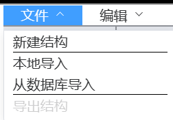
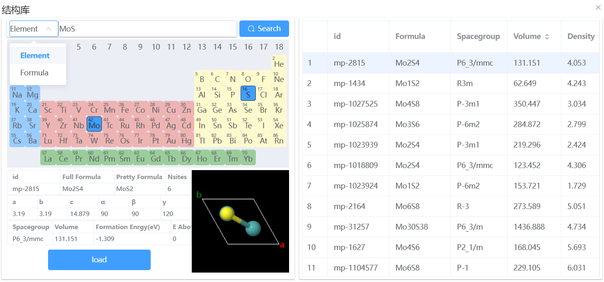

# 文件菜单

<!--  -->

文件菜单栏下有四个选项，对应三个功能：

- 新建结构：点击该选项将出现 New Tab 可视化页面，后续在该页面中建模；
- 结构导入：从已有结构中导入结构文件；
  - 本地导入：支持 `pwmat`、`cif`、`vasp` 格式；
  - 从数据库导入：PWmat 提供的数据库接口，可根据元素或化学式结构；
- 结构导出：可将结构导出到 Q-Flow 工作流，也可以导出到本地。支持导出`pwmat`、`cif`、`pdb`、`mol`格式。