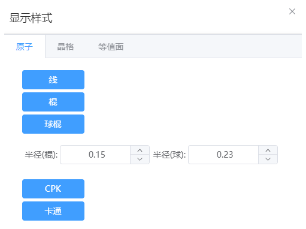
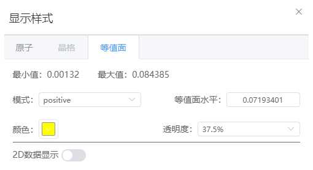
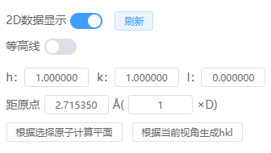

# 显示样式

## 原子

- 线：隐藏原子，以线表示键
- 棍：隐藏原子，以棍表示键
- 球棍：以球表示原子，以棍表示键；可以分别设置球和棍的半径
- CPK：以CPK模型表示
- 卡通：以卡通形式表示，用于蛋白质结构
---
## 晶格

- 显示样式：展示沿A、B、C方向重复后的结构样式，仅支持周期性结构
:::tip NOTE：
仅展示，没有真正发生扩胞行为
:::
- 晶格：可以将晶格设置为实线或虚线，也可以取消展示晶格
- 坐标轴：隐藏或显示坐标轴
---
## 等值面

- 最大值、最小值：展示当前体积数据文件中体积数据的最大和最小值。
- 模式：可选择positive、negative、positive and negative
- 等值面水平：默认为2*sqrt(variance)+ave，其中variance为数据的方差，ave为数据的平均值
- 颜色：指定正值等值面的颜色，若同时选择了negative或positive and negative模式，负值的等值面颜色将为正值的反色。
- 透明度：调整等值面的透明度
- 2D数据显示：打开后将会进行2D体积数据切面展示
  
  
  - 刷新：每次更改2D数据显示设置后，点击刷新才会更新2D切面展示
  - 等高线：打开或关闭等高线
  - hkl：2D切面的hkl
  - 距原点：2D切面距原点O的距离，单位为埃
  - 根据选择原子计算平面：点击后更新hkl和距原点距离，至少选择3个及以上原子
  - 根据当前视角生成hkl：点击后更新hkl和距原点距离
