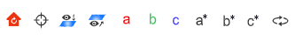
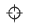

# 快捷操作按钮（视角）

快速调整观察视角

- ：重置视角
- ：设置选中原子的质心为旋转视角时的旋转中心。未选中原子时，则设置结构质心为视角旋转中心，若结构为晶体，则设置分数坐标[0.5,0.5,0.5]的位置为视角旋转中心
- ：俯视观察选中原子 (View onto)
- ：侧视观察选中原子 (View across)
- ：视角沿a轴
- ：视角沿b轴
- ：视角沿c轴
- ：视角沿a*(与bc轴正交)轴
- ：视角沿b*(与ac轴正交)轴
- ：视角沿c*(与ab轴正交)轴
