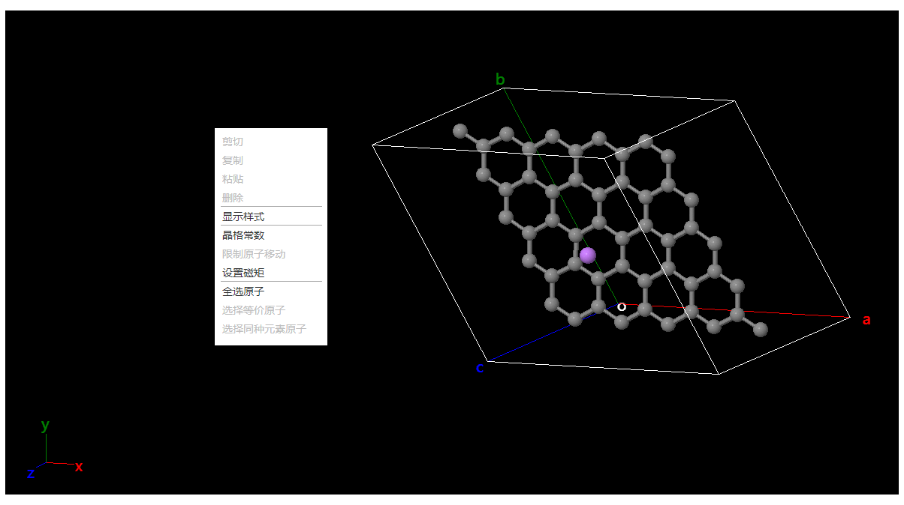

# 可视化区域

## 选择模式

- 在原子上单击鼠标左键：选中单个原子
- 在空白处单击鼠标左键：取消选中
- 按住鼠标左键拖拽鼠标：框选多个原子
- 单击鼠标右键：弹出菜单
  

  - [`剪切` `复制` `粘贴` `删除`](./qstudio_manual_edit)
  - [`显示样式`](./qstudio_manual_view_display)
  - [`晶格常数`](./qstudio_manual_settings_latticeconstant)
  - [`限制原子移动`](./qstudio_manual_settings_fixatom)
  - [`设置磁矩`](./qstudio_manual_settings_magmom)
  - [`全选原子` `选择等价原子` `选择同种元素原子`](./qstudio_manual_select)
- 按住鼠标右键移动鼠标：旋转视角
- 键盘`↑` `↓` `←` `→`：按固定角度旋转视角，旋转的角度在[平移与旋转](./qstudio_structtools)弹窗中定义
- 键盘Delete：删除选中原子

## 观察模式

- 在原子上单击鼠标左键：选中单个原子
- 在空白处单击鼠标左键：取消选中
- 按住鼠标左键拖拽鼠标：旋转视角
- 单击鼠标右键：弹出菜单
- 按住鼠标右键移动鼠标：旋转视角
- 键盘`↑` `↓` `←` `→`：按固定角度旋转视角，旋转的角度在[平移与旋转](./qstudio_structtools)弹窗中定义
- 键盘Delete：删除选中原子

## 平移模式

- 在原子上单击鼠标左键：选中单个原子
- 在空白处单击鼠标左键：取消选中
- 按住鼠标左键拖拽鼠标：平移视角
- 单击鼠标右键：弹出菜单
- 按住鼠标右键移动鼠标：旋转视角
- 键盘`↑` `↓` `←` `→`：按固定角度旋转视角，旋转的角度在[平移与旋转](./qstudio_structtools)弹窗中定义
- 键盘Delete：删除选中原子

## 拖拽原子模式

- 在原子上按住鼠标左键拖拽鼠标：拖拽原子移动
- 在空白处按住鼠标左键移动鼠标：旋转视角
- 按住鼠标右键移动鼠标：旋转视角
- 键盘`↑` `↓` `←` `→`：按固定角度旋转视角，旋转的角度在[平移与旋转](./qstudio_structtools)弹窗中定义

## 拖拽分子模式

- 在属于分子的某个原子上按住鼠标左键拖拽鼠标：拖拽分子移动
- 在空白处按住鼠标左键移动鼠标：旋转视角
- 按住鼠标右键移动鼠标：旋转视角
- 键盘`↑` `↓` `←` `→`：按固定角度旋转视角，旋转的角度在[平移与旋转](./qstudio_structtools)弹窗中定义

## 测量模式

- 在原子上单击鼠标左键：开始/结束测量
- 在空白处按住鼠标左键移动鼠标：旋转视角
- 按住鼠标右键移动鼠标：旋转视角
- 键盘`↑` `↓` `←` `→`：按固定角度旋转视角，旋转的角度在[平移与旋转](./qstudio_structtools)弹窗中定义