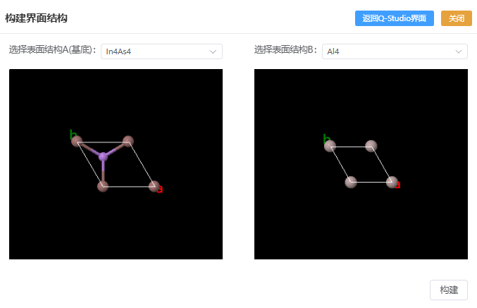
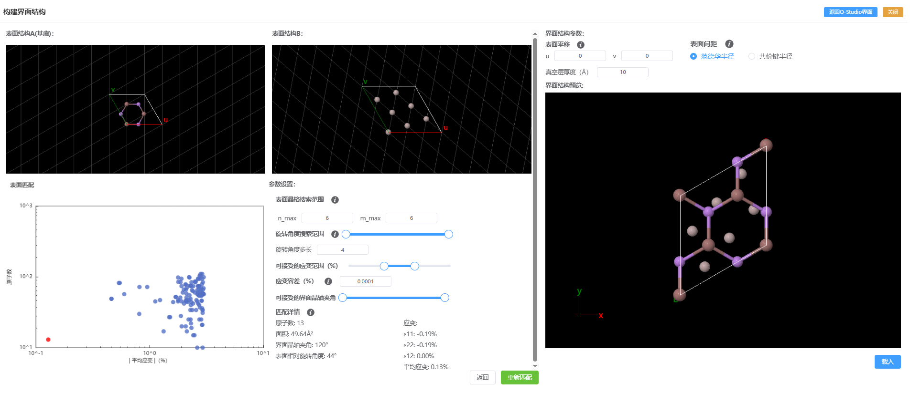

# 构建界面结构
自动搜索两个表面结构的最佳晶格匹配方案，计算应变分布并生成低应变界面模型，支持设置晶格搜索范围、旋转角度、应变容差等参数，并提供界面平移和真空层厚度调节功能。


- 选择表面结构：需要选择有晶格的结构，满足α=β=90°
- 点击构建后开始表面匹配计算

```
注：在表面匹配过程中，可点击返回Q-Studio界面进行其他操作。之后可点击右上角‘返回构建界面’
```

---
计算完成后返回表面匹配结果，点击图中的数据点可查看详细的匹配信息，和该匹配情况下各表面的晶格变换后的结构。


- 表面晶格搜索范围：使用CSL(coincidence site lattice)方法对两种表面进行匹配，可选取的表面晶格矢量 为nv₁ + mv₂ 。其中向量 v₁ 和 v₂ 为表面结构B的表面基矢，整数 n 和 m 的取值区间分别为 -n_max 至 n_max 以及 0 至 m_max。
- 旋转角度搜索范围：两表面的相对旋转角度。较大的步长可缩短计算时间，但可能遗漏相关匹配结果。
- 旋转角度步长：角度搜索时的步长
- 可接受的应变范围：不在设定应变值范围内的匹配结果会被滤除
- 应变容差：匹配结果中，应变差异在该范围内的匹配结果将被视为等同（仅保留最优结构）。
- 可接受的界面晶轴夹角：不在设定界面晶轴夹角范围内的匹配结果会被滤除
- 表面平移：设置界面中两表面之间的相对平移（分数坐标）
- 真空层厚度：设置界面两端的真空层厚度

```
注：载入界面结构后，可点击右上角‘返回构建界面’
```