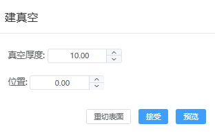

# 切表面
通过设置hkl晶面指数，从晶体结构建立表面，可调节slab的偏移量、厚度和真空层参数。

- 定义表面晶格：输入所切表面的hkl信息
- 位置：
  - 偏移：切面相对原点O的偏移量/原结构在切面法向上的投影长度
  - 厚度：slab的厚度/原结构在切面法向上的投影长度
- 切表面：点击后切换到建真空界面

---

  - 真空厚度：为slab添加真空层
  - 位置：slab质心在新建晶格中的位置
  - 重切表面：点击后返回到切表面界面
  - 预览：预览添加真空层后的结构
  - 接受：加载当前预览结构并关闭弹窗