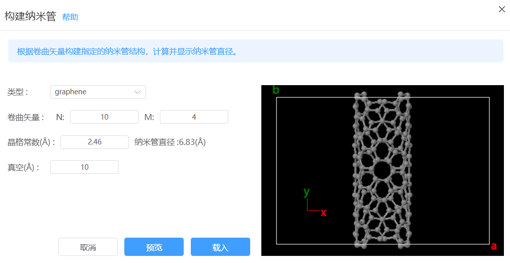
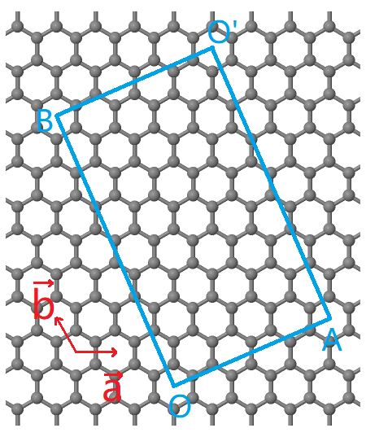

# 构建纳米管
根据卷曲矢量构建指定的纳米管结构，计算并显示纳米管直径。

- 类型：graphene（石墨烯）、h-BN（氮化硼）、MoS2（二硫化钼）
- 卷曲矢量：定义卷曲矢量OA=*N·a + M·b*，确定矩形区域OAO'B，将其沿OA方向卷曲形成在OB方向具有周期性的纳米管结构。影响纳米管直径。

- 晶格常数：所选类型结构的晶格常数。影响纳米管直径。
- 纳米管直径：根据卷曲矢量和晶格常数计算并显示纳米管的直径，单位为埃。
- 真空：纳米管周围的真空层厚度。