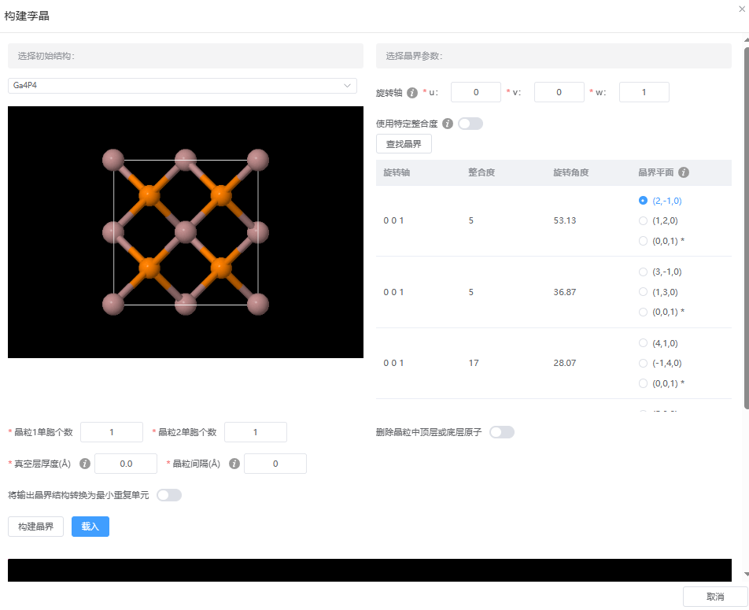

# 构建孪晶
创建具有特定晶界结构的双晶体系，通过旋转轴和Σ值参数生成巧合位点晶格(CSL)，并提供晶粒调控、原子层删减和真空层设置功能。"

- 选择初始结构：需为晶体，立方晶系

- 选择晶界参数
  - 旋转轴：从初始结构构建两个晶粒时使用的共同旋转轴(u, v, w)。3个数不可同时为0
  - 使用特定整合度：设置Σ值，巧合位点晶格(coincidence site lattice, CSL)单胞与旋转轴单胞的体积比。
  - 查找晶界：点击后返回满足条件的CSL列表，其中带*号的晶界平面为扭转晶界（两晶粒沿旋转轴方向拼接）

- 构建晶界
  - 晶粒单胞个数：晶粒的重复单元
  - 删除晶粒中顶层或底层原子：根据设置的层间距，删除晶粒中顶层或底层的原子
  - 真空层厚度：为构建后的孪晶添加真空
  - 晶粒间隔：手动控制两晶粒之间的距离
  - 将输出晶界结构转换为最小重复单元：执行对称性检查，返回原胞