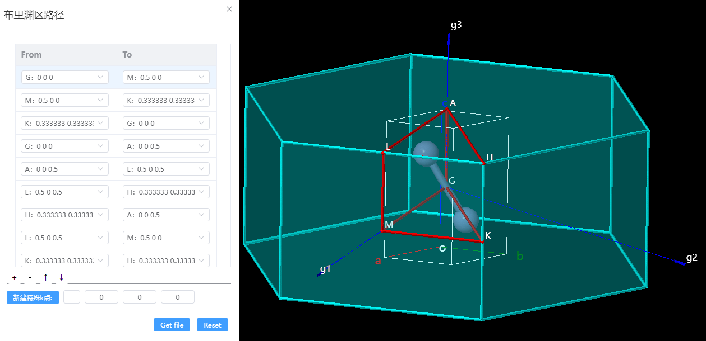
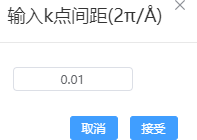

# 布里渊区路径

根据对称性信息，将倒格矢、第一布里渊区、布里渊区内的高对称K点及其路径进行可视化。编辑高对称点路径后可以输出为PWmat格式的高对称点路径文件。
```
注：需使用原胞（Primitive cell）生成布里渊区路径
```


- 生成：点击后，根据对称性信息，可视化倒格矢、第一布里渊区，返回自动生成的高对称K点及其路径信息。

- 调整路径：点击 ‘+’、‘-’ 增加、删除路径，点击 ‘↑’、‘↓’ 上移、下移路径。输入特殊K点符号和位置后点击‘新建特殊K点’，可以在编辑路径时选中新建的特殊K点。
  
- Get file:输入k点间距，再点击接受会将高对称点路径文件gen.kpt导出到本地。
