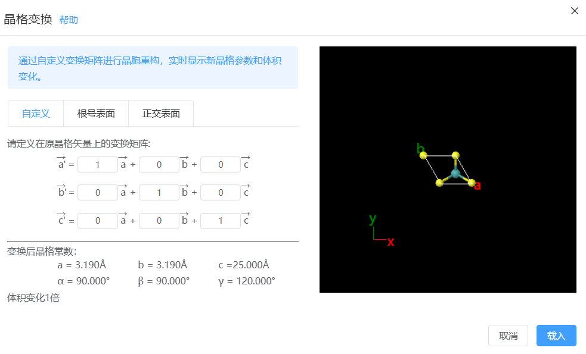
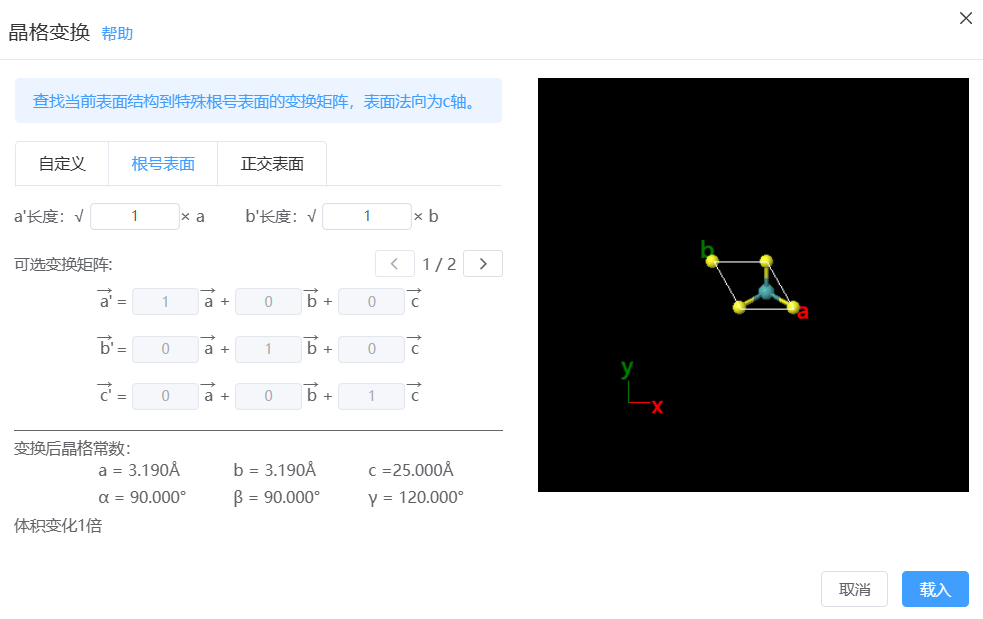
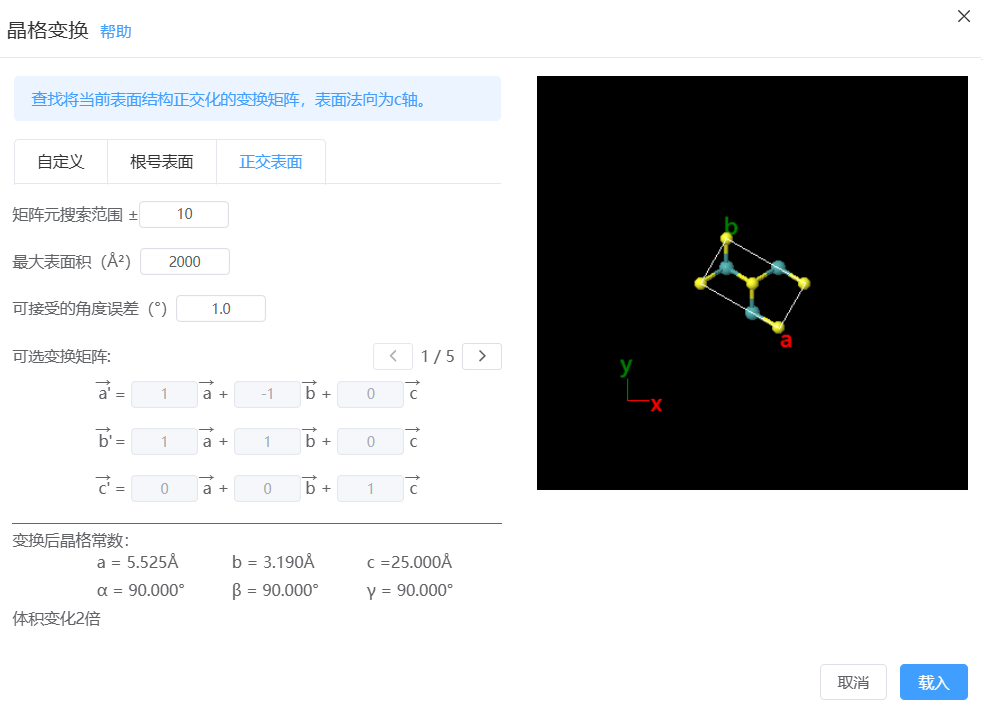

# 晶格变换

## 自定义

通过自定义变换矩阵进行晶胞重构，实时显示新晶格参数和体积变化。

- 定义变换矩阵：TransMatrix。假设原晶格矢量矩阵为LattMatrix，晶格变换后的新晶格矢量矩阵=TransMatrix@LattMatrix
- 变换后晶格信息：展示变换后的晶格常数和体积变化量。
- 载入：会将变换后结构替代现有结构。

## 根号表面

查找当前表面结构到特殊根号表面的变换矩阵，表面法向为c轴。

- a'长度，b'长度：输入根号表面的a'和b'轴相对于原结构a和b轴的根号倍数。
- 可选变换矩阵：根据输入返回所有满足条件的变换矩阵。
- 变换后晶格信息：展示变换后的晶格常数和体积变化量。
- 载入：会将变换后结构替代现有结构。

## 正交表面

查找将当前表面结构正交化的变换矩阵，表面法向为c轴。

- 矩阵元搜索范围：输入变换矩阵中矩阵元的遍历范围，用来查找所有满足条件的变换矩阵。
- 最大表面积：对搜索条件加以限制，变换后的结构的表面积需小于该值
- 可接受的角度误差：允许变换后的结构的γ角度在90°左右的误差范围内浮动
- 可选变换矩阵：根据输入返回所有满足条件的变换矩阵。
- 变换后晶格信息：展示变换后的晶格常数和体积变化量。
- 载入：会将变换后结构替代现有结构。