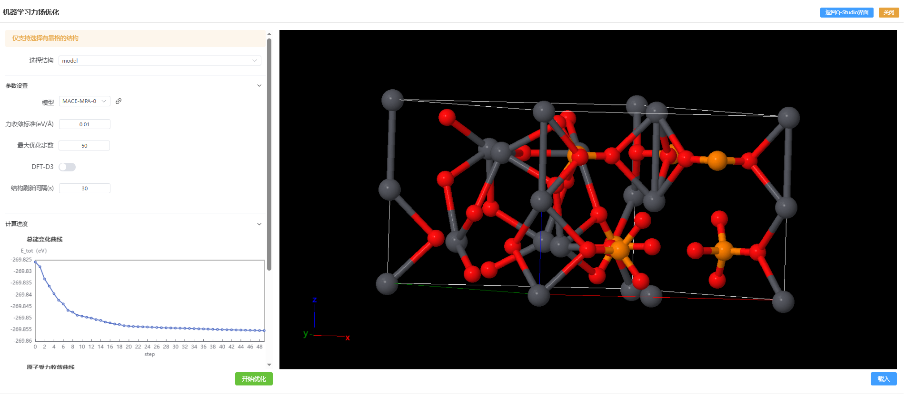

# 机器学习力场优化

- 选择结构：仅支持选择有晶格的结构

---

- 参数设置
  - 模型：[MACE-MPA-0](https://github.com/ACEsuit/mace?tab=readme-ov-file#latest-recommended-foundation-models)
  - 力收敛标准：在达到标准后计算停止
  - 最大优化步数：在达到最大优化步数后计算停止
  - DFT-D3：考虑范德华力
    - damping
    - 截断半径
  - 结构刷新间隔：定时刷新优化后结构

- 计算进度：可查看计算过程中总能、力收敛情况
- 载入：将当前结构载入到Q-Studio

```
注：在优化过程中，可点击返回Q-Studio界面进行其他操作。之后可点击右上角‘返回机器学习力场优化’
```