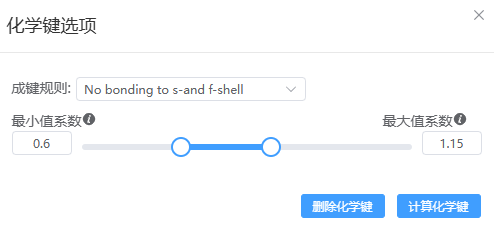

# 化学键选项

- 成键规则：
  - No bonding to s- and f-shell：第1、2列元素（H除外），以及镧系锕系元素禁止成键
  - No bonding to d-shell：第1、2列元素（H除外），过渡金属元素，以及镧系锕系元素禁止成键
  - Include All Elements：所有元素均可成键
  - Tetrahedral：O、S元素禁止成键
  - Anions：Al、Si、P元素禁止成键
- 最小值系数：最小成键半径=共价键半径*最小值系数
- 最大值系数：最大成键半径=共价键半径*最大值系数