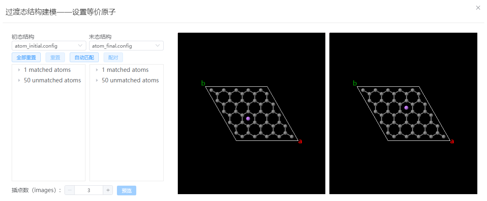
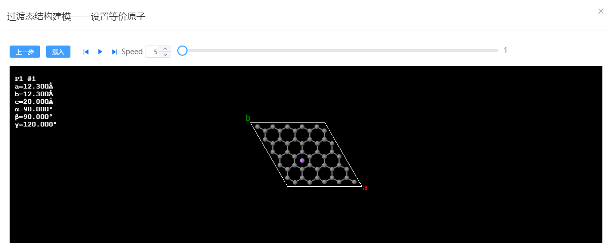

# 过渡态结构建模

## 设置等价原子

- 初态结构：必须为有格子的结构，晶格常数、各元素原子总数需要和末态结构一致
- 末态结构：必须为有格子的结构，晶格常数、各元素原子总数需要和初态结构一致
- 全部重置：将所有配对原子重置
- 重置：将当前所选配对原子重置
- 自动匹配：根据序号和元素自动配对原子
- 配对：将当前所选原子配对
- 插点数：过渡态中的插点个数，默认将采用线性插值
- 预览：完成所有原子配对后可点击进入预览窗口
  
## 预览

- 播放：点击上一帧、下一帧、播放按键或滑动滑块可以预览过渡态结构
- 上一步：如果预览时发现匹配有误可返回上一步重新进行等价原子配对
- 载入：确认无误后将过渡态结构导入新窗口

## 微调结构
  载入后的结构，可以逐帧微调各image中原子的位置，以调整初始迁移路径。初态和末态结构不允许调整
