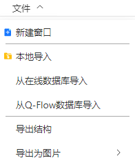

# 文件菜单

- 新建窗口：在结构导航栏新建 New Tab 标签，生成空白的可视化页面并激活
- 本地导入：从本地导入文件，周期性体系支持 `pwmat`、`config`、`cif`、`vasp`、`xsf` 格式；非周期性体系支持`pdb`、`xyz`、`mol`格式；轨迹动画格式支持`xsf`、`MOVEMENT`；电荷密度文件格式支持`xsf`、`jvxl`；振动模式文件格式支持`band.yaml`
- [从在线数据库导入](../%E5%B7%A5%E5%85%B7/qstudio_online_database.md)
- [从Q-Flow数据库导入](../%E5%B7%A5%E5%85%B7/qstudio_qflow_database.md)
- [导出结构](../%E5%B7%A5%E5%85%B7/qstudio_export_structure.md)
- 导出为图片：将当前窗口的当前视角保存为图片，支持`jpg`、`png`格式

