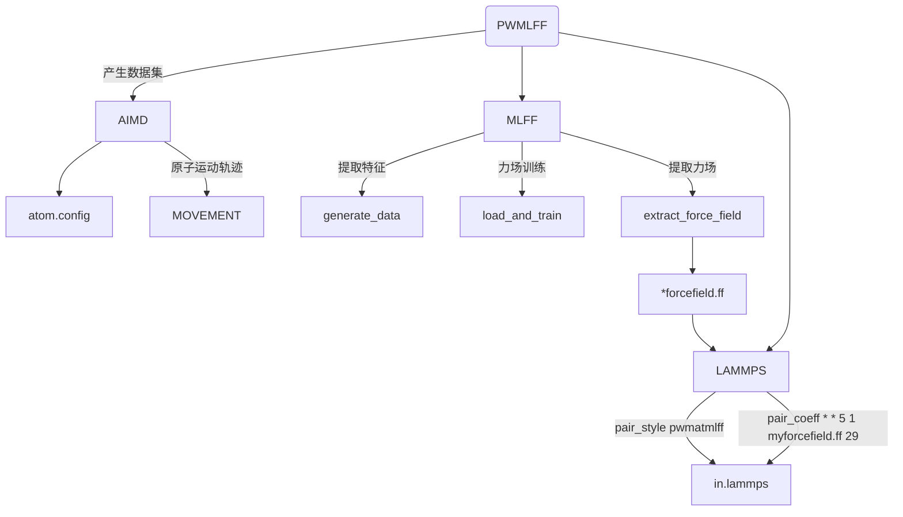
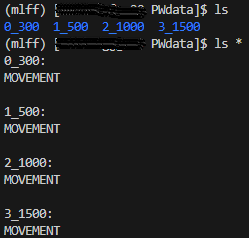
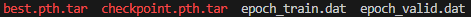
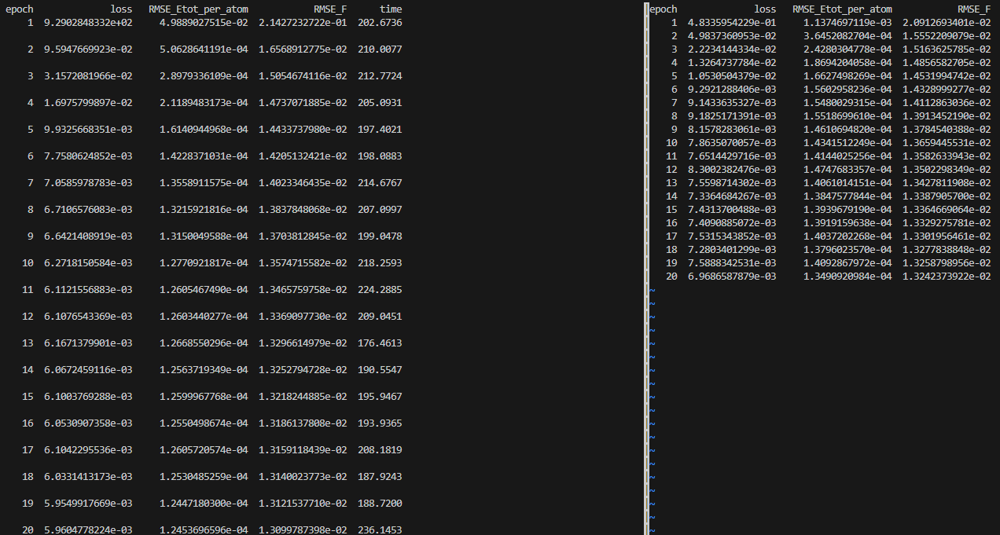

# Bulk Cu system

下文将以 Cu 系统为例，介绍如何使用 **PWMLFF Deep Potential** 模型进行训练及 lammps 模拟。

（补充简介）

整个过程分为以下几个步骤：



## 1. 产生数据集

以 PWmat AIMD 模拟得到的 Cu 数据为例，数据文件为`MOVEMENT`，包含 1000 个结构，每个结构包含 72 个 Cu 原子。

**etot.input**输入文件示例：

```bash
8  1
JOB = MD
MD_DETAIL = 2 1000 1 300 300
XCFUNCTIONAL = PBE
ECUT = 60
ECUT2 = 240
MP_N123 = 2 2 3 0 0 0 3
ENERGY_DECOMP = T
IN.ATOM = atom.config
IN.PSP1 = Cu.SG15.PBE.UPF
OUT.STRESS = T
```

- 必选项`ENERGY_DECOMP`：把总 DFT 能量分解为属于每个原子的能量（原子能量）。即原子能量的总和将等于总的 DFT 能量。结果输出在`MOVEMENT`文件中。
- 可选项`OUT.STRESS`：是否输出应力信息，如需训练`Virial`，则需要将其设置为`T`。
- 其他参数含义参考[PWmat manual](http://www.pwmat.com/pwmat-resource/Manual.pdf)。

## 2. 训练力场

### 2.1 准备数据集

新建目录`PWdata`，将`MOVEMENT`文件复制到该目录中。
:::tip NOTE
如果有多个`MOVEMENT`文件，需要在`PWdata`目录下分别新建目录（名称任意），并将 `MOVEMENT` 文件分别放入其中。每个目录只能放一个`MOVEMENT`。程序会自动识别。



:::

### 2.2 输入文件

在`PWdata`同级目录下，新建`main.py`文件，通过该文件提取特征并训练力场。

输入文件示例：

```python
from PWmatMLFF.dp_network import dp_network

if __name__ == "__main__":

    atom_type = [29]

    """
        command line option:
        python main.py --gpu 0 -b 10 --opt LKF --epochs 20 -s record
    """

    dp_trainer = dp_network(
                            atom_type = atom_type,
                            optimizer = "LKF",
                            gpu_id = 0,
                            session_dir = "record",
                            n_epoch = 20,
                            batch_size = 10,
                            max_neigh_num = 100,
                            Rmax = 6.0,
                            Rmin = 0.5,
                            M2 = 16,
                            block_size= 10240,
                            is_resume = False,
                            # model_name = 'checkpoint.pth.tar',
                            pre_fac_force = 1.,
                            pre_fac_etot = .5,
                            embedding_net_size = [25, 25, 25],
                            fitting_net_size = [50, 50, 50, 1],
                           )
    # pre-process trianing data. ONLY NEED TO BE DONE ONCE
    dp_trainer.generate_data()

    # load data and train
    dp_trainer.load_and_train()

    dp_trainer.extract_force_field("1.ff")

```

- `atom_type`：原子类型，Cu 的原子序数为 29。
- `optimizer`：优化器，可选项为`LKF`、`ADAM`。默认为`ADAM`，此时建议使用更多的 epoch，如 1000。
- `gpu_id`：使用的 GPU 编号，目前仅支持单 GPU 训练。
- `session_dir`：训练过程中的记录文件保存目录。具体文件说明见下文。
- `n_epoch`：训练迭代次数。根据`MOVEMENT`总的 images 数量修改,images 少时可适当增加,如 50。
- `batch_size`：用于产生特征的数据大小。如 1, 2, 5, 10。
- `max_neigh_num`：最大近邻原子数。
- `Rmax`：DP 平滑函数最大截断半径。
- `Rmin`：DP 平滑函数最小截断半径。
- `M2`：DP 模型网络参数。决定 embedding net 输出尺寸(25\*16), fitting net 输入尺寸(400)。
- `block_size`：KF 优化器参数。保持默认即可。
- `is_resume`：是否从上次训练中断/完成处继续训练。
- `model_name`：模型名称，结合`is_resume`用于继续训练。
- `pre_fac_force`：用于 KF 训练时的更新力的缩放因子。
- `pre_fac_etot`：用于 KF 训练时的更新总能的缩放因子。
- `embedding_net_size`：embedding net 网络结构。保持默认即可。
- `fitting_net_size`：fitting net 网络结构。保持默认即可。

:::tip NOTE
以下三个函数可根据需要选择执行：

- dp_trainer.generate_data() - 用于产生特征，仅需运行一次。例如需要重新训练,修改相应的设置后,只需注释掉该行再次执行程序即可。
- dp_trainer.load_and_train() - 用于加载特征,对特征进行处理后训练力场。
- dp_trainer.extract_force_field("1.ff") - 用于提取力场,并生成`1.ff`文件。可自行修改文件名。

:::

### 2.3 运行

以下适用于 Mcloud,提交任务时确保已经加载必要的环境和模块。

```bash
#!/bin/sh
#SBATCH --partition=q4
#SBATCH --job-name=mlff
#SBATCH --nodes=1
#SBATCH --ntasks-per-node=1
#SBATCH --gres=gpu:1
#SBATCH --gpus-per-task=1

python main.py > log
```

申请到 gpu 节点的用户可以直接在命令行运行：

```bash
python main.py
```

---

在训练期间，可以通过检查指定的目录中(`/record`)的日志来查看训练情况。

该目录下存在以下四个文件:



- `best.pth.tar` 和 `checkpoint.pth.tar` 为模型文件，用于继续训练。分别对应于最佳模型和最后一次训练的模型。
- `epoch_train.dat` 和 `epoch_valid.dat` 日志文件中包含每个 epoch 的训练误差和验证误差。

:::info epoch_train.dat&epoch_valid.dat



- `loss` 对应训练总误差
- `RMSE_Etot_per_atom` 对应训练能量误差
- `RMSE_F` 对应训练力误差

<font color='red'>如果训练集的误差比验证集的误差明显偏小,表明训练过拟合,可适当增加训练集的大小或调整 batch_size 的数量。</font>

:::

## 3. Lammps 模拟

将训练完成后生成的`*.ff`力场文件用于 lammps 模拟。（需使用重新编译修改的[版本](https://github.com/LonxunQuantum/Lammps_for_PWMLFF)）

为了使用 PWMLFF 生成的力场文件，需要在 lammps 的输入文件中设置以下内容：

```bash
pair_style      pwmatmlff
pair_coeff      * * 5 1 ./1.ff 29
```

其中`5`表示使用 DP 模型产生的力场，`1`表示读取 1 个力场文件，`1.ff`为 PWMLFF 生成的力场文件名称，`29`为 Cu 的原子序数。

如果有多个力场文件（如主动学习时），(例如 3 个)可以修改为：

```bash
pair_style      pwmatmlff
pair_coeff      * * 5 3 ./1.ff ./2.ff ./3.ff 29
```
