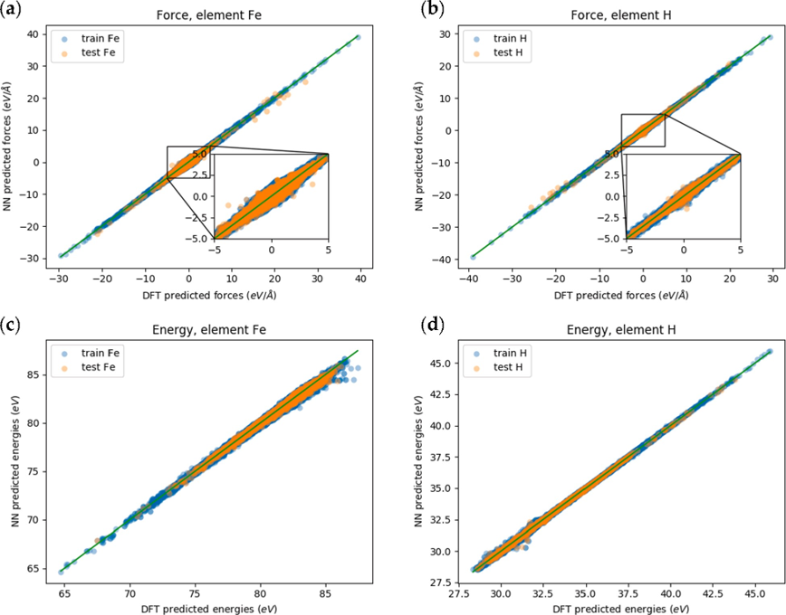
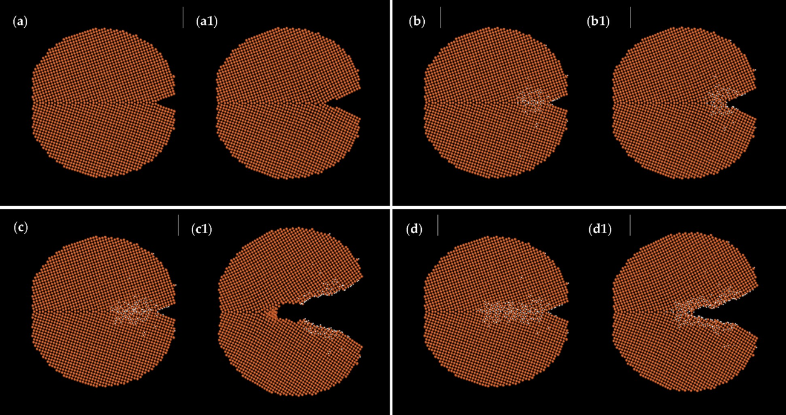
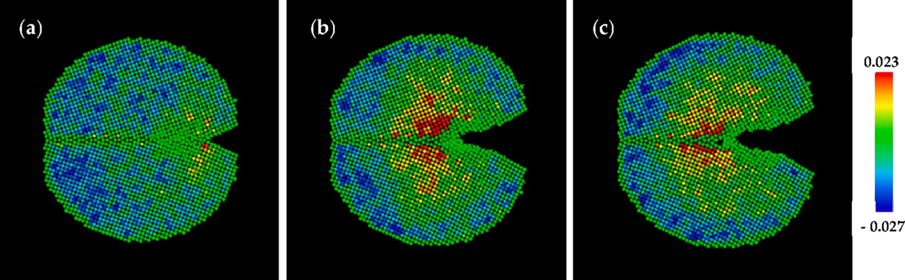
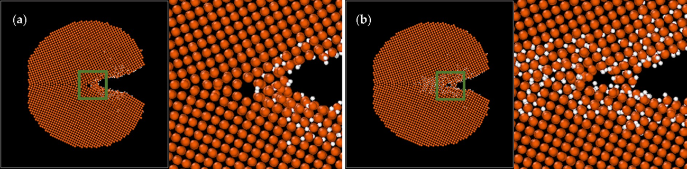

## Fe-H System Force Field

[[Reference: Machine learning force field for Fe-H system and investigation on role of hydrogen on the crack propagation in α-Fe]](https://www.osti.gov/pages/biblio/1882447-machine-learning-force-field-fe-system-investigation-role-hydrogen-crack-propagation-fe)

This example examines the effect of hydrogen on crack propagation in α-Fe using a machine-learning force field. The study: (1) constructs a neural-network force field for the Fe-H system from density-functional-theory data and demonstrates sound statistical and dynamical behavior; (2) uses molecular dynamics to show that higher hydrogen concentrations at a crack tip accelerate crack propagation; (3) observes microvoid formation near crack tips in specimens containing grain boundaries, which relieves tensile stress and promotes propagation, although microvoid formation appears only weakly related to hydrogen; (4) finds faster propagation in structures with shorter periodicity along x, possibly because of cooperative effects; (5) shows a stronger hydrogen effect than embedded-atom models, highlighting the importance of accurately describing hydrogen-metal interactions; and (6) identifies hydrogen accumulation at crack tips as a key factor in hydrogen-embrittlement cracking.

Model-fitting accuracy.

Molecular-dynamics simulations of a system with a tilted grain boundary. Panels (a, a1) show the initial and final frames without hydrogen; (b, b1), (c, c1), and (d, d1) show the initial and final frames at total hydrogen concentrations of 0.709%, 1.097%, and 1.856%, respectively.

Volumetric-strain distribution for the system with a total hydrogen concentration of 1.097%: (a) initial frame and (b) frame at approximately 6000 fs.

Volumetric-strain distribution for the system with a total hydrogen concentration of 1.097%: (a) initial frame and (b) frame at approximately 6000 fs.

For additional results, see [Machine learning force field for Fe-H system and investigation on role of hydrogen on the crack propagation in α-Fe](https://www.osti.gov/pages/biblio/1882447-machine-learning-force-field-fe-system-investigation-role-hydrogen-crack-propagation-fe).
