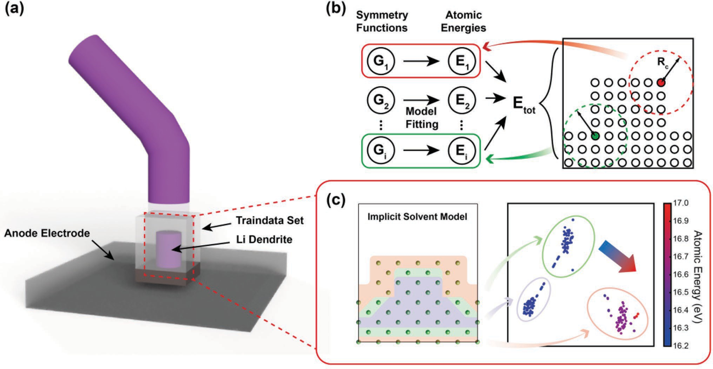
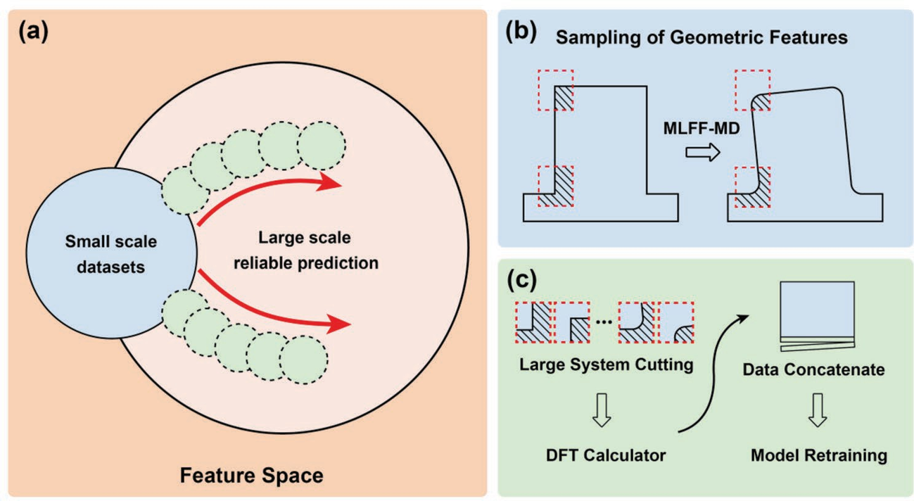
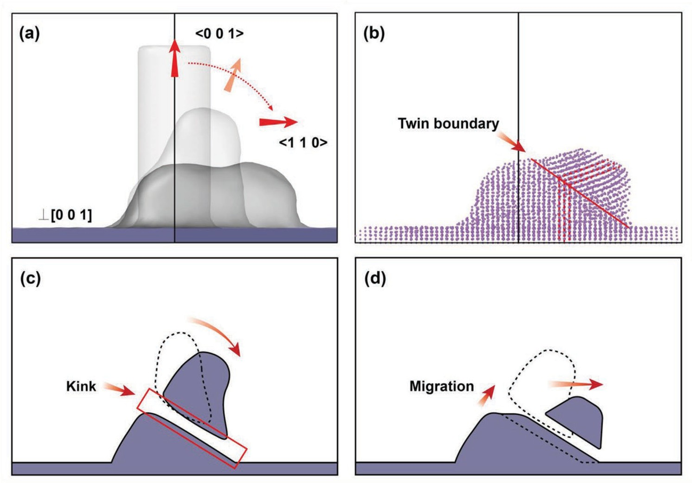
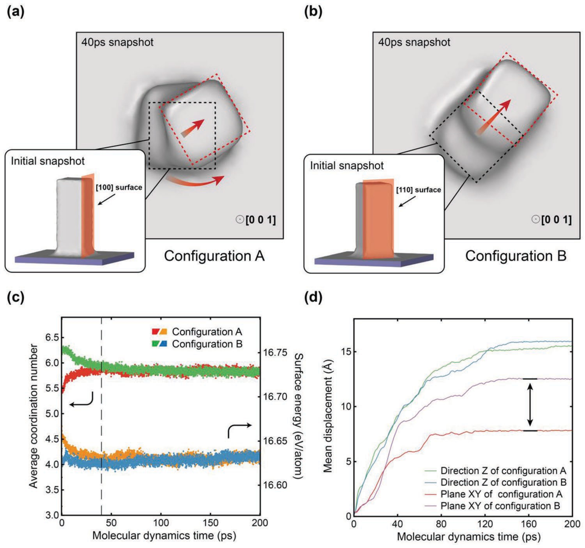

## Morphological Evolution of Lithium Dendrites

For details, see the [[Lonxun WeChat article]](https://mp.weixin.qq.com/s/kapzIrPvL2AcGTUzdHgglg) and [[Revealing Morphology Evolution of Lithium Dendrites by Large-Scale Simulation Based on Machine Learning Force Field]](https://iopscience.iop.org/article/10.1088/1367-2630/acf2bb).

Lithium-ion batteries offer high energy density and are widely used in electric vehicles and large-scale energy-storage systems. Lithium-metal anodes combine the lowest chemical potential with high capacity and are therefore promising for next-generation batteries with higher specific energy. During repeated charge-discharge cycles, however, lithium-metal anodes undergo dendrite growth and severe volume changes. Dendrites reduce Coulombic efficiency, energy density, and stability; once sufficiently long, they may pierce the separator, contact the cathode, and cause a short circuit or fire. Controlling dendrite growth is therefore essential to the development of lithium-metal anodes.

Advances in transmission electron microscopy (TEM) allow direct observation of lithium-dendrite morphology and phase structure. Nevertheless, limited spatial and temporal resolution leaves the dynamics of morphological evolution poorly understood. Existing simulations typically use phase-field methods or empirical force fields, whose limited accuracy makes it difficult to predict realistic dendrite morphologies. Large-scale simulations with atomistic accuracy are therefore needed.

Machine-learning methods trained on quantum-chemical calculations provide both accuracy and speed. A force field trained on accurate small-system data can extend simulations of alkali metals and other materials toward mesoscopic or even macroscopic scales. Potential-energy-surface data may also come from density-functional-theory calculations that represent realistic environments, such as lithium atoms in an implicit electrolyte, making realistic dendrite-evolution simulations possible.

This example uses molecular dynamics driven by a `MatPL machine-learning force field` to simulate the morphological evolution of lithium dendrites in an electrolyte environment. It reveals the dendrite-growth mechanism and supports the development of lithium-metal anode materials.

**Accelerating model development with DFT-accuracy atomic-energy labels**

(a) Composition of the small-scale dendrite dataset; (b) MLFF architecture; and (c) cross-sectional view of the body-centered-cubic structure and visualization of descriptor-atomic-energy relationships.

**Active-learning and validation strategy for cross-scale force-field applications**

Schematic of active learning for cross-scale simulations: (a) data sampling during active-learning model expansion; (b) sampling key changing regions from MLFF molecular-dynamics trajectories; and (c) DFT labeling of the selected regions followed by model retraining.

**Morphological evolution and driving-force analysis for dendrites with different initial configurations**

 **Morphological evolution of a cylindrical structure**

**Morphological evolution of rectangular structures with different exposed surfaces**
