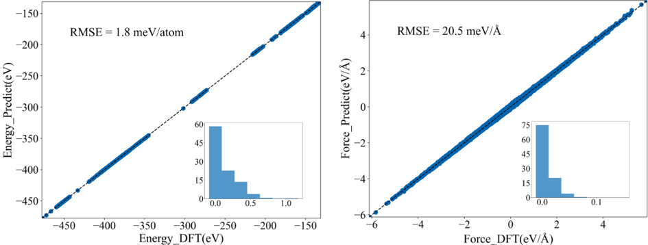
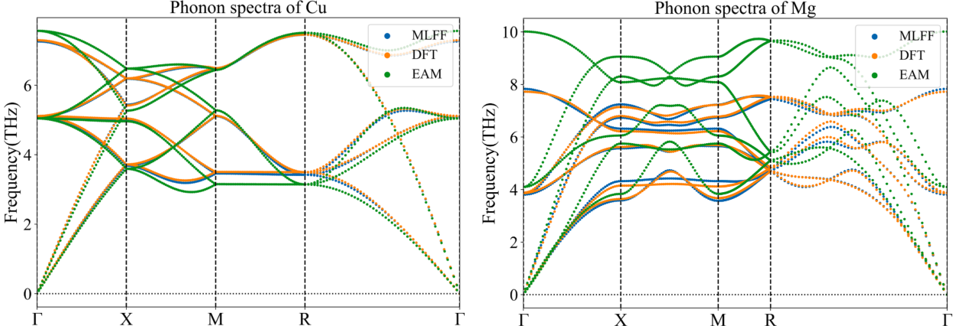
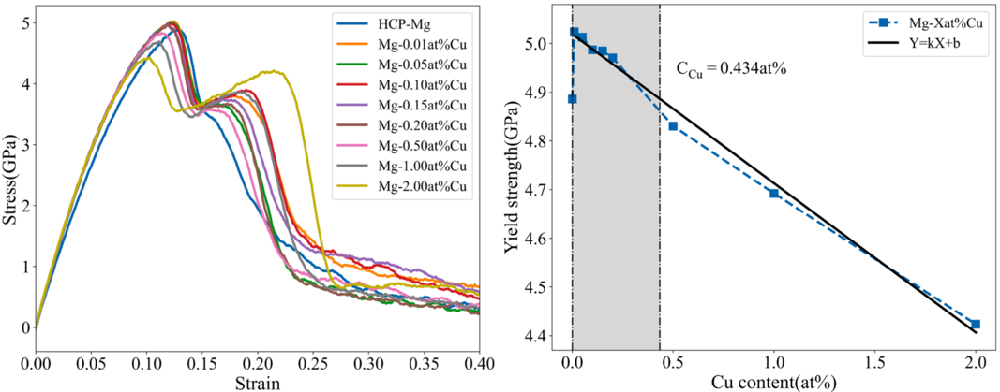
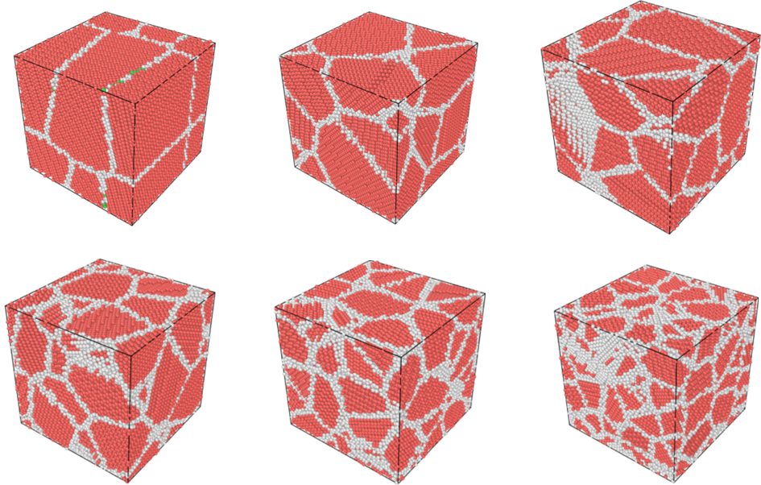
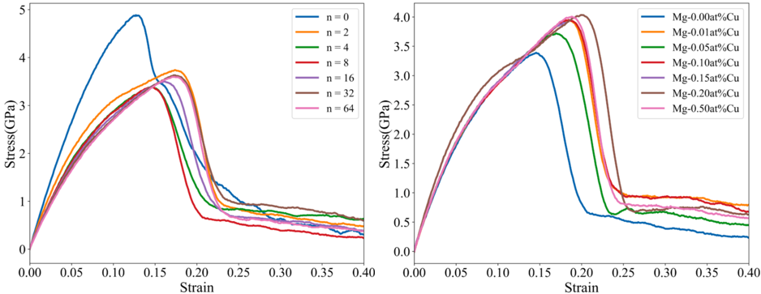

## Mg-Cu Alloy Force Field
Xingze Gen, Lin-Wang Wang, and Xiangying Meng. Comput. Mat. Sci. 246 (2025) 113486

**Fitting Accuracy**

**Mg and Cu Phonon-Spectrum Tests**

**Yield Strength**

A small amount of Cu increases the alloy's yield strength, whereas higher Cu concentrations reduce it.

**Effect of Grain Count on the Strength of Mg-Cu Alloys**

**Modeling Structures with Different Grain Counts**

**Grain refinement has only a minor effect on alloy strength.**

