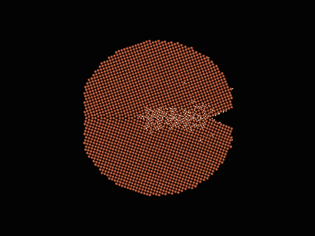
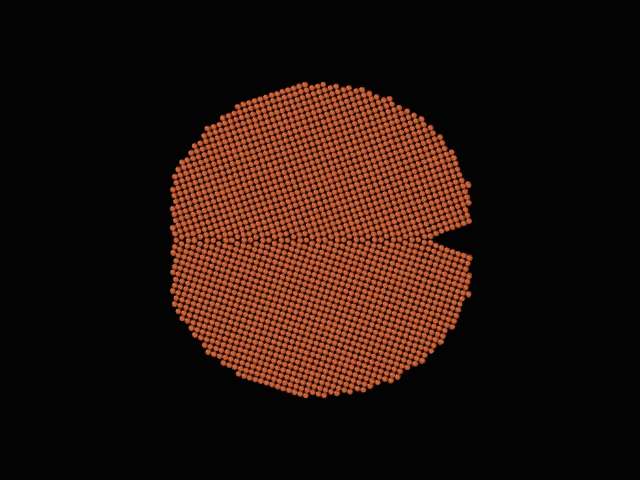

# MatPL Literature Examples
This chapter collects selected MatPL benchmarks and published studies that used MatPL as references for users.

## Selected Literature
The publications associated with these examples are summarized below. See each corresponding section for details.

[1. Comparison of Features](./features.md)

This example compares the ability of the `feature types implemented in MatPL` to represent physical systems. These include `cosine features`, `Gaussian features`, `Moment Tensor Potential (MTP) features`, `Spectral Neighbor Analysis Potential features`, simplified smooth Deep Potential descriptors with `Chebyshev-polynomial` and `Gaussian-polynomial features`, and Atomic Cluster Expansion features. Using a `linear regression model`, the study evaluates training root-mean-square errors (RMSEs) for `atomic-group energies`, `total energies`, and `forces` against density-functional-theory results for `amorphous sulfur` and `carbon` systems. For details about the features, see the [Feature Wiki](../models/nn/README.md).

For more benchmark details, see the [Lonxun WeChat article](https://mp.weixin.qq.com/s/JjkivADrvUdOE_C9qCuA9g) and the paper [[Accuracy evaluation of different machine learning force field features]](https://iopscience.iop.org/article/10.1088/1367-2630/acf2bb).

<!-- ### [2. LKF and ADAM](./LKF%20vs%20Adam.md)

PWMLFF implements the [[Reorganized-Layer Extended Kalman Filter (LKF) optimizer]](https://arxiv.org/abs/2212.06989) to accelerate neural-network force-field training. LKF improves on the Global Kalman Filter (GKF) by splitting large layers and grouping small layers to reduce computational cost. It approximates the dense weight-error covariance matrix with a sparse block-diagonal matrix, improving efficiency. The authors performed numerical experiments on `13` common systems and compared LKF with the ADAM optimizer. -->
<!-- The results show that LKF `converges faster and achieves slightly higher accuracy` than ADAM. The authors also prove theoretically that the weight updates converge, overcoming the exploding-gradient problem. Overall, LKF is insensitive to weight initialization and performs well for neural-network force-field training. -->

<!-- ### [3. Active Learning](./Active%20Learning.md)
[PWact](../pwact/README.md) (active learning based on MatPL) is our open-source automated active-learning platform for efficient data sampling. PWact implements the widely used multi-model Committee Query strategy and our Kalman-filter-based uncertainty metric, Kalman Prediction Uncertainty (KPU). KPU-based active learning is still in internal testing and is not yet publicly available. This example compares the two sampling approaches. -->

<!-- ### [4. Universal Models (Large Models)](./GNN.md)
GNN-based universal models are emerging rapidly. They can be used out of the box or as foundation models adapted to specialized domains through fine-tuning, distillation, and active learning, substantially reducing the cost of force-field development. We performed several fine-tuning tests on the recently released [[MACE (paper)]](https://arxiv.org/abs/2401.00096). -->

[2. Simulating Liquid-to-Crystal Silicon Growth with a Machine-Learning Force Field](./Si.md)

[[Paper: Liquid-to-crystal Si growth simulation using machine learning force field]](https://pubs.aip.org/aip/jcp/article/153/7/074501/1064762/Liquid-to-crystal-Si-growth-simulation-using)

This example uses PMLFF to simulate silicon-melt growth far from equilibrium. It shows that an MLFF trained on atomic energies decomposed from first-principles calculations (a `PWmat feature`) can accurately reproduce the growth process observed in first-principles simulations.
The work proposes a method for correcting systematic bias during ML-FF training, which is important for accurately predicting key quantities such as phase-transition temperatures.
The results demonstrate that an ML-FF can accurately simulate silicon-melt growth and support its use for far-from-equilibrium simulations.

[3. Machine-Learning Force Field for Fe–H and the Role of Hydrogen in Crack Propagation in α-Fe](./Fe.md)

[[Paper: Machine learning force field for Fe-H system and investigation on role of hydrogen on the crack propagation in α-Fe]](https://www.osti.gov/pages/biblio/1882447-machine-learning-force-field-fe-system-investigation-role-hydrogen-crack-propagation-fe)

This example studies how hydrogen affects crack propagation in α-iron using a machine-learning force field. Its main findings are: 1. A neural-network force field for the Fe–H system was trained on atomic energies from density-functional-theory calculations and exhibits good statistical and dynamical properties. 2. Molecular-dynamics simulations show that increasing the hydrogen concentration at a crack tip accelerates crack propagation, indicating that hydrogen promotes cracking. 3. In samples containing grain boundaries, microvoids form near the crack tip, relieving tensile stress and facilitating crack growth; their formation, however, appears largely unrelated to hydrogen. 4. Crack propagation is faster in structures with a shorter periodic length along the x direction, possibly because of cooperative effects along x. 5. Compared with embedded-atom-potential results, the machine-learning force field reveals a pronounced influence of hydrogen, highlighting the importance of accurately describing hydrogen–metal interactions. 6. Hydrogen accumulation at the crack tip plays a key role in hydrogen-embrittlement crack propagation, motivating further investigation under different conditions.

<!-- For details, see the [Lonxun WeChat article](https://mp.weixin.qq.com/s/WdxQCJ0fMVAL7cjw-g5x-g) and the paper [Revealing Morphology Evolution of Lithium Dendrites by Large-Scale Simulation Based on Machine Learning Force Field](https://onlinelibrary.wiley.com/doi/abs/10.1002/aenm.202202892). -->

<!-- 

  

    
  

  

    
  

 -->

[4. Morphological Evolution of Lithium Dendrites Revealed by Machine-Learning Force-Field MD](./Li.md)

For details, see the [[Lonxun WeChat article]](https://mp.weixin.qq.com/s/kapzIrPvL2AcGTUzdHgglg) and the paper [[Revealing Morphology Evolution of Lithium Dendrites by Large-Scale Simulation Based on Machine Learning Force Field]](https://iopscience.iop.org/article/10.1088/1367-2630/acf2bb).

This example combines a machine-learning force field with a self-consistent continuum-solvation model to simulate the morphological evolution of lithium dendrites in an operating electrolyte. The evolution occurs in two stages. In the first, a decrease in surface-atom energy drives local orientational rearrangement of an initially single-crystal dendrite, producing multiple crystalline domains. In the second, a decrease in internal atomic energy drives those domains to slide along grain boundaries and lowers the grain-boundary energy. The study also examines how different exposed-surface orientations affect dendrite morphology. Overall, reductions in surface and grain-boundary energies drive the morphological evolution.

<!-- #### GNN
#### NEP -->

[5. Mg–Cu Alloy Force Field](./Mg_Cu.md)

[6. Thermal Conductivity of Amorphous Silicon with a Machine-Learning Force Field](./Si_temp.md)

