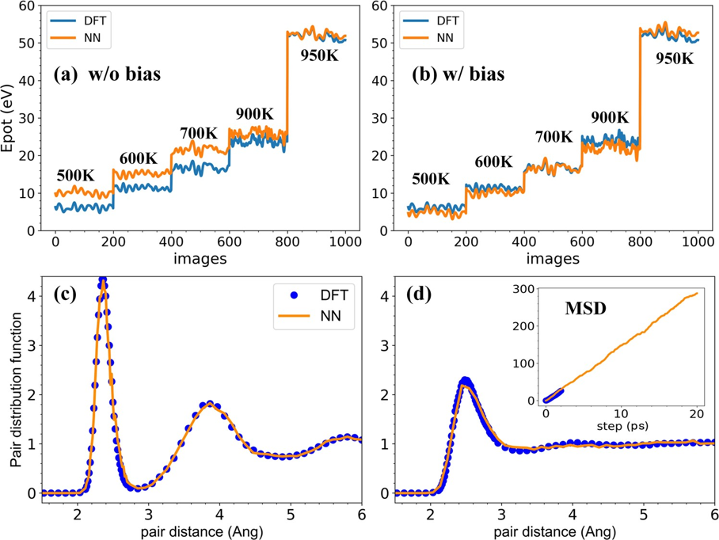
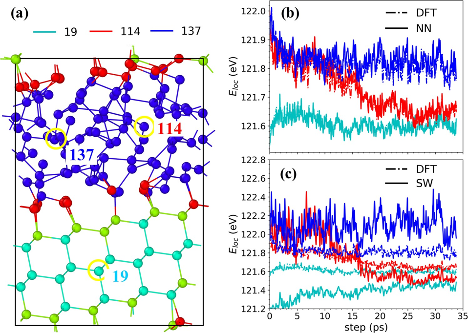
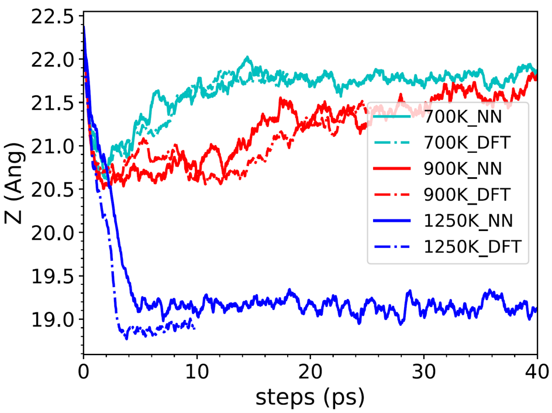
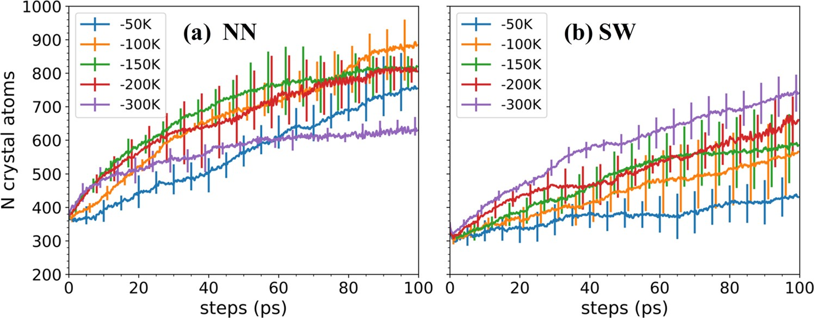

## Silicon Melt-Growth Process

[[Reference: Si growth]](https://pubs.aip.org/aip/jcp/article/153/7/074501/1064762/Liquid-to-crystal-Si-growth-simulation-using)

This example uses PMLFF to simulate silicon melt growth far from equilibrium. It shows that an MLFF trained with atom-resolved energies derived from first-principles calculations (a `PWmat feature`) can accurately reproduce the growth process observed in first-principles simulations. The results demonstrate the suitability of MLFFs for far-from-equilibrium simulations.

Comparison of total energies from NN and DFT: (a) without an offset and (b) with an offset. The x-axis represents snapshots from crystal-growth molecular-dynamics (MD) simulations at different temperatures. The inset in (b) shows the mean-square displacement of the liquid phase at 1500 K. Panels (c) and (d) show the pair-distribution functions of the crystalline phase at 950 K and the liquid phase at 1500 K, respectively.

(a) Supercell structure of a crystalline silicon slab with an FCC (111) surface. (b) Comparison of the local energy, Eloc(t), calculated using DFT, the neural network, and the SW potential (the classical Stillinger-Weber force field).

Growth of the Z dimension over time calculated with DFT and NN models ([features 1 and 2](../models/nn/README.md#spectral-neighbor-analysis-potential-feature-6)).

Growth curves (with error bars) showing the number of crystalline atoms at different ΔT values: (a) neural network and (b) SW potential.
