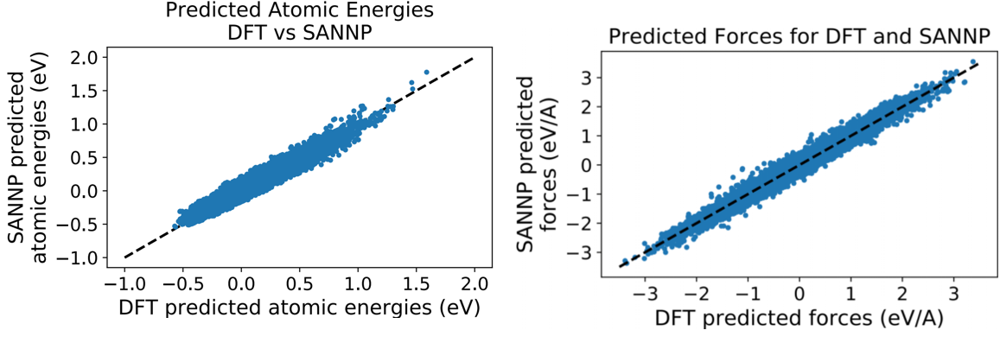
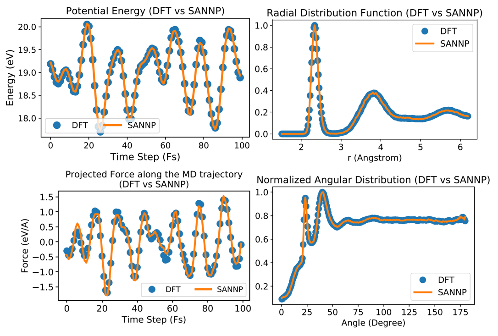
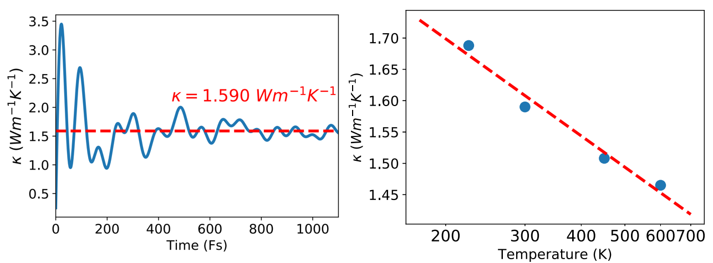

## Calculating the Thermal Conductivity of Amorphous Silicon with a Machine-Learning Force Field

Yufeng Huang et al. Phys. Rev. B 99, 064103 (2019)

**Training-Set Accuracy**

**Test-Set Accuracy**

**Green-Kubo Formula**
$$
\kappa_{\mu\nu}(t)=\frac{1}{k_B T^2 V} \int_{0}^{t} dt' \langle J_\mu(0) J_\nu(t') \rangle
$$

$$
\mathbf{J} = \sum_{i} \mathbf{v}_i E_i + \sum_{i} \mathbf{r}_i \frac{d}{dt} E_i
$$

$$
= \sum_{i} \mathbf{v}_i (K_i + U_i) + \sum_{i} \mathbf{W}_i \cdot \mathbf{v}_i
$$
**Thermal Conductivity**

