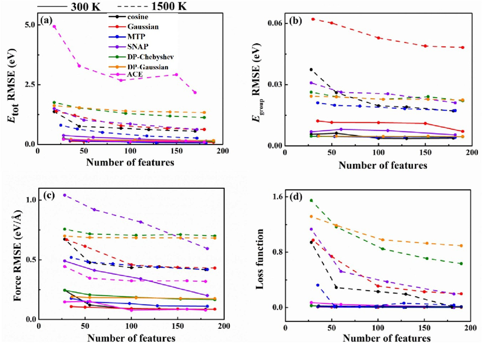
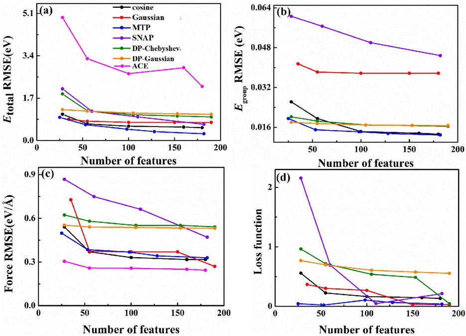
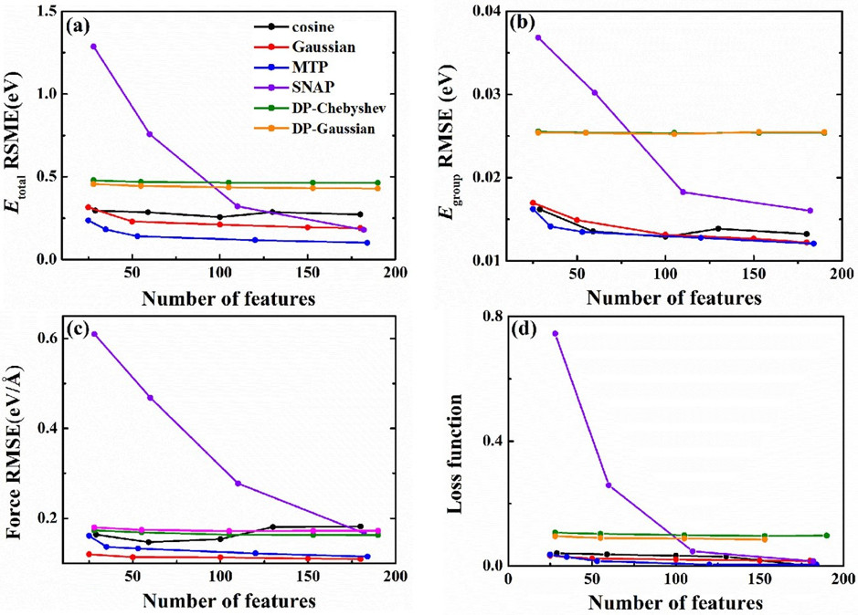

## Comparison of NN Descriptors

[[Article: Accuracy evaluation of different machine learning force field features]](https://iopscience.iop.org/article/10.1088/1367-2630/acf2bb/pdf)

This work compares the ability of the `descriptor types implemented in MatPL` to represent physical systems. The descriptors include `cosine descriptors`, `Gaussian descriptors`, `moment tensor potential (MTP) descriptors`, `spectral neighbor analysis potential descriptors`, simplified smooth deep potentials with `Chebyshev-polynomial descriptors` and `Gaussian-polynomial descriptors`, and atomic cluster expansion descriptors. See the [Feature Wiki](../models/nn/README.md) for details.

For sulfur, NVT AIMD simulations were performed at 300 K and 1500 K. A 2 ps simulation at 300 K produced 2,000 structures. At 1500 K, a 3 ps molecular-dynamics simulation was followed by 2 ps of AIMD to generate the training dataset. Sulfur rings broke during the simulations, providing configurations containing broken bonds.

For carbon, four distinct phases were selected for NVT AIMD simulations from 300 K to 3500 K. High-temperature configurations at 3500 K were added to broaden the configuration space. Each phase was simulated for 1,000 steps, producing a total of 4,000 training structures.

|    System     | Description   | Temperature (K) | Steps (fs) |
|:-------------:|:-------------:|:----------------:|:----------:|
|  Sulfur-300 K | α-S 128 atoms |        300       |    2000    |
| Sulfur-1500 K |   128 atoms   |       1500       |    2000    |
|    Diamond    |    64 atoms   |      300–3500    |    1000    |
|   Graphene    |    64 atoms   |      300–3500    |    1000    |
|  Graphenylene |    64 atoms   |      300–3500    |    1000    |
|    M-carbon   |    64 atoms   |      300–3500    |    1000    |

 **Details and AIMD steps for the sulfur and carbon systems**
 
 **Selected Results**

Training errors for different descriptor types on the sulfur-300 K dataset (solid lines) and sulfur-1500 K dataset (dashed lines): (a) total energy, (b) atomic energy, (c) force, and (d) loss function.

<!-- 

Training errors for different descriptor types on the combined sulfur-300 K and sulfur-1500 K datasets: (a) total energy, (b) atomic energy, (c) force, and (d) loss function. -->

Training errors for different descriptor types on the combined carbon-system dataset: (a) total energy, (b) atomic energy, (c) force, and (d) loss function.
