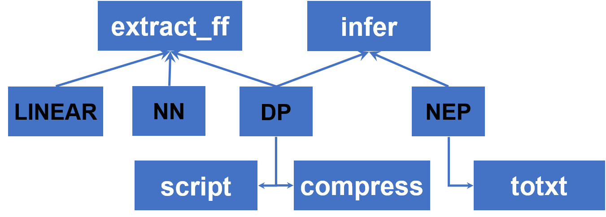

# MatPL 操作命令

在MatPL中，您可以使用 `matpl`、`MatPL`、`MATPL`或者 `PWMLFF` 作为起始命令。其中 `PWMLFF` 为 MatPL-2025.3 之前的版本，新版本（2026.3）兼容该命令。

MatPL 命令包括做训练 `train` 命令、做推理测试的 `test` 命令以及一些不同模型独有的`功能性命令`。您可以通过 `matpl -h` 命令输出 MatPL 的所有支持命令列表。

```bash
MatPL -h
或者 MatPL --help
```

## train 训练

train 命令是 MatPL 的训练命令，使用该命令需要用户提前准备好训练设置的 json 文件。
``` bash
MatPL train input.json
```
 - NEP 的训练请参考 [NEP 训练](./models/nep/nep-tutorial.md#train-训练)
 - DP的训练请参考 [DP 训练](./models/dp/dp-tutorial.md#train-训练)
 - NN的训练请参考 [NN 训练](./models/nn/nn-tutorial.md#train-训练)
 - LINEAR训练请参考 [LINEAR 训练](./models/linear/linear-tutorial.md#train-训练)

**train 文件目录**

力场训练结束后产生如下目录如下所示
``` txt
├── model_record
│   ├── epoch_train.dat
│   ├── epoch_valid.dat
│   ├── nep_model.ckpt
│   └── nep5.txt
├── std_input.json
├── train.json
└── forcefield/
    └── forcefield.ff
```

- `std_input.json` 为模型训练中使用的所有设置参数（用户自定义参数以及默认参数）

- `model_record/nep_model.ckpt` 为最近一个epoch训练结束后的力场文件，.ckpt 为pytorch可读的文件格式，对于 DP 力场，则为 dp_model.ckpt，对于 NN 力场则为 nn_model.ckpt

- `model_record/nep5.txt` 为 nep_model.ckpt 提取出的 txt 格式力场文件，用于 lammps 或 GPUMD 中做MD，其他力场训练不存在该文件

- `model_record/epoch_train.dat` 为训练过程中"train_data"中，每个 epoch 的训练集的 loss 信息汇总，内容如下所示。
从左到右分别为 训练 epoch 步；总 loss；L2 loss ，不开启 L2 训练则不存在该列（ADAM 优化器对应`lambda_2`、LKF优化器对应`po_weight`）；原子能量 rmse(eV/atom)；原子力 rmse(ev/Å)；原子位力 rmse(eV/atom)，不开启`train_virial`则不存在该列；学习率；epoch耗时(秒)。

```txt
# epoch              loss           Loss_l2   RMSE_Etot(eV/atom)         RMSE_F(eV/Å)   RMSE_virial(eV/atom)           real_lr        time(s)
    1    4.7907987747e+04  1.3987758802e-01     2.2508174106e+00     7.7088011034e-01       5.4796850561e+00  1.0000000000e-03         3.5540
    ......
```

- `model_record/epoch_valid.dat` 为训练过程中"valid_data"中，每个 epoch训练结束时验证集的 loss 信息汇总，如果不设置验证集则不输出改文件，文件内容如下所示。从左到右分别为 训练 epoch 步；总 loss；原子能量 rmse(eV/atom)；原子力 rmse(ev/Å)；原子位力 rmse(eV/atom)，不开启 `train_virial` 则不存在该列；学习率；epoch耗时(秒)。

```txt
# epoch              loss   RMSE_Etot(eV/atom)         RMSE_F(eV/Å)   RMSE_virial(eV/atom)
    1    2.9945036197e+04     1.8128180972e+00     6.5953191220e-01       5.2145886493e+00

```

- `forcefield` 目录为 NN 或 linear 力场提取出的txt格式力场文件目录，用于[fortran 版本的lammps接口](https://github.com/LonxunQuantum/lammps-MatPL/tree/fortran#)

## test 测试

test 命令是 MatPL 的测试命令，使用该命令需要用户提前准备好推理设置的 json 文件。执行成功后，该命令将输出力场对测试数据的能量和受力信息。
``` bash
MatPL test input.json
```
 - NEP 的测试请参考 [NEP 测试](./models/nep/nep-tutorial.md#test-测试)
 - DP的测试请参考 [DP 测试](./models/dp/dp-tutorial.md#test-测试)
 - NN的测试请参考 [NN 测试](./models/nn/nn-tutorial.md#test-测试)
 - LINEAR测试请参考 [LINEAR 测试](./models/linear/linear-tutorial.md#test-测试)

**test 文件目录**

test 结束后，在当前目录生成一个 test_result 目录，保存了 测试 结构，文件目录如下所示。

```txt
test_result/
│   ├──image_atom_nums.txt
│   ├── dft_total_energy.txt
│   ├── dft_force.txt
│   ├── dft_virial.txt
│   ├── dft_atomic_energy.txt
│   ├── inference_total_energy.txt
│   ├── inference_force.txt
│   ├── inference_virial.txt
│   ├── inference_atomic_energy.txt
│   ├── inference_summary.txt
│   ├── Energy.png
│   └── Force.png
└── std_input.json
```

- `image_atom_nums.txt` 存储测试集中结构对应的原子数

- `dft_total_energy.txt` 存储每个结构的能量标签

- `dft_force.txt` 存储每个结构中，每个原子的力标签，每行存储该原子的x、y、z三个方向分力

- `dft_virial.txt` 存储每个结构的维里标签，每个结构存储为一行，如果该结构不存在维里信息，则该行用 9个`-e6`值占位

- `dft_atomic_energy.txt` 存储每个结构中，每个原子的能量标签（该标签为PWmat 独有），每个结构存储为一行

- `inference_total_energy.txt` 存储每个结构的能量推理结果，与 dft_total_energy.txt 中的行对应

- `inference_virial.txt` 存储每个结构的维里推理结果，每个结构存储为一行，与 dft_virial.txt 中的行对应

- `inference_atomic_energy.txt` 存储每个结构中，每个原子的能量推理结果，每个结构存储为一行，与 dft_atomic_energy.txt 中的行对应

- `Energy.png` 为标签能量与力场推理能量对比

- `Force.png` 为标签受力与力场推理受力对比

- `Virial.png` 为标签维里与力场推理维里对比，标签不存在维里，则不存在该图

- `inference_summary.txt` 存储本次测试的汇总信息，如下例子中所示。

```txt
For 1140 images: 
Average RMSE of Etot per atom: 0.029401988821789057 
Average RMSE of Force: 0.045971754863441294 
Average RMSE of Virial per atom: None 

More details can be found under the file directory:
/the/path/test/test_result
```

## ASE 接口
NEP 和 DP 模型接入了 ase，支持 CPU 或 GPU 的 ase 相关操作：
 - [NEP ASE 操作案例](./models/nep/nep-tutorial.md#ase-接口) 
 - [DP ASE  操作案例](./models/nep/nep-tutorial.md#ase-接口)

## 其他功能性命令

MatPL 对不同的模型提供了不同的功能性命令



### extract_ff

该命令用于提取 NN 力场的ckpt文件为txt格式，提取后的力场文件可以用于 [fortran语言 实现的 lammps 接口](https://github.com/LonxunQuantum/lammps-MatPL/tree/fortran#)。

```bash
# 提取nn力场模型
MatPL extract_ff nn_model.ckpt
```

操作使用请参考 
- [提取 NN 力场](./models/nn/nn-tutorial.md#extract_ff)

### infer

该命令用于使用 NEP 或 DP 模型对单结构文件做能量和受力推理。

``` bash
# nep 模型推理 pwmat atom.config 结构
MatPL infer nep_to_lmps.txt atom.config pwmat/config
MatPL infer nep_modek.ckpt atom.config pwmat/config
# dp 模型推理lammps dump 结构
MatPL infer dp_model.ckpt 0.lammpstrj lammps/dump Hf O
```

操作使用请参考
- [NEP力场 单结构推理](./models/nep/nep-tutorial.md#infer-推理单结构)
- [DP力场 单结构推理](./models/dp/dp-tutorial.md#infer-推理单结构)

### totxt

该命令为 NEP 力场独有，用于将 NEP 的 ckpt 力场文件转换为 lammps 或 GPUMD 中使用的 txt 格式力场。
``` bash
MatPL totxt nep_model.ckpt
```
操作请参考 
- [NEP 力场转为 Lammps 或 GPUMD 格式](./models/nep/nep-tutorial.md#totxt)

### compress
该命令为 DP 力场独有，用于DP模型的推理加速，原理是将 DP 模型中的 embedding net 网络拟合为多项式，在训练集的原子类型较多时有明显的加速效果。完整的模型压缩指令如下：
```json
MatPL compress dp_model.ckpt -d 0.01 -o 3 -s cmp_dp_model
```
- compress 是压缩命令
- dp_model.ckpt为待压缩模型文件名称，为必须要提供的参数
- -d 为S_ij 的网格划分大小，默认值为0.01
- -o 为模型压缩阶数，3为三阶模型压缩，5为五阶模型压缩，默认值为3
- -s 为压缩后的模型名称，默认名称为“cmp_dp_model”

压缩后，将在当前目录得到一个名称为`cmp_dp_model.ckpt`的力场文件。
操作请参考 
- [DP 力场多项式压缩](./models/dp/dp-tutorial.md#compress-模型压缩)

### script
该命令为 DP 力场独有，用于将 DP 的ckpt 力场文件转换为 libtorch 格式，之后该文件可用于 lammps 模拟。

```bash
MatPL script dp_model.ckpt 
# 转换后将在当前目录生成一个 jit_dp.pt 文件
# 转化压缩后的力场文件
MatPL script cmp_dp_model.ckpt
# 转换后将在当前目录生成一个 jit_cmp_dp.pt 文件
```

操作请参考 
- [DP 力场转 libtorch格式](./models/dp/dp-tutorial.md#script-转-md-力场)

## Lammps 力场应用

MatPL 提供了 lammps 力场接口，安装方式请参考 [`在线安装`](./install/Installation-online.md#matpl-编译安装) 或 离线安装

lammps 运行命令为

``` bash
# 加载 lammps 环境变量env.sh 文件，正确安装后，该文件位于 lammps 源码根目录下
source /the/path/of/lammps/env.sh

# 执行lammps命令
# 对于 NEP 力场，提供了kokkos 加速，对应pair设置为 matpl/nep/kk 采用如下命令启动
# 单节点多卡（如下为4卡）
mpirun -np 4 lmp -k on g 4 -sf kk -pk kokkos -in kkin.lmp

# 多节点多卡（如下为2个节点，每个节点4张卡）
mpirun -np 8 --map-by ppr:4:node lmp -k on g 4 -sf kk -pk kokkos -in kkin.lmp

# 下面的这种方式适合于matpl/nep cpu版本或者matpl/dp的启动
mpirun -np N lmp -in in.lammps
```

运行lammps时需要在lammps控制文件中指定力场文件所在路径，如下所示。

对于lammps nep的 kokkos 加速版本：
``` bash
pair_style   matpl/nep/kk   力场文件路径 
pair_coeff   * *     O Hf
```

其中：
- pair_style 设置力场文件路径，这里 `matpl/nep/kk` 为固定格式，代表使用MatPL中的 NEP kokkos GPU 加速功能，如果是 `matpl/nep` 则使用只使用 cpu。如果是使用 DP 模型，则对应`matpl/dp`，此时如果存在GPU，将会自动调用GPU做加速，否则只使用CPU。

  这里也支持多模型的偏差值输出，该功能一般用于主动学习采用中。您可以指定多个模型，在模拟中将使用第1个模型做MD，其他模型参与偏差值计算，例如例子中所示，此时pair_style设置为如下:
  
  ```txt
  pair_style   matpl/nep/kk   0_nep.txt 1_nep.txt 2_nep.txt 3_nep.txt  out_freq DUMP_FREQ_VALUE out_file model_devi.out 
  ```

- pair_coeff 指定待模拟结构中的原子类型对应的元素序号。例如，如果您的结构中 `1` 为 `O` 元素，`2` 为 `Hf` 元素，设置 `pair_coeff * * 8 72`即可。这里支持使用元素序号或者元素名称，只要顺序与输入结构文件中保持一致即可。

对于 DP 和 NEP 力场在 Lammps 中的设置例子，请参考
 - [NEP lammps MD](./models/nep/nep-tutorial.md#lammps-md) 
 - [DP lammps MD ](./models/nep/nep-tutorial.md#lammps-md)


 对于 NN 和 LINEAR 力场 pair_style 在 Lammps 中的设置，稍有不同：
``` bash
pair_style   matpl 
pair_coeff   * * 3 1 forcefield.ff 29
```
- pair_style 设置使用 matpl 力场

- pair_coeff 设置力场文件和原子类型。这里 `3` 表示使用 Neural Network 模型产生的力场，如果使用 Liear 力场，请设置为`1`；第二个数字 `1` 表示读取 1 个力场文件，forcefield.ff为 MatPL 生成的力场文件名称，29 为 Cu 的元素序号

 - [NN lammps MD](./models/nn/nn-tutorial.md#lammps-md)
 - [LINEAR lammps MD](./models/linear/linear-tutorial.md#lammps-md)

:::caution
MatPL-2026.3 的lammps 接口编译后的可执行文件名称默认为`lmp`，使用cmake方式编译；MatPL-2025.3 的lammps接口可执行文件默认为`lmp_mpi`，使用make编译。
:::