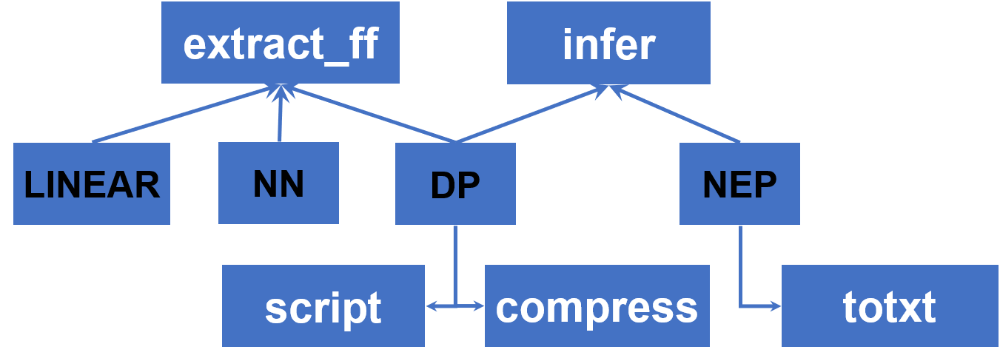

# MatPL Commands

You can invoke MatPL with `matpl`, `MatPL`, `MATPL`, or `PWMLFF`. `PWMLFF` was the command used before MatPL-2025.3 and remains compatible with version 2026.3.

MatPL provides the `train` command for training, the `test` command for inference and evaluation, and several `model-specific utility commands`. Run `matpl -h` to list all supported commands.

```bash
MatPL -h
or MatPL --help
```

## train

The `train` command trains a MatPL model and requires a prepared JSON training configuration.
``` bash
MatPL train input.json
```
 - For NEP training, see [NEP training](./models/nep/nep-tutorial.md#train).
 - For DP training, see [DP training](./models/dp/dp-tutorial.md#train).
 - For NN training, see [NN training](./models/nn/nn-tutorial.md#train).
 - For LINEAR training, see [LINEAR training](./models/linear/linear-tutorial.md#train).

**train output directory**

After force-field training, the following files and directories are generated:
``` txt
├── model_record
│   ├── epoch_train.dat
│   ├── epoch_valid.dat
│   ├── nep_model.ckpt
│   └── nep5.txt
├── std_input.json
├── train.json
└── forcefield/
    └── forcefield.ff
```

- `std_input.json` contains all settings used for training, including user-defined and default parameters.

- `model_record/nep_model.ckpt` is the force-field checkpoint saved after the latest epoch. `.ckpt` is a PyTorch-readable format. The corresponding files are `dp_model.ckpt` for DP and `nn_model.ckpt` for NN.

- `model_record/nep5.txt` is the text-format force field extracted from `nep_model.ckpt` for MD in LAMMPS or GPUMD. Other model types do not generate this file.

- `model_record/epoch_train.dat` summarizes the loss on `train_data` for each epoch, as shown below.
From left to right, the columns are: epoch; total loss; L2 loss, omitted when L2 regularization is disabled (`lambda_2` for ADAM and `po_weight` for LKF); atomic-energy RMSE (eV/atom); force RMSE (eV/Å); atomic-virial RMSE (eV/atom), omitted when `train_virial` is disabled; learning rate; and epoch time in seconds.

```txt
# epoch              loss           Loss_l2   RMSE_Etot(eV/atom)         RMSE_F(eV/Å)   RMSE_virial(eV/atom)           real_lr        time(s)
    1    4.7907987747e+04  1.3987758802e-01     2.2508174106e+00     7.7088011034e-01       5.4796850561e+00  1.0000000000e-03         3.5540
    ......
```

- `model_record/epoch_valid.dat` summarizes the validation loss on `valid_data` after each epoch. It is not generated when no validation set is configured. From left to right, the columns are: epoch; total loss; atomic-energy RMSE (eV/atom); force RMSE (eV/Å); atomic-virial RMSE (eV/atom), omitted when `train_virial` is disabled; learning rate; and epoch time in seconds.

```txt
# epoch              loss   RMSE_Etot(eV/atom)         RMSE_F(eV/Å)   RMSE_virial(eV/atom)
    1    2.9945036197e+04     1.8128180972e+00     6.5953191220e-01       5.2145886493e+00

```

- The `forcefield` directory contains text-format NN or Linear force fields for the [Fortran LAMMPS interface](https://github.com/LonxunQuantum/lammps-MatPL/tree/fortran#).

## test

The `test` command evaluates a MatPL model and requires a prepared JSON inference configuration. When successful, it outputs predicted energies and forces for the test data.
``` bash
MatPL test input.json
```
 - For NEP testing, see [NEP testing](./models/nep/nep-tutorial.md#test).
 - For DP testing, see [DP testing](./models/dp/dp-tutorial.md#test).
 - For NN testing, see [NN testing](./models/nn/nn-tutorial.md#test).
 - For LINEAR testing, see [LINEAR testing](./models/linear/linear-tutorial.md#test).

**test output directory**

After testing, a `test_result` directory is created in the current directory to store the evaluated structures and results:

```txt
test_result/
│   ├──image_atom_nums.txt
│   ├── dft_total_energy.txt
│   ├── dft_force.txt
│   ├── dft_virial.txt
│   ├── dft_atomic_energy.txt
│   ├── inference_total_energy.txt
│   ├── inference_force.txt
│   ├── inference_virial.txt
│   ├── inference_atomic_energy.txt
│   ├── inference_summary.txt
│   ├── Energy.png
│   └── Force.png
└── std_input.json
```

- `image_atom_nums.txt` stores the atom count of each structure in the test set.

- `dft_total_energy.txt` stores the energy label for each structure.

- `dft_force.txt` stores per-atom force labels. Each line contains the x, y, and z force components of one atom.

- `dft_virial.txt` stores one virial label per structure. If virial information is unavailable, the line contains nine `-e6` placeholders.

- `dft_atomic_energy.txt` stores per-atom energy labels, a PWmat-specific label, with one structure per line.

- `inference_total_energy.txt` stores predicted energies in the same structure order as `dft_total_energy.txt`.

- `inference_virial.txt` stores one predicted virial per structure, aligned with `dft_virial.txt`.

- `inference_atomic_energy.txt` stores predicted per-atom energies, one structure per line, aligned with `dft_atomic_energy.txt`.

- `Energy.png` compares labeled and predicted energies.

- `Force.png` compares labeled and predicted forces.

- `Virial.png` compares labeled and predicted virials. It is omitted when the labels contain no virial data.

- `inference_summary.txt` contains the evaluation summary, as shown below.

```txt
For 1140 images: 
Average RMSE of Etot per atom: 0.029401988821789057 
Average RMSE of Force: 0.045971754863441294 
Average RMSE of Virial per atom: None 

More details can be found under the file directory:
/the/path/test/test_result
```

## ASE Interface
NEP and DP models support ASE operations on CPUs or GPUs:
 - [NEP ASE example](./models/nep/nep-tutorial.md#ase-interface)
 - [DP ASE example](./models/dp/dp-tutorial.md#ase-interface)

## Other Utility Commands

MatPL provides different utility commands for each model type.



### extract_ff

This command extracts an NN force-field checkpoint to text format for use with the [Fortran LAMMPS interface](https://github.com/LonxunQuantum/lammps-MatPL/tree/fortran#).

```bash
# Extract the NN force-field model
MatPL extract_ff nn_model.ckpt
```

For usage, see:
- [Extract an NN force field](./models/nn/nn-tutorial.md#extract_ff)

### infer

This command uses an NEP or DP model to predict the energy and forces of a single structure.

``` bash
# NEP inference on a PWmat atom.config structure
MatPL infer nep_to_lmps.txt atom.config pwmat/config
MatPL infer nep_modek.ckpt atom.config pwmat/config
# DP inference on a LAMMPS dump structure
MatPL infer dp_model.ckpt 0.lammpstrj lammps/dump Hf O
```

For usage, see:
- [Single-structure inference with an NEP force field](./models/nep/nep-tutorial.md#infer-a-single-structure)
- [Single-structure inference with a DP force field](./models/dp/dp-tutorial.md#infer-a-single-structure)

### totxt

This NEP-specific command converts an NEP checkpoint to a text-format force field for LAMMPS or GPUMD.
``` bash
MatPL totxt nep_model.ckpt
```
For usage, see:
- [Convert an NEP force field to LAMMPS or GPUMD format](./models/nep/nep-tutorial.md#totxt)

### compress
This DP-specific command accelerates inference by fitting the DP embedding network with polynomials. It provides a significant speedup when the training set contains many atom types. The complete command is:
```json
MatPL compress dp_model.ckpt -d 0.01 -o 3 -s cmp_dp_model
```
- `compress` is the compression command.
- `dp_model.ckpt` is the required model file to compress.
- `-d` sets the $S_{ij}$ grid spacing; the default is `0.01`.
- `-o` sets the compression order: `3` for third order or `5` for fifth order. The default is `3`.
- `-s` sets the compressed model name. The default is `cmp_dp_model`.

After compression, `cmp_dp_model.ckpt` is created in the current directory.
For usage, see:
- [Polynomial compression of a DP force field](./models/dp/dp-tutorial.md#compress-a-model)

### script
This DP-specific command converts a DP checkpoint to LibTorch format for use in LAMMPS simulations.

```bash
MatPL script dp_model.ckpt 
# Creates jit_dp.pt in the current directory
# Convert a compressed force-field file
MatPL script cmp_dp_model.ckpt
# Creates jit_cmp_dp.pt in the current directory
```

For usage, see:
- [Convert a DP force field to LibTorch format](./models/dp/dp-tutorial.md#script-convert-to-an-md-force-field)

## Using Force Fields in LAMMPS

MatPL provides LAMMPS force-field interfaces. For installation, see [`Online Installation`](./install/Installation-online.md#build-and-install-matpl) or the offline installation guide.

Run LAMMPS as follows:

``` bash
# Load the LAMMPS env.sh file from the LAMMPS source root
source /the/path/of/lammps/env.sh

# Run LAMMPS
# NEP supports Kokkos acceleration with pair style matpl/nep/kk
# Multiple GPUs on one node (four GPUs here)
mpirun -np 4 --bind-to numa lmp -k on g 4 -sf kk -pk kokkos -in kkin.lmp

# Multiple nodes and GPUs (two nodes with four GPUs each)
mpirun -np 8 --map-by ppr:4:node lmp -k on g 4 -sf kk -pk kokkos -in kkin.lmp

# Use the following form for the CPU version of matpl/nep or for matpl/dp
mpirun -np N lmp -in in.lammps
```

Specify the force-field path in the LAMMPS input file as shown below.

For the Kokkos-accelerated LAMMPS NEP interface:
``` bash
# LAMMPS 2024 requires neigh half; LAMMPS 2023 accepts either half or full
package kokkos neigh half comm device
newton on

pair_style   matpl/nep/kk   /path/to/force-field
pair_coeff   * *     O Hf
```

Here:
- LAMMPS 2024 requires `neigh half`; LAMMPS 2023 accepts either `half` or `full`.

- `pair_style` sets the force-field path. `matpl/nep/kk` selects MatPL's Kokkos GPU acceleration for NEP, while `matpl/nep` uses only the CPU. For a DP model, use `matpl/dp`; it automatically uses a GPU when available and otherwise runs on the CPU.

  The interface also supports model-deviation output from multiple models, commonly used in active learning. The first model drives the MD simulation, while the others participate in the deviation calculation. Configure `pair_style` as follows:
  
  ```txt
    # LAMMPS 2024 requires neigh half; LAMMPS 2023 accepts either half or full
    package kokkos neigh half comm device
    newton on

    pair_style   matpl/nep/kk   0_nep.txt 1_nep.txt 2_nep.txt 3_nep.txt  out_freq DUMP_FREQ_VALUE out_file model_devi.out 
  ```
- LAMMPS 2024 requires `neigh half`; LAMMPS 2023 accepts either `half` or `full`.

- `pair_coeff` maps atom types in the simulated structure to elements. For example, if type `1` is `O` and type `2` is `Hf`, use `pair_coeff * * 8 72`. Atomic numbers or element symbols are both accepted, provided their order matches the input structure.

For LAMMPS configuration examples for DP and NEP force fields, see:
 - [NEP LAMMPS MD](./models/nep/nep-tutorial.md#lammps-md)
 - [DP LAMMPS MD](./models/nep/nep-tutorial.md#lammps-md)


The LAMMPS `pair_style` configuration is slightly different for NN and LINEAR force fields:
``` bash
pair_style   matpl 
pair_coeff   * * 3 1 forcefield.ff 29
```
- `pair_style` selects the MatPL force field.

- `pair_coeff` specifies the force-field file and atom type. Here, `3` selects a Neural Network force field; use `1` for a Linear force field. The second `1` means that one force-field file is read, `forcefield.ff` is generated by MatPL, and `29` is the atomic number of Cu.

 - [NN lammps MD](./models/nn/nn-tutorial.md#lammps-md)
 - [LINEAR lammps MD](./models/linear/linear-tutorial.md#lammps-md)

:::caution
The MatPL-2026.3 LAMMPS interface is built with CMake and produces an executable named `lmp` by default. The MatPL-2025.3 interface is built with Make and produces `lmp_mpi` by default.
:::
