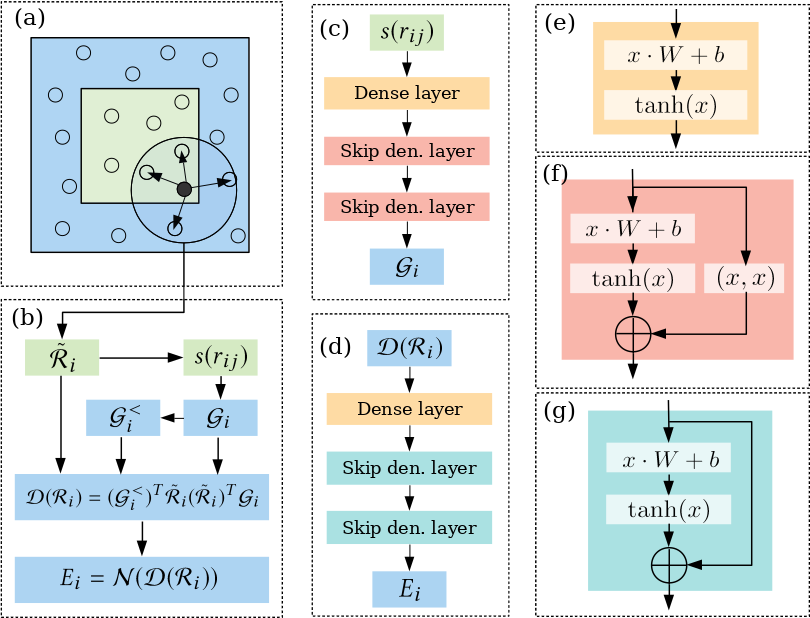
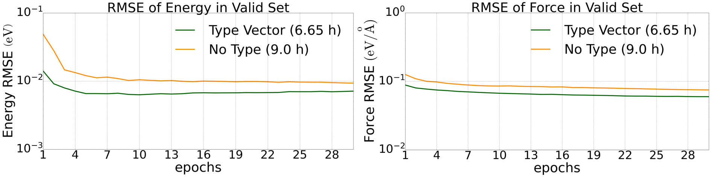
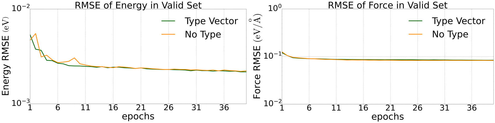
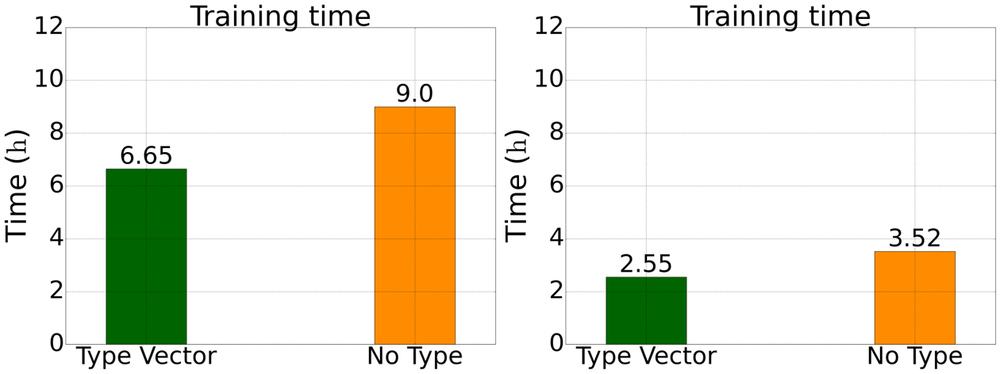
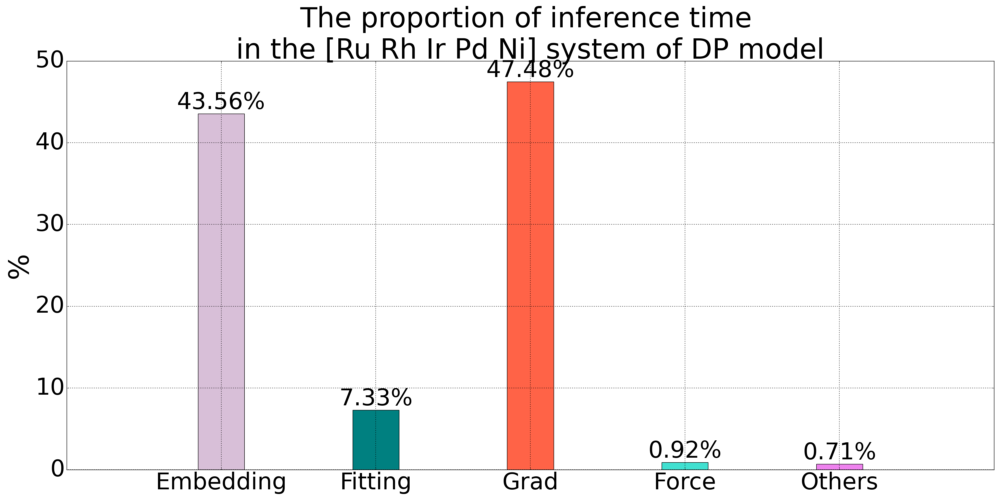
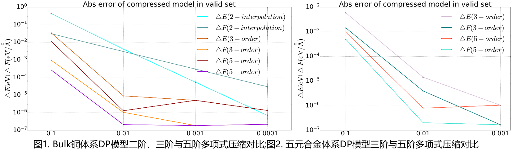

## DP Model

**[Tutorial](./dp-tutorial.md)**

### DP Model Overview




For the DP model, see the following references:

- [SC’20] Weile Jia, Han Wang, Mohan Chen, Denghui Lu, Lin Lin, Roberto Car, E Weinan, Linfeng Zhang*, "Pushing the Limit of Molecular Dynamics with Ab Initio Accuracy to 100 Million Atoms with Machine Learning," SC20: International Conference for High Performance Computing, Networking, Storage and Analysis, 2020, pp. 1-14, doi: 10.1109/SC41405.2020.00009.(CCF-A)(Gordon Bell Prize)

- Han Wang, Linfeng Zhang, Jiequn Han, and Weinan E. "DeePMD-kit: A deep learning package for many-body potential energy representation and molecular dynamics." Computer Physics Communications 228 (2018): 178-184. doi:10.1016/j.cpc.2018.03.016

- Zhang L, Han J, Wang H, et al. End-to-end symmetry preserving inter-atomic potential energy model for finite and extended systems[J]. Advances in neural information processing systems, 2018, 31.

- Lu D, Jiang W, Chen Y, et al. DP compress: A model compression scheme for generating efficient deep potential models[J]. Journal of chemical theory and computation, 2022, 18(9): 5559-5567.

### type embedding


A DP model contains $N^2$ Embedding Nets, where $N$ is the number of element types. When a system contains many element types, this design limits both training and inference speed and restricts the potential of DP as a general-purpose large model. Because the $N^2$ Embedding Nets implicitly encode element types, we modify $S_{ij}$ by concatenating it with the physical properties of the corresponding element type. This enables a single Embedding Net to achieve results comparable to those of $N^2$ networks.

For $S_{ij}$, $i$ is the central atom. The [physical properties](../../parameterdetail.md#physical_property) of the element type corresponding to $j$ are concatenated with $S_{ij}$ to form a vector of length $1 +$ the number of physical properties, which is then passed to the Embedding Net. Tests on our [five-component alloy (Ru, Rh, Ir, Pd, and Ni) dataset](https://github.com/LonxunQuantum/MatPL_library/tree/main/alloy/Ru_Rh_Ir_Pd_Ni) and [quaternary LiGePS dataset (1200 K)](https://github.com/LonxunQuantum/MatPL_library/tree/main/LiGePS) show that a DP model using this type-embedding method matches or exceeds the prediction accuracy of a standard DP model while reducing training time by 27%. See the [performance benchmarks](#type_performance) for details.

**Usage**

To enable type embedding with the default physical properties, add the $type\_embedding$ parameter to the JSON training configuration. See **example/LiGePS/ligeps.json** in the project examples.

```json
{
  "type_embedding": true
}
```

You can also specify the required physical properties in the [model parameters](../../parameterdetail.md#physical_property) of the JSON file.

### Performance Benchmark: Accuracy{#type_performance}


Comparison of validation-set prediction accuracy between the type-embedding method and a standard DP model on the [mixed five-component alloy dataset (9,486 configurations)](https://github.com/LonxunQuantum/MatPL_library/tree/main/alloy/Ru_Rh_Ir_Pd_Ni):



<!-- <table>
  <tr>
    <td>
      
      <p>Figure 1: Reduction in validation-set energy error for the five-component alloy system</p>
    </td>
    <td>
      
      <p>Figure 2: Reduction in validation-set force error for the five-component alloy system</p>
    </td>
  </tr>
</table> -->

Comparison of validation-set prediction accuracy between the type-embedding method and a standard DP model on the [quaternary LiGePS dataset (10,000 configurations at 1200 K)](https://github.com/LonxunQuantum/MatPL_library/tree/main/LiGePS):



<!-- <table>
  <tr>
    <td>
      
      <p>Figure 1: Reduction in validation-set energy error for the quaternary LiGePS system</p>
    </td>
    <td>
      
      <p>Figure 2: Reduction in validation-set force error for the quaternary LiGePS system</p>
    </td>
  </tr>
</table> -->

### Performance Benchmark: Training Time



<!-- <table>
  <tr>
    <td>
      
      <p>Figure 1: Total training time for the five-component alloy system</p>
    </td>
    <td>
      
      <p>Figure 2: Total training time for the quaternary LiGePS system</p>
    </td>
  </tr>
</table> -->
The force field is invoked in LAMMPS in the same way as the standard DP model described above.

### Polynomial Model Compression

A DP model contains $N^2$ Embedding Nets, where $N$ is the number of atom types. As the number of types increases, the number of Embedding Nets grows rapidly, enlarging the computational graph used for backpropagation and becoming an inference bottleneck. The timing breakdown below for DP inference on a five-component alloy shows that Embedding Net evaluation and gradient computation account for more than 90% of the total time, leaving substantial room for optimization. An Embedding Net takes a scalar $S_{ij}$ as input and outputs $m$ values, where $m$ is the number of neurons in its final layer. It can therefore be replaced by $m$ scalar functions.

MatPL implements the [fifth-order polynomial](#5order_cmp) compression method described in [Lu D, Jiang W, Chen Y, et al., *DP compress: A model compression scheme for generating efficient deep potential models*](https://pubs.acs.org/doi/10.1021/acs.jctc.2c00102?fig=fig3&ref=pdf). It also provides a [third-order polynomial](#3order_cmp) method based on Hermite interpolation.



**Usage**

To compress a trained DP model, use the following command:

```json
MatPL compress dp_model.ckpt -d 0.01 -o 3 -s cmp_dp_model
```
* `compress` is the compression command.
* `dp_model.ckpt` is the required model file to compress.
* `-d` sets the grid spacing for $S_{ij}$; the default is `0.01`.
* `-o` sets the compression order: `3` for third order or `5` for fifth order. The default is `3`.
* `-s` sets the compressed model name. The default is `cmp_dp_model`.

After compression, the model is used for molecular-dynamics simulations in LAMMPS in the same way as a standard [DP model](./dp-tutorial.md/#lammps-md).

<!-- ### Performance Test{#cmp_time} -->

<!--
 Model compression for type embedding has not yet been added to LAMMPS, so it is omitted here.
 -->

**Model compression accuracy**

We compressed DP models for bulk copper and a five-component alloy and evaluated them on their respective test sets. The results are shown below. For copper, second-order interpolation is included for comparison; unlike the third- and fifth-order methods, it does not provide sufficient accuracy.



<!-- <table>
  <tr>
    <td>
      
      <p>Figure 1: Comparison of second-, third-, and fifth-order polynomial compression for the bulk-copper DP model</p>
    </td>
    <td>
      
      <p>Figure 2: Comparison of third- and fifth-order polynomial compression for the five-component alloy DP model</p>
    </td>
  </tr>
</table> -->

<!-- #### Timing statistics for different dx values? -->

<!-- ### Inference Speed -->

<!-- We measured inference time over the complete test set for an uncompressed DP model and a third-order polynomial-compressed model of the five-component alloy system. Polynomial compression substantially reduces autograd time because it significantly shrinks the Embedding Net computational graph used by PyTorch automatic differentiation.

<table>
  <tr>
    <td>
      
      <p>Figure 1: Third-order polynomial compression (dx=0.01) versus the uncompressed model for the five-component alloy system</p>
    </td>
  </tr>
</table> -->

<!-- #### Speedup in LAMMPS -->

### Polynomial Model Compression Procedure

#### Grid Construction

We scan the entire training set to obtain the maximum value of $s_{ij}$. Because $s_{ij}$ is a function of the three-dimensional distance $r_{ij}$ between atoms $i$ and $j$, it reaches its minimum when $r_{ij} = r_{\text{cut}}$. The range of $s_{ij}$ is divided into $L$ equal intervals of width $dx$, yielding $L+1$ interpolation points denoted by $x_1, x_2, \cdots, x_{L+1}$. In practice, an incomplete training set may not cover every $s_{ij}$ encountered during inference. The grid is therefore extended from the original upper limit to $10 \times s_{ij}$ using a spacing of $10 \times dx$.

#### Third-Order Polynomial{#3order_cmp}

For each interval $[x_l, x_{l+1})$, the Embedding Net is replaced by the following third-order polynomial:

$$
g^l_m(x) = a^l_m x^3 + b^l_m x^2 + c^l_m x + d^l_m
$$

Here, $m$ is the number of neurons in the final layer of the Embedding Net—that is, the number of output values—and the polynomial variable $x$ is $s_{ij} - x_l$. The following two conditions must hold at every grid point:

1. The polynomial value equals the Embedding Net output:
   $$
   y_l = \mathcal{G}_m(x_l)
   $$

2. The first derivative of the polynomial equals the first derivative of the Embedding Net with respect to $s_{ij}$:
   $$
   y'_l = \mathcal{G}'_m(x_l)
   $$

The resulting coefficients are

$$
a^l_m = \frac{1}{\Delta t^3} \left[ (y'_{l+1} + y'_l) \Delta t - 2h \right]
$$

$$
b^l_m = \frac{1}{\Delta t^2} \left[ -(y'_{l+1} + 2y'_l) \Delta t + 3h \right]
$$

$$
c^l_m = y'_l
$$

$$
d^l_m = y_l
$$

where $h = y_{l+1} - y_l$ and $\Delta t = x_{l+1} - x_l$.

#### Fifth-Order Polynomial{#5order_cmp}

We also implement the fifth-order polynomial compression method from [DP Compress](https://pubs.acs.org/doi/10.1021/acs.jctc.2c00102?fig=fig3&ref=pdf).

For the fifth-order polynomial, $s_{ij}$ is partitioned in the same way as for the third-order method, and the Embedding Net is replaced by the following polynomial:

$$
g^l_m(x) = a^l_m x^5 + b^l_m x^4 + c^l_m x^3 + d^l_m x^2 + e^l_m x + f^l_m
$$

Note that the polynomial variable $x$ is $s_{ij} - x_l$. The following three conditions must hold at every grid point:

1. The polynomial value equals the Embedding Net output:
   $$
   y_l = \mathcal{G}_m(x_l)
   $$

2. The first derivative of the polynomial equals the first derivative of the Embedding Net with respect to $s_{ij}$:
   $$
   y'_l = \mathcal{G}'_m(x_l)
   $$

3. The second derivative of the polynomial equals the second derivative of the Embedding Net with respect to $s_{ij}$:
   $$
   y''_l = \mathcal{G}''_m(x_l)
   $$

The six coefficients are therefore:

$$
a^l_m = \frac{1}{2\Delta t^5} \left[ 12h - 6(y'_{l+1} + y'_l) \Delta t + (y''_{l+1} - y''_l) \Delta t^2 \right]
$$

$$
b^l_m = \frac{1}{2\Delta t^4} \left[ -30h + (14y'_{l+1} + 16y'_l) \Delta t + (-2y''_{l+1} + 3y''_l) \Delta t^2 \right]
$$

$$
c^l_m = \frac{1}{2\Delta t^3} \left[ 20h - (8y'_{l+1} + 12y'_l) \Delta t + (y''_{l+1} - 3y''_l) \Delta t^2 \right]
$$

$$
d^l_m = \frac{1}{2} y''_l
$$

$$
e^l_m = y'_l
$$

$$
f^l_m = y_l
$$

where $h = y_{l+1} - y_l$ and $\Delta t = x_{l+1} - x_l$.

#### Verification of the Model Compression Formula

The model-compression scheme divides the range of $s_{ij}$ into $L$ equal intervals, giving $L+1$ interpolation points denoted by $x_1, x_2, \cdots, x_{L+1}$. For each interval $[x_l, x_{l+1})$, the embedding network is replaced by the following fifth-order polynomial:

$$
g^l_m(x) = a^l_m x^5 + b^l_m x^4 + c^l_m x^3 + d^l_m x^2 + e^l_m x + f^l_m
$$

Note that the polynomial variable $x$ is $s_{ij} - x_l$. The following three boundary conditions must hold at every grid point:

1. The function values are equal:
   $$
   y_l = \mathcal{G}_m(x_l)
   $$

2. The first derivatives are equal:
   $$
   y'_l = \mathcal{G}'_m(x_l)
   $$

3. The second derivatives are equal:
   $$
   y''_l = \mathcal{G}''_m(x_l)
   $$

The six coefficients are therefore:

$$
a^l_m = \frac{1}{2\Delta t^5} \left[ 12h - 6(y'_{l+1} + y'_l) \Delta t + (y''_{l+1} - y''_l) \Delta t^2 \right]
$$

$$
b^l_m = \frac{1}{2\Delta t^4} \left[ -30h + (14y'_{l+1} + 16y'_l) \Delta t + (-2y''_{l+1} + 3y''_l) \Delta t^2 \right]
$$

$$
c^l_m = \frac{1}{2\Delta t^3} \left[ 20h - (8y'_{l+1} + 12y'_l) \Delta t + (y''_{l+1} - 3y''_l) \Delta t^2 \right]
$$

$$
d^l_m = \frac{1}{2} y''_l
$$

$$
e^l_m = y'_l
$$

$$
f^l_m = y_l
$$

where $h = y_{l+1} - y_l$ and $\Delta t = x_{l+1} - x_l$.
<!-- 
## Verification

The required condition is that when $s_{ij}=x_l,\,x_{l+1}$, the function value and its first and second derivatives equal those of the embedding network. The corresponding values of $x$ are $0,\,\Delta t$. The fifth-order polynomial value is

$$
\begin{aligned}
    g^l_m(x) &= \frac{x^5}{2\Delta t^5}[12h-6(y'_{l+1}+y'_l)\Delta t+(y''_{l+1}-y''_l)\Delta t^2]\\
    &+\frac{x^4}{2\Delta t^4}[-30h+(14y'_{l+1}+16y'_l)\Delta t+(-2y''_{l+1}+3y''_l)\Delta t^2]\\
    &+\frac{x^3}{2\Delta t^3}[20h-(8y'_{l+1}+12y'_l)\Delta t+(y''_{l+1}-3y''_l)\Delta t^2]\\
    &+\frac{1}{2}y''_lx^2+y'_lx+y_l
\end{aligned}
$$

The first derivative is

$$
\begin{aligned}
g^l_m(x)  &=\frac{x^4}{2\Delta t^5}5[12h-6(y'_{l+1}+y'_l)\Delta t+(y''_{l+1}-y''_l)\Delta t^2]\\
&+\frac{x^3}{2\Delta t^4}4[-30h+(14y'_{l+1}+16y'_l)\Delta t+(-2y''_{l+1}+3y''_l)\Delta t^2]\\
&+\frac{x^2}{2\Delta t^3}3[20h-(8y'_{l+1}+12y'_l)\Delta t+(y''_{l+1}-3y''_l)\Delta t^2]\\
&+y''_lx+y'_l
\end{aligned}
$$

The second derivative is

$$
\begin{aligned}
g^l_m(x)&=\frac{x^3}{2\Delta t^5}20[12h-6(y'_{l+1}+y'_l)\Delta t+(y''_{l+1}-y''_l)\Delta t^2]\\
&+\frac{x^2}{2\Delta t^4}12[-30h+(14y'_{l+1}+16y'_l)\Delta t+(-2y''_{l+1}+3y''_l)\Delta t^2]\\
&+\frac{x}{2\Delta t^3}6[20h-(8y'_{l+1}+12y'_l)\Delta t+(y''_{l+1}-3y''_l)\Delta t^2]\\+y''_l
\end{aligned}
$$

When $x=0$, the conditions are satisfied directly. For $x=\Delta t$, the function value is

$$
\begin{aligned}
g^l_m(\Delta t&)=\frac{1}{2}[12h-6(y'_{l+1}+y'_l)\Delta t+(y''_{l+1}-y''_l)\Delta t^2]\\
&+\frac{1}{2}[-30h+(14y'_{l+1}+16y'_l)\Delta t+(-2y''_{l+1}+3y''_l)\Delta t^2]\\
&+\frac{1}{2}[20h-(8y'_{l+1}+12y'_l)\Delta t+(y''_{l+1}-3y''_l)\Delta t^2]\\
&+\frac{1}{2}y''_l\Delta t^2+y'_l\Delta t+y_l\\
&=h-y'_l\Delta t-\frac{1}{2}y''_l\Delta t^2+\frac{1}{2}y''_l\Delta t^2+y'_l\Delta t+y_l\\
&=y_{l+1}
\end{aligned}
$$

The first derivative is

$$
\begin{aligned}
g^l_m(\Delta t)&=\frac{5}{2\Delta t}[12h-6(y'_{l+1}+y'_l)\Delta t+(y''_{l+1}-y''_l)\Delta t^2]\\
&+\frac{4}{2\Delta t}[-30h+(14y'_{l+1}+16y'_l)\Delta t+(-2y''_{l+1}+3y''_l)\Delta t^2]\\
&+\frac{3}{2\Delta t}[20h-(8y'_{l+1}+12y'_l)\Delta t+(y''_{l+1}-3y''_l)\Delta t^2]\\
&+y''_l\Delta t+y'_l\\
&=y'_{l+1}-y'_l-y''_l\Delta t+y''_l\Delta t+y'_l\\
&=y'_{l+1}
\end{aligned}
$$

The second derivative is

$$
\begin{aligned}
g^l_m(\Delta t)&=\frac{20}{2\Delta t^2}[12h-6(y'_{l+1}+y'_l)\Delta t+(y''_{l+1}-y''_l)\Delta t^2]\\
&+\frac{12}{2\Delta t^2}[-30h+(14y'_{l+1}+16y'_l)\Delta t+(-2y''_{l+1}+3y''_l)\Delta t^2]\\
&+\frac{6}{2\Delta t^2}[20h-(8y'_{l+1}+12y'_l)\Delta t+(y''_{l+1}-3y''_l)\Delta t^2]\\
&+y''_l\\
&=y''_{l+1}-y''_l+y''_l\\
&=y''_{l+1}
\end{aligned}
$$ -->
