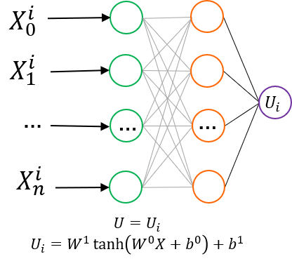
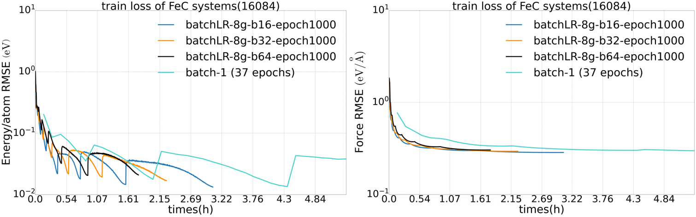
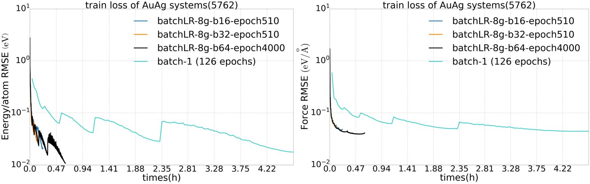
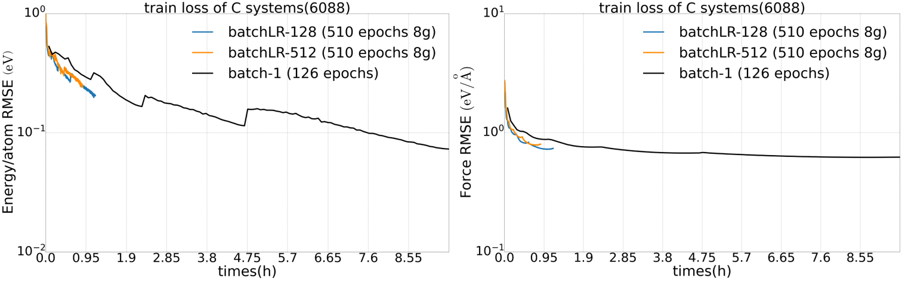
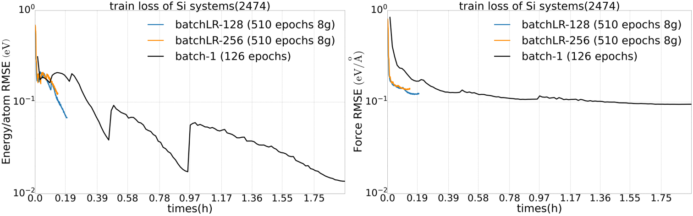
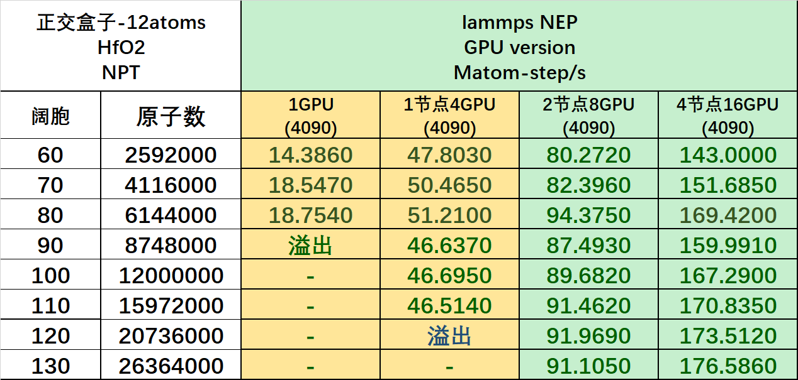

## NEP 模型

**[操作演示](./nep-tutorial.md)**

### 模型介绍
NEP模型最初是在 GPUMD 软件包中实现的 ([2022b GPUMD](https://doi.org/10.1063/5.0106617))。GPUMD 中训练 NEP 采用了[可分离自然演化策略(separable natural evolution strategy，SNES)](https://doi.org/10.1145/2001576.2001692)，由于不依赖梯度信息，实现简单。但是对于标准的监督学习任务，特别是深度学习，更适合采用基于梯度的优化算法。我们从 `MatPL 2025.3` 版本开始实现了 NEP 模型（NEP5，网络结构如图1所示），能够使用 MatPL 中`基于梯度的 LKF 或 ADAM 优化器`做模型训练。并且我们对梯度计算中的耗时部分通过 c++ cuda 算子做了优化，大幅提升了训练速度。

我们在多种体系中比较了LKF 和 SNES 两种优化方法的训练效率，测试结果表明，LKF 优化器在对NEP模型的训练中展现了优越的训练精度和收敛速度 NEP模型的网络结构只有一个单隐藏层，具有非常快的推理速度，而引入LKF优化器则大幅提高了训练效率。用户可以在 MatPL 中以较低的训练代价获得优质的NEP并使用它进行高效的机器学习分子动力学模拟，这对于资源/预算有限的用户非常友好。

我们也实现了 NEP 模型的Lammps分子动力学接口，支持 `CPU` 或 `GPU` 设备，受益于NEP 简单的网络结构和化繁为简的feature设计，NEP 模型在 lammps 推理中具有非常快的速度，并支持跨节点（跨节点 GPU）。

`在 MatPL-2026.3 版本中`，我们对 NEP 做了极致优化。

在训练上，针对单卡，我们优化了梯度算子，单卡相比 MatPL2025.3版本 训练速度`提升3倍以上`。并且，引入了多节点多卡的大batch训练并缓解了大batch训练时的精度下降问题，让训练效率得到`巨幅提升`。

在 lammps 模拟中，我们将最耗时的近邻计算通过 KOKKOS 从 CPU 卸载到GPU上，并且优化了推理核函数，让显存占用缩减了1/3以上同时让模拟速度相比MatPL-2025.3 `提升了一个量级以上`。

:::info
这里提到的`nep4.txt`是来自GPUMD训练出的力场文件，`nep5.txt`为MatPL训练出的力场文件，区别是 nep5.txt 每个子网络输出层有自己独立的bias参数，而 nep4.txt 所有子网络输出层共享一个bias项。
:::

### NEP 训练测试
下面展示了 MatPL 在做跨节点多卡训练时的 Loss 收敛以及训练时间情况。横轴为训练时间，纵轴为训练loss收敛情况。

采用2个节点8卡训练 FeC 训练集（16084个结构）:

采用2个节点8卡训练 金银合金 AuAg 训练集（5762个结构）:

<!-- 采用2个节点8卡训练 C 训练集（6088 个结构）:

采用2个节点8卡训练 Si 训练集（2474 个结构）:

 -->

### lammps 接口测试
下表展示了 NEP KOKOS 版本在lammps中的模拟速度，超大规模模拟结果会在后续放出。

