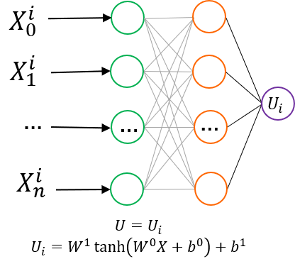
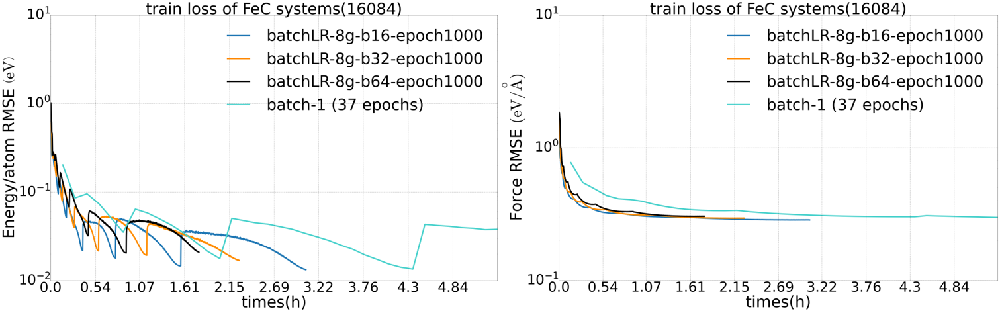
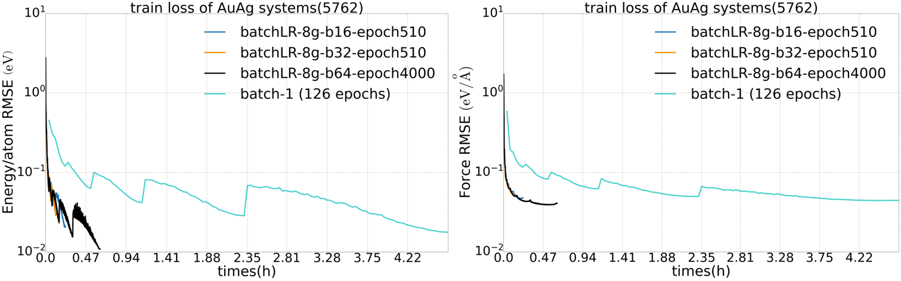
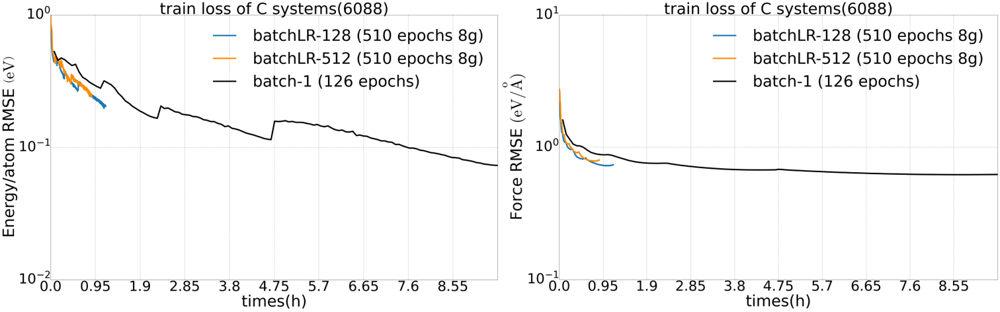
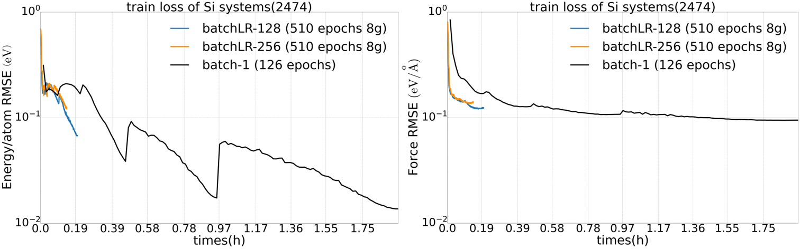
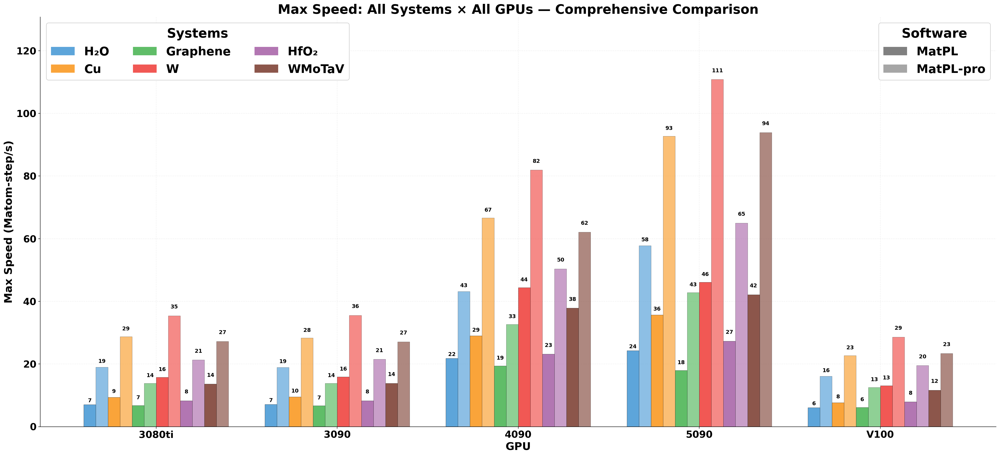
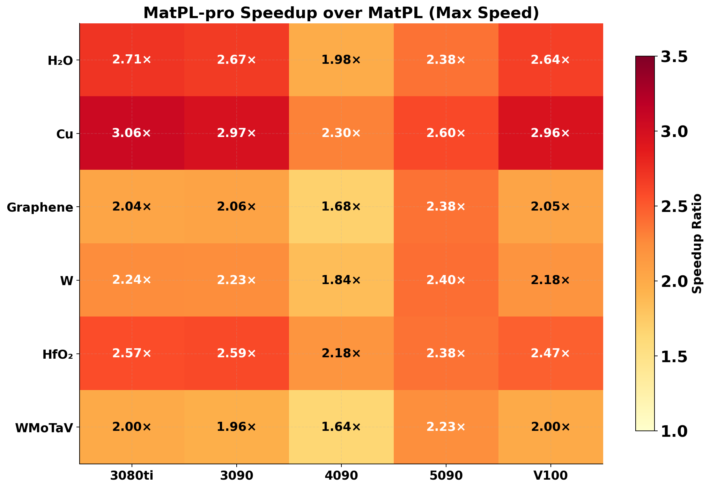

## NEP Model

**[Tutorial](./nep-tutorial.md)**

### Model Overview
The NEP model was originally implemented in the GPUMD package ([GPUMD 2022b](https://doi.org/10.1063/5.0106617)). GPUMD trains NEP models using the [separable natural evolution strategy (SNES)](https://doi.org/10.1145/2001576.2001692), which is straightforward to implement because it does not rely on gradient information. For standard supervised-learning tasks, however—especially deep learning—gradient-based optimization algorithms are generally more suitable. Beginning with `MatPL 2025.3`, MatPL implements the NEP model (NEP5; its network architecture is shown in Figure 1) and supports model training with the `gradient-based LKF or ADAM optimizer`. We have also optimized the most time-consuming parts of gradient computation with C++/CUDA operators, substantially improving training speed.

We compared the training efficiency of LKF and SNES across multiple systems. The results show that LKF delivers superior training accuracy and convergence speed for NEP models. Because an NEP network contains only one hidden layer, inference is already extremely fast; introducing the LKF optimizer also greatly improves training efficiency. MatPL therefore enables users to obtain high-quality NEP models at relatively low training cost and use them for efficient machine-learning molecular dynamics, which is especially valuable when computational resources or budgets are limited.

We have also implemented a LAMMPS molecular-dynamics interface for NEP models that supports both `CPU` and `GPU` devices. Thanks to NEP's compact network architecture and streamlined feature design, the model provides extremely fast inference in LAMMPS and supports multi-node execution, including GPUs across nodes.

`In MatPL-2026.3`, NEP has been extensively optimized.

For training on a single GPU, optimized gradient operators provide a `more than threefold speedup` over MatPL-2025.3. Multi-node, multi-GPU large-batch training has also been introduced, together with measures that mitigate the loss of accuracy commonly associated with large batches, delivering a `major improvement` in training efficiency.

For LAMMPS simulations, the most time-consuming neighbor calculations are offloaded from the CPU to the GPU through Kokkos. The inference kernels have also been optimized, reducing GPU memory usage by more than one third while making simulations `over an order of magnitude faster` than MatPL-2025.3.

:::info
Here, `nep4.txt` refers to a force-field file trained with GPUMD, while `nep5.txt` is trained with MatPL. In `nep5.txt`, the output layer of each subnet has its own independent bias parameter; in `nep4.txt`, all subnet output layers share a single bias term.
:::

### NEP Training Benchmarks
The following figures show loss convergence over time during multi-node, multi-GPU training with MatPL. The horizontal axis represents training time, and the vertical axis represents the training loss.

Training the FeC dataset (16,084 structures) on two nodes with eight GPUs:

Training the AuAg alloy dataset (5,762 structures) on two nodes with eight GPUs:

<!-- Training the C dataset (6,088 structures) on two nodes with eight GPUs:

Training the Si dataset (2,474 structures) on two nodes with eight GPUs:

 -->

### LAMMPS Interface Benchmarks
The following figures show the LAMMPS simulation speed of the NEP Kokkos version. The NEP/KK LAMMPS Kokkos interface is now available. The Pro version is two to three times faster than the standard version.

