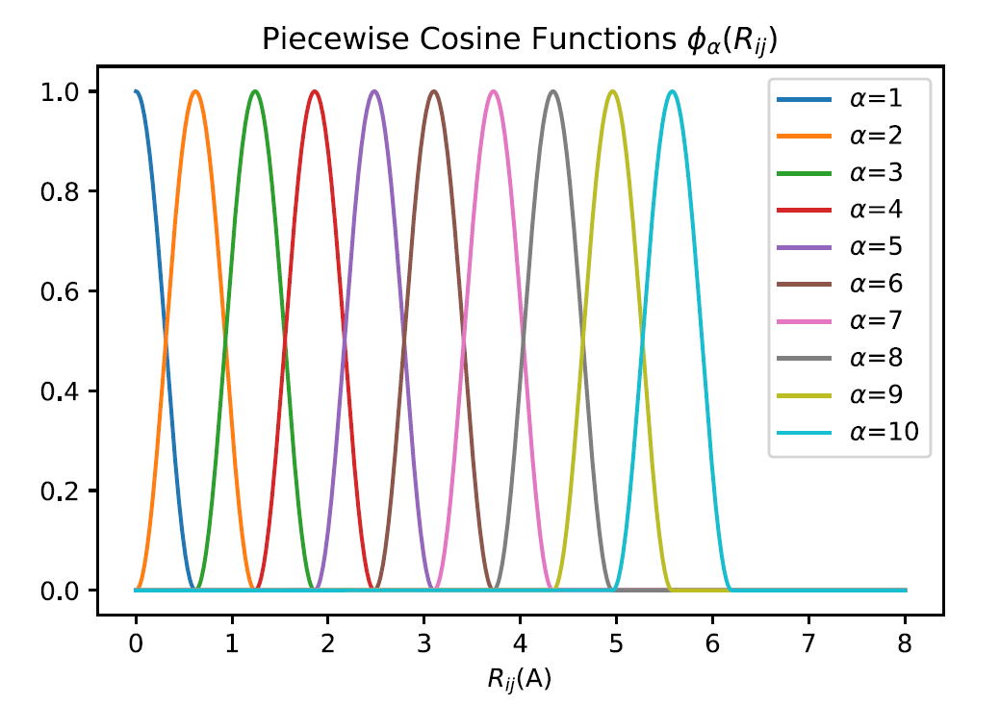

## NN Model

**[Tutorial](./nn-tutorial.md)**

### Neural Network (NN) Model Overview

The Neural Network (NN) model implements the following `8` feature types, all invariant under translation, rotation, and permutation:
```
        1. 2-body(2b)
        2. 3-body(3b)
        3. 2-body Gaussian(2b gauss)
        4. 3-body Cosine(3b cos)
        5. Moment Tensor Potential(MTP)
        6. Spectral Neighbor Analysis Potential(SNAP)
        7. DP-Chebyshev(dp1)
        8. DP-Gaussian(dp2)
```

Features (or descriptors) characterize the local atomic environment and must preserve translational, rotational, and permutational symmetry. They are commonly used as inputs to regressors such as linear models and neural networks, which predict atomic energies and forces. Because the features are differentiable functions of spatial coordinates, forces can be calculated as

$$
\mathbf{F}_i = - \frac{d E_{\text{tot}}}{d \mathbf{R}_i} = - \sum_{j,\alpha} \frac{\partial E_j}{\partial G_{j,\alpha}} \frac{\partial G_{j,\alpha}}{\partial \mathbf{R}_i}
$$

where $j$ indexes neighboring atoms within the cutoff radius and $\alpha$ indexes the features.

### 2-b and 3-b features with piecewise cosine functions (feature 1 & 2)

For a given central atom, piecewise cosine functions are used to describe its local environment. The following diagram illustrates the basic idea.



We first define piecewise cosine functions for the two-body and three-body features. Given inner and outer cutoffs $R_{\text{inner}}$ and $R_{\text{outer}}$, basis order $M$, segment width $h$, and interatomic distance $R_{ij}$ between central atom $i$ and neighboring atom $j$, the basis function is

$$
\phi_\alpha (R_{ij}) =
\begin{cases}
    \frac{1}{2} \cos\left( \frac{R_{ij} - R_\alpha}{h} \pi \right) + \frac{1}{2} &, |R_{ij} - R_\alpha| < h \\
    0 &, \text{otherwise}
\end{cases}
$$

where

$$
R_\alpha = R_{\text{inner}} + (\alpha - 1) h,\ \alpha = 1, 2, ..., M
$$

The **two-body feature** of central atom $i$ is

$$
G_{\alpha,i} = \sum_{m} \phi_{\alpha}(R_{ij})
$$

and the **three-body feature** is

$$
G_{\alpha\beta\gamma,i} = \sum_{j,k} \phi_{\alpha}(R_{ij}) \phi_{\beta}(R_{ik}) \phi_{\gamma}(R_{jk})
$$

where $\sum_{m}$ and $\sum_{m,n}$ denote sums over all atoms within the cutoff radius $R_{\text{outer}}$ of central atom $i$, respectively.

These two features are usually used together.

_Reference_:

Huang, Y., Kang, J., Goddard, W. A. & Wang, L.-W. Density functional theory based neural network force fields from energy decompositions. Phys. Rev. B 99, 064103 (2019)

### 2-b and 3-b Gaussian feature (feature 3 & 4)

These features were first used in the Behler–Parrinello neural network. Given cutoff radius $R_c$ and interatomic distance $R_{ij}$ between central atom $i$ and neighboring atom $j$, the cutoff function $f_c$ is defined as

$$
f_c(R_{ij}) =
\begin{cases}
    \frac{1}{2} \cos\left( \frac{\pi R_{ij}}{R_c} \right) + \frac{1}{2} &, R_{ij} < R_c \\
    0 &, \text{otherwise}
\end{cases}
$$

The **two-body Gaussian** feature of central atom $i$ is defined as

$$
G_i = \sum_{j \neq i} e^{(-\eta(R_{ij} - R_s)^2)} f_c(R_{ij})
$$

where $\eta$ and $R_s$ are user-defined parameters.

The **three-body Gaussian** feature of central atom $i$ is defined as

$$
G_i = 2^{1-\zeta} \sum_{j,k \neq i} (1 + \lambda \cos \theta_{ijk})^\zeta e^{-\eta(R_{ij}^2 + R_{ik}^2 + R_{jk}^2)} f_c(R_{ij}) f_c(R_{ik}) f_c(R_{jk})
$$

where

$$
\cos \theta_{ijk} = \frac{\mathbf{R}_{ij} \cdot \mathbf{R}_{ik}}{|\mathbf{R}_{ij}| |\mathbf{R}_{ik}|}
$$

$\eta$, $\zeta$, and $\lambda = \pm 1$ are user-defined parameters.

These two features are usually used together.

_Reference_:

J. Behler and M. Parrinello, Generalized Neural-Network Representation of High Dimensional Potential-Energy Surfaces. Phys. Rev. Lett. 98, 146401 (2007)

### Moment Tensor Potential (feature 5)

In MTP, the local environment of central atom $i$ is defined by

$$
\mathbf{n}_i = (z_i, z_j, \mathbf{r}_{ij})
$$

where $z_i$ is the atom type of the central atom, $z_j$ is the atom type of a neighbor, and $\mathbf{r}_{ij}$ is the relative coordinate of that neighbor. The energy contribution of each atom is then expanded as

$$
E_i(\mathbf{n}_i) = \sum_\alpha c_\alpha B_\alpha(\mathbf{n}_i)
$$

where $B_\alpha$ is a user-selected basis function and $c_\alpha$ is a parameter to be fitted.

To construct the basis functions, we introduce the moment tensor $M_{\mu\nu}$:

$$
M_{\mu\nu}(\mathbf{n}_i) = \sum_j f_\mu(|\mathbf{r}_{ij}|, z_i, z_j) \bigotimes_\nu \mathbf{r}_{ij}
$$

These moment tensors contain radial and angular components. The radial component can be expanded as

$$
f_\mu(|\mathbf{r}_{ij}|, z_i, z_j) = \sum_\beta c^{(\beta)}_{\mu,z_i,z_j} Q^{(\beta)}(|\mathbf{r}_{ij}|)
$$

where $Q^{(\beta)}(|\mathbf{r}_{ij}|)$ is a radial basis function. Specifically,

$$
Q^{(\beta)}(|\mathbf{r}_{ij}|) =
\begin{cases}
    \phi^{(\beta)}(|\mathbf{r}_{ij}|) (R_{\text{cut}} - |\mathbf{r}_{ij}|)^2 &, |\mathbf{r}_{ij}| < R_{\text{cut}} \\
    0 &, \text{otherwise}
\end{cases}
$$

where $\phi^{(\beta)}$ is a polynomial, such as a Chebyshev polynomial, defined on $[R_{\text{min}}, R_{\text{cut}}]$.

The angular component is given by $\bigotimes_\nu \mathbf{r}_{ij}$, the $\nu$-fold tensor product of $\mathbf{r}_{ij}$, and contains the angular information of neighborhood $\mathbf{n}_i$. The value of $\nu$ determines the rank of the moment tensor: $\nu=0$ gives a constant scalar, $\nu=1$ a vector (rank-1 tensor), $\nu=2$ a matrix (rank-2 tensor), and so on.

Finally, the level of a moment tensor is defined as

$$
\text{lev}(M_{\mu\nu}) = 2 + 4\mu + \nu
$$

This is an empirical formula.

_Reference_:

I.S. Novikov, etal, The MLIP package: moment tensor potential with MPI and active learning. Mach. Learn.: Sci. Technol, 2, 025002 (2021)

### Spectral Neighbor Analysis Potential (feature 6)

SNAP does not use Gaussian basis functions, so it does not calculate distances or kernel functions between two atomic-environment maps. Instead, it first defines a local atomic environment and expands it in spherical harmonics—or on a 4D hypersphere using rotation matrices. A bispectrum is then used to enforce rotational invariance. In this sense, SNAP resembles MTP, but uses a specialized contraction of directional indices to achieve rotational invariance. It is commonly paired with linear regression.

First, the local environment around the neighbors of central atom $i$ at $\mathbf{r}$ is defined as a sum of $\delta$ functions in three-dimensional space:

$$
\rho(\mathbf{r}) = \delta(\mathbf{r}) + \sum_{\mathbf{r}_{ki} < R_C} f_C(\mathbf{r}_{ki}) \omega_k \delta(\mathbf{r} - \mathbf{r}_{ki})
$$

where $\mathbf{r}_{ki}$ is the position of the $k$-th neighbor of atom $i$, $\omega_k$ is its weight, and radial function $f_C(\mathbf{r}_{ki})$ ensures that each neighbor's contribution smoothly approaches zero near cutoff radius $R_C$:

$$
f_C(\mathbf{r}) = 0.5 \left[ \cos\left( \frac{\pi r}{R_C} \right) + 1 \right]
$$

The angular component of this local-environment function can be expanded in spherical harmonics defined for $l = 0, 1, 2, ...$ and $m = -l, -l+1, ..., l-1, l$. A radial distribution is normally represented by a set of radial basis functions. Here, however, radial information $\mathbf{r}$ is mapped to the 4D hyperspherical function $U^j_{mm'}(\theta_0,\theta,\phi)$, where all points (neighboring atoms) lie on a 3D sphere embedded in 4D space and orientation is represented by three angles:

$$
\mathbf{r} \equiv \begin{pmatrix} x \\ y \\ z \end{pmatrix} \rightarrow
\begin{matrix}
\phi = \arctan(y/x) \\
\theta = \arccos(z/r) \\
\theta_0 = \frac{3}{4} \pi r / r_c
\end{matrix}
$$

The local-environment function can therefore be expanded in these 4D hyperspherical functions $U^j_{mm'}(\theta_0,\theta,\phi)$ with coefficients $u^j_{mm'}$:

$$
\rho(\mathbf{r}) = \sum_{j=0,\frac{1}{2},1,...}^\infty \sum_{m=-j,-j+1}^{j} \sum_{m'=-j,-j+1}^{j} u^j_{mm'} U^j_{mm'}(\theta_0,\theta,\phi)
$$

Using the local-environment function above, $u^j_{mm'}$ is calculated as

$$
u^j_{mm'} = U^j_{mm'}(0,0,0) + \sum_{\mathbf{r}_{ki} < R_C} f_C(\mathbf{r}_{ki}) \omega_k U^j_{mm'}(\theta_0(k),\theta(k),\phi(k))
$$

where $k$ indexes neighboring atoms and $\theta_0(k),\theta(k),\phi(k)$ are the three angles of the position vector of atom $i$'s $k$-th neighbor. Because of the indices $m$ and $m'$, $u^j_{mm'}$ is direction dependent. Three such terms can be contracted using

$$
F(j_1,j_2,j) = \sum_{m_1,m_1'=-j_1}^{j} \sum_{m_2,m_2'=-j_2}^{j} \sum_{m,m'=-j}^{j} (u^{j}_{mm'})^* u^{j_1}_{m_1 m_1'} u^{j_2}_{m_2 m_2'} \times C_{j_1 m_1 j_2 m_2}^{j m} C_{j_1 m_1' j_2 m_2'}^{j m'}
$$

Here, $C_{j_1 m_1 j_2 m_2}^{j m} C_{j_1 m_1' j_2 m_2'}^{j m}$ are Clebsch–Gordan coefficients, and the final scalar feature is $F(j_1,j_2,j)$. Different choices of $j_1,j_2,j$ produce different features. These features have no radial-function index; instead, they contain three angular-momentum indices because radial-distance information has been transformed into the third angular coordinate on the 3D sphere.

### DP-Chebyshev (feature 7)

This feature resembles the DP embedding network and uses Chebyshev polynomials as its basis.

First, $S(\mathbf{r}_{ij})$ is defined as a weighted inverse-distance function:

$$
S(\mathbf{r}) = \frac{f_C(\mathbf{r})}{r}
$$

$$
f_C(\mathbf{r}) = 
\begin{cases}
    1 &, r < R_{C_2} \\
    \frac{1}{2} \cos\left( \pi \frac{r - R_{C_2}}{R_c - R_{C_2}} \right) + \frac{1}{2} &, R_{C_2} \leq r < R_C \\
    0 &, r > R_C
\end{cases}
$$

Here, $R_{C_2}$ is a smooth cutoff parameter that allows the components of $\mathbf{r}_i$ to approach zero smoothly at the boundary of the local region defined by $R_C$. This smoothing function is more elaborate than the one used previously. $S(\mathbf{r}_{ji})$ reduces the weight of atoms farther from central atom $i$. We then define radial function $g_M(s)$ using Chebyshev polynomial $C_M$ for the *Deep Potential Chebyshev feature*:

$$
g_M(s) = C_M(2R_{\min} S - 1)
$$

Here, $R_{\min}$ is the minimum input value of $r$.

To construct this feature, we first calculate a four-component vector:

$$
T_M(k) = \sum_{\mathbf{r}_{ji} < R_C} \hat{X}_{ji}(k) S(\mathbf{r}_{ji}) g_M(S(\mathbf{r}_{ji}))
$$

Here, $k = 0,1,2,3$ indexes the four components: the usual $x,y,z$ components plus an $S$ component:

$$
\{ x_{ji}, y_{ji}, z_{ji}\} \rightarrow \{ S(\mathbf{r}_{ji}), \hat{x}_{ji}, \hat{y}_{ji}, \hat{z}_{ji} \}
$$

Here, $\hat{x}_{ji} = \frac{x_{ji}}{r_{ji}}, \hat{y}_{ji} = \frac{y_{ji}}{r_{ji}}, \hat{z}_{ji} = \frac{z_{ji}}{r_{ji}}$ are the components of the unit vector along $\mathbf{r}_{ji}$.

The component indices of these 4D vectors can then be contracted to obtain a scalar feature:

$$
F(M_1,M_2) = \sum_{k=0}^3 T_{M_1}(k) T_{M_2}(k)
$$

In addition to the Chebyshev order, $M_1$ also encodes the atom type. Therefore, if the maximum Chebyshev order is $M$, the number of features is $M \cdot n_{\text{type}} \cdot (M \cdot n_{\text{type}} + 1) / 2$. Different values of $M$ produce different feature sets.

### DP-Gaussian (feature 8)

This feature is similar to DP-Chebyshev, but replaces the Chebyshev polynomials with Gaussian functions whose position and width parameters are specified by the user.

As in DP-Chebyshev, the 4D vector is constructed as follows:

$$
T_M(k) = \sum_{\mathbf{r}_{ji} < R_C} \hat{X}_{ji}(k) g_M(\mathbf{r}_{ji})
$$

$$
\hat{X}(0) = S(\mathbf{r}'), \quad \hat{X}(1) = \frac{x}{r}, \quad \hat{X}(2) = \frac{y}{r}, \quad \hat{X}(3) = \frac{z}{r}
$$

$$
g_M(\mathbf{r}) = f_C(\mathbf{r}) \cdot \exp\left( -\frac{(r - r_M)}{\omega_M} \right)
$$

$$
f_C(\mathbf{r}) = \frac{1}{2} \cos\left( \frac{\pi r}{R_C} \right) + \frac{1}{2}
$$

The contraction is

$$
F(M_1,M_2) = \sum_{k=0}^3 T_{M_1}(k) T_{M_2}(k)
$$

In addition to the Gaussian-function index, $M_1$ also encodes the atom type. Therefore, if the maximum basis order is $M$, the number of features is $M \cdot n_{\text{type}} \cdot (M \cdot n_{\text{type}} + 1) / 2$. Different values of $M$ produce different feature sets.
