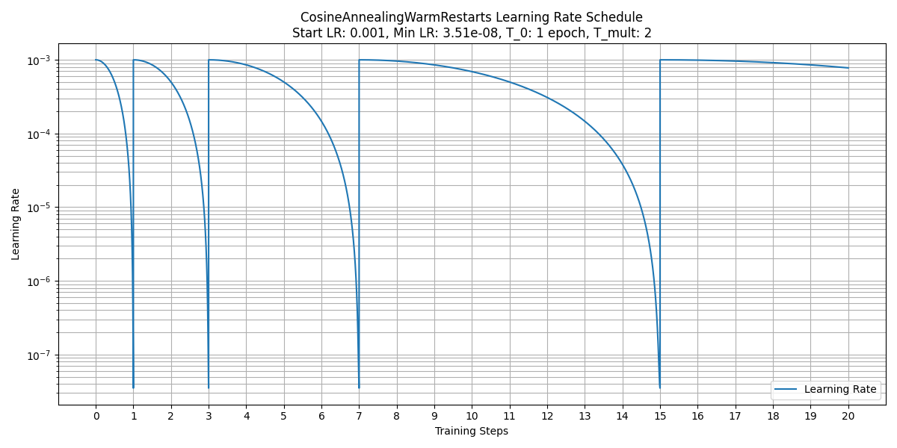

# MatPL Parameters

This section describes user-configurable parameters for all models. `Basic parameters` must be supplied, while `advanced parameters` have defaults that can be overridden in JSON. A relative path is resolved from the current working directory; an absolute path begins at the filesystem root.

## Basic Parameters

### model_type
Selects the model type: `LINEAR`, `NN`, `DP`, or `NEP`.

### atom_type
Sets the elements in any chosen order using atomic numbers or symbols. Examples: `[29]` or `["Cu"]` for copper, and `[1,6]` or `["H","C"]` for CH4.

### train_data
Specifies training-data paths, either relative or absolute.
   - DP and NEP support `extxyz`, `pwmlff/npy`, `deepmd/npy`, `deepmd/raw`, `pwmat/movement`, `vasp/outcar`, and `cp2k/md`.
   - LINEAR and NN support only `pwmat/movement`.

### valid_data
Specifies validation-data paths, either relative or absolute.
   - DP and NEP support `extxyz`, `pwmlff/npy`, `deepmd/npy`, `deepmd/raw`, `pwmat/movement`, `vasp/outcar`, and `cp2k/md`.
   - LINEAR and NN support only `pwmat/movement`.

### test_data
Specifies test-data paths for the `test` command, either relative or absolute.
   - DP and NEP support `extxyz`, `pwmlff/npy`, `deepmd/npy`, `deepmd/raw`, `pwmat/movement`, `vasp/outcar`, and `cp2k/md`.
   - LINEAR and NN support only `pwmat/movement`.

### format
Sets the format of `train_data`, `valid_data`, and `test_data`. Supported values include `extxyz`, `pwmlff/npy`, `deepmd/npy`, `deepmd/raw`, and direct trajectory formats `pwmat/movement`, `vasp/outcar`, and `cp2k/md`. The default is `pwmat/movement`. See [`pwdata`](./pwdata/README.md).
:::info
All input datasets must use the same format.
:::

### model_load_file
- For fine-tuning or continued training, specifies an initial `.ckpt` model.
- For `test`, specifies the model path, either relative or absolute.

### nep_txt_file
- For fine-tuning or continued training, specifies a `.txt` model such as GPUMD `nep4.txt` or `nep5.txt`.
- The text file may be a universal force field covering 89 elements. MatPL extracts parameters for the elements in [`atom_type`](#atom_type), enabling fine-tuning to a smaller model. This can be combined with `fix_cij`, `fix_hiddenlayer`, and `fix_outlayer` under `model->fitting_net`.

### recover_train
Whether to resume an interrupted training task. The default is `true`.

### reserve_work_dir
For LINEAR and NN, whether to retain `work_dir` after execution. The default is `false`.
 <!-- ### max_neigh_num
MatPL scans the training set to estimate the maximum neighbor count. For some systems, this may be too small and feature generation may fail with the following warning:

```txt
Error! maxNeighborNum too small
```
Increase the value in this case. -->

### save_step
Sets the model-save interval in iterations. The default is `None`, so models are saved only after each epoch.

### max_save_num
With `save_step`, sets the maximum number of recent models retained. The default is `10`.

## NEP Model Hyperparameters

The complete NEP model configuration is:

```json
    "model": {
        "descriptor": {
            "cutoff": [6.0,6.0],
            "n_max": [4,4],
            "basis_size": [12,12],
            "l_max": [4,2,1],
            "zbl": 2.0
        },
        "fitting_net": {
            "network_size": 40,
            "fix_cij":false,
            "fix_hiddenlayer":false,
            "fix_outlayer":false
        }
    }
```
<!-- ### batch_max_types
Sets the maximum number of element types allowed in a batch. Structures exceeding it are discarded. This is useful for large-batch universal-force-field training, preventing GPU-memory overflow from structures with many element types or neighbors. By default, no limit is applied. -->

### cutoff
Sets radial and angular cutoff radii. The default is `[8.0, 4.0]`.

### n_max
Sets `n_max` for radial and angular descriptors. Each value must be between 0 and 19. The default is `[4,4]`.

### basis_size
Sets the radial and angular basis sizes. Each value must be between 0 and 19. The default is `[8,8]`.

### l_max
Sets angular expansion orders and enables four- and five-body descriptors. The default `[4,2,1]` contains the three-, four-, and five-body orders. Use `[4,0,0]` for three-body only or `[4,2,0]` for three- and four-body descriptors.

:::info
The numbers of two-, three-, four-, and five-body descriptors are `n_max[0]+1`, `(n_max[1]+1)*l_max[0]`, `n_max[1]+1`, and `n_max[1]+1`, respectively.
:::

### network_size
Sets the number of neurons in NEP's single hidden layer. The default is `40`.
<!-- Multiple layers such as `[50,50,50,1]` are supported, but the default is recommended. In our tests, deeper networks provide little accuracy improvement while increasing inference cost. -->

### zbl
Sets the outer cutoff of the Ziegler–Biersack–Littmark (ZBL) potential (`DOI: 10.1007/978-1-4615-8103-1_3`); the inner cutoff is fixed at half the outer cutoff. It is disabled by default. A value in $1.0 \le zbl \le 3.0$ is recommended.

### use_typewise_cutoff_zbl
Enables type-wise ZBL cutoffs. The outer cutoff for a pair is `min(zbl, use_typewise_cutoff_zbl × sum of covalent radii)`, and the inner cutoff is fixed at 0.0. Disabled by default; introduced in `MatPL-2026.3 Update 1`.

### fix_cij
Fine-tuning option that freezes NEP two- and three-body feature coefficients. The default is `false`.

### fix_hiddenlayer
Fine-tuning option that freezes NEP hidden-layer parameters `W0` and `B0`. The default is `false`.

### fix_outlayer
Fine-tuning option that freezes NEP output-layer parameters `W1` and `B1`. The default is `false`.

### Interpreting NEP.txt

A standard `NEP.txt` header is shown below.

```txt
nep5   2 O Hf           # Number of element types, followed by their symbols
zbl 1 2                 # Present only when ZBL is enabled during training
cutoff 6.0 6.0 108 108  # Two-body cutoff, many-body cutoff, and their maximum neighbor counts
n_max  4 4              # Two-body and many-body n_max
basis_size 12 12        # Two-body and many-body basis_size
l_max  4 2 1            # Three-, four-, and five-body l_max values
ANN    40 0             # 40 hidden neurons; 0 is a placeholder
```

The remaining lines contain four blocks: `network parameters`, `two-body coefficients`, `three-body coefficients`, and `normalization values`.

- Block 1 contains network parameters for $E_i=\tanh(q_nW0+B0)W1+b1$. Its size is `number of elements × (number of features × ANN[0] + ANN[0] + ANN[0]) + number of elements`. For each element in header order, it stores `W0`, `B0`, and `W1`, followed by one `b1` per element. A GPUMD-trained NEP4 file stores only one `b1`, the mean across elements. `W0` is flattened row-major from `[ANN hidden units, number of features]`.

- Block 2 contains two-body coefficients: `number of elements² × (n_max[0]+1) × (basis_size[0]+1)`.

- Block 3 contains three-body coefficients: `number of elements² × (n_max[1]+1) × (basis_size[1]+1)`.

    In either coefficient block, the matrix order is `[I,J,N,K]`: `I` is the central element, `J` is the neighbor element, both following header order; `N=n_max+1`; and `K=basis_size+1`.

- Block 4 contains one normalization value per feature, ordered by two-, three-, four-, and five-body terms. Their counts are `n_max[0]+1`, `(n_max[1]+1)*l_max[0]`, `n_max[1]+1`, and `n_max[1]+1`.

## DP Model Hyperparameters

The complete DP model configuration is:

```json
    "type_embedding":false,
    "model": {
        "type_embedding":{
            "physical_property":["atomic_number", "atom_mass", "atom_radius", "molar_vol", "melting_point", "boiling_point", "electron_affin", "pauling"]
        },
        "descriptor": {
            "Rmax": 6.0,
            "Rmin": 0.5,
            "M2": 16,
            "network_size": [25,25,25]
        },
        "fitting_net": {
            "network_size": [50,50,50,1]
        }
    }
```

### type_embedding
Configures type embedding for DP training. You may also set `"type_embedding":true` alongside `model`, which uses `["atomic_number","atom_radius","atom_mass","electron_affin","pauling"]`. The default is `false`.

#### physical_property

Selects physical properties for DP type embedding. Eight properties are available:

    - `atomic_number`: atomic number
    - `atom_mass`: atomic mass
    - `atom_radius`: atomic radius
    - `molar_vol`: molar volume
    - `melting_point`: melting point
    - `boiling_point`: boiling point
    - `electron_affin`: electron affinity
    - `pauling`: Pauling electronegativity

    The default `physical_property` is `["atomic_number","atom_radius","atom_mass","electron_affin","pauling"]`.

### Rmax
Maximum cutoff radius of the DP smoothing function. The default is $6.0 \text{\AA}$.

### Rmin
Minimum cutoff radius of the DP smoothing function. The default is $0.5 \text{\AA}$.

### M2
Sets the DP embedding-network output dimension and therefore the fitting-network input dimension. In the example, these are `25 × 16` and `25 × 16 = 400`. The default is `16`.

### network_size
Sets the embedding- and fitting-network structures. Defaults are `[25,25,25]` and `[50,50,50,1]`.

Embedding network:
Input -> hidden layer 1 (25 neurons) -> hidden layer 2 (25 neurons) -> output layer (25 neurons)

Fitting network:
Input (`M2 × 25`) -> three hidden layers (50 neurons each) -> output (1 neuron)

## NN Model Hyperparameters

The complete NN model configuration is:

```json
    "model": {
        "descriptor": {
            "Rmax": 6.0,
            "Rmin": 0.5,
            "feature_type": [3,4]
        },
        "fitting_net": {
            "network_size": [15,15,1]
        }
    }
```

### Rmax
Maximum feature cutoff radius. The default is $6.0 \text{\AA}$.

### Rmin
Minimum feature cutoff radius. The default is $0.5 \text{\AA}$.

### feature_type
Selects feature types. Supported values are `[1,2]`, `[3,4]`, `[5]`, `[6]`, `[7]`, and `[8]`. The default `[3,4]` selects two- and three-body Gaussian features. See [Appendix 1](./models/nn/README.md).

### network_size
Sets the fitting-network structure. The default `[15,15,1]` gives:
Input -> hidden layer 1 (15 neurons) -> hidden layer 2 (15 neurons) -> output (1 neuron)


## Linear Model Hyperparameters

The complete Linear model configuration is:

```json
    "model": {
        "descriptor": {
            "Rmax": 6.0,
            "Rmin": 0.5,
            "feature_type": [3,4]
        }
    }
```

### Rmax
Maximum feature cutoff radius. The default is $6.0 \text{\AA}$.

### Rmin
Minimum feature cutoff radius. The default is $0.5 \text{\AA}$.

### feature_type
Selects feature types using the same settings as the NN model. Supported values are `[1,2]`, `[3,4]`, `[5]`, `[6]`, `[7]`, and `[8]`. The default `[3,4]` selects two- and three-body Gaussian features. See [Appendix 1](./models/nn/README.md).

## ADAM Optimizer Hyperparameters

The complete ADAM configuration is:

```json
    "optimizer": {
        "optimizer": "ADAM",
        "epochs": 30,
        "reset_epoch":false,
        "batch_size": 1,
        "print_freq": 10,
        "lambda_2" : 0.1,
        "learning_rate": 0.001,
        "stop_lr": 3.51e-08,
        "stop_step": 1000000,
        "decay_step": 5000,
        "max_norm": 0.5,
        "norm_type": 2,
        "t_0": 6,
        "t_mult": 1,
        "train_energy": true,
        "train_force": true,
        "train_virial": false,
        "start_pre_fac_force": 1000,
        "start_pre_fac_etot": 0.02,
        "start_pre_fac_virial": 50.0,
        "end_pre_fac_force": 1.0,
        "end_pre_fac_etot": 1.0,
        "end_pre_fac_virial": 1.0
    }
```

### optimizer
Selects the optimizer. The default is `ADAM`; use `LKF` for the LKF optimizer. See the [LKF paper](https://dl.acm.org/doi/abs/10.1609/aaai.v37i7.25957).

### reset_epoch
Whether restarted training begins at epoch 0. The default is `true`. Set `false` to resume from a checkpoint and restore ADAM's first- and second-moment states.

### epochs
Sets the number of epochs. Each epoch processes the entire dataset in mini-batches with forward propagation, loss calculation, and backpropagation. The default is `30`.

Choose the epoch count by monitoring training and validation. Too few epochs may underfit; too many may overfit and reduce generalization.

### batch_size
Sets the number of samples in each mini-batch. The default is `1`.

### print_freq
Sets the number of mini-batch iterations between training-error reports. The default is `10`.

### train_energy
Whether to train on total energy. The default is `true`.

### train_force
Whether to train on forces. The default is `true`.

### train_virial
Whether to train on virials. The default is `false`.

### lambda_2
Sets ADAM `L2` regularization. It is disabled by default and may reduce overfitting.

### learning_rate
Initial ADAM learning rate. The default is `0.001`.

### stop_lr
Minimum learning rate. Once reached, it remains fixed. The default is `3.51e-08`.

### stop_step
Step at which learning-rate decay stops and the rate equals `stop_lr`. The default is `1000000`.

### decay_step
Learning-rate decay interval. The default is `5000` steps.

`learning_rate`, `stop_lr`, `stop_step`, and `decay_step` determine the schedule as follows:

```python
decay_rate = np.exp(np.log(stop_lr/learning_rate) / (stop_step/decay_step))
real_lr = learning_rate * np.power(decay_rate, (iter_num//decay_step))
```

First calculate `decay_rate`:

$$
\text{decay\_rate} = \exp\left(\frac{\log(\text{stop\_lr}/\text{start\_lr})}{\text{stop\_step}/\text{decay\_step}}\right)
$$

Then update the learning rate:

$$
\text{real\_lr} = \text{start\_lr} \cdot \text{decay\_rate}^{\lfloor \text{iter\_num}/\text{decay\_step} \rfloor}
$$

where `iter_num` is the training iteration.

### Energy and Force Prefactors in the Loss

Force, energy, and virial prefactors:

- `start_pre_fac_force`: force-loss prefactor at the start of training. Must be nonnegative; default `100`.

- `end_pre_fac_force`: force-loss prefactor at the end of training. Default `1.0`.

- `start_pre_fac_etot`: total-energy prefactor at the start of training. Default `1.0`.

- `end_pre_fac_etot`: total-energy prefactor at the end of training. Default `1.0`.

- `start_pre_fac_virial`: virial prefactor at the start of training. Default `0.1`.

- `end_pre_fac_virial`: virial prefactor at the end of training. Default `0.1`.


`Loss-prefactor calculation`:

During ADAM training, each loss prefactor depends on the current `real_lr`:

```python
lr_ratio = real_lr / learning_rate
lr_ratio = min(max(lr_ratio, 0.0), 1.0)

prefactor = end_prefactor + (start_prefactor - end_prefactor) * lr_ratio
```

Equivalently:

$$
r =
\mathrm{clip}
\left(
\frac{\text{real\_lr}}{\text{learning\_rate}},
0,
1
\right)
$$

$$
p_x =
p_x^{\mathrm{end}}
+
\left(
p_x^{\mathrm{start}} - p_x^{\mathrm{end}}
\right)
r
$$

where `x` may be `force`, `etot`, or `virial`.
At the start of training:

$$
\text{real\_lr} \approx \text{learning\_rate}, \quad r \approx 1
$$

Therefore:

$$
p_x \approx p_x^{\mathrm{start}}
$$

Later, as the learning rate decreases:

$$
\text{real\_lr} \to 0, \quad r \to 0
$$

Therefore:

$$
p_x \to p_x^{\mathrm{end}}
$$

`Loss formula`:


Total loss combines enabled force, total-energy, and virial terms:

$$
L =
p_F L_F^{\mathrm{MSE}}
+
p_{\mathrm{etot}}
\frac{L_{\mathrm{Etot}}^{\mathrm{MSE}}}{N_{\mathrm{avg}}}
+
p_{\mathrm{virial}}
\frac{L_{\mathrm{Virial}}^{\mathrm{MSE}}}{N_{\mathrm{avg}}}
$$

- Each term uses `MSELoss`:

$$
L_{\mathrm{}}^{\mathrm{MSE}}
=
\frac{1}{n}\sum_{i}^{n}\left(Y_i-\hat{Y_i}\right)^2
$$

- $L_F$ is force loss.
- $L_{Etot}$ is total-energy loss.
- $L_{Virial}$ is total-virial loss.
- $N_{\mathrm{avg}}$ is the mean atom count per structure in the current batch.
- $p_F$, $p_{Etot}$, and $p_{Virial}$ are the corresponding prefactors.


Because `Etot` and `Virial` are structure-level totals, dividing them by `N_avg` makes their scale closer to per-atom quantities and prevents larger systems from receiving inherently greater weight.

### Gradient Clipping

#### Norm-Based Clipping: max_norm and norm_type

`max_norm` and `norm_type` configure norm-based clipping. The default `max_norm=None` disables it.

If the norm of all parameter gradients exceeds `max_norm`, gradients are scaled proportionally until the norm equals `max_norm`.

This preserves relative gradient directions while preventing exploding gradients. `norm_type` selects the norm.

`norm_type` is integer `1` for L1 or `2` for L2. The default is `2`.

The L1 norm is the sum of absolute gradient values:
$\|g\|_1 = \sum_{i=1}^{n} |g_i|$，
If $\|g\|_1 > \text{max\_norm}$, gradients are scaled to

$$
g_{\text{clipped}} = g \cdot \frac{\text{max\_norm}}{\|g\|_1}
$$

The L2 norm is the Euclidean gradient norm:
$\|g\|_2 = \sqrt{\sum_{i=1}^{n} g_i^2}$，
If $\|g\|_2 > \text{max\_norm}$, gradients are scaled to

$$
g_{\text{clipped}} = g \cdot \frac{\text{max\_norm}}{\|g\|_2}
$$

#### Value-Based Clipping: clip_value
Clips each gradient component to `[-clip_value, clip_value]`. The default `None` disables it.

$$
g_i^{\text{(clipped)}} = 
\begin{cases}
  \text{clip\_value}, & \text{if } g_i > \text{clip\_value} \\
  -\text{clip\_value}, & \text{if } g_i < -\text{clip\_value} \\
  g_i, & \text{otherwise}
\end{cases}
$$

### Cosine Annealing with Warm Restarts: t_0 and t_mult

Positive integers `t_0` and `t_mult` enable cosine annealing with warm restarts for ADAM. Once enabled, `optim.lr_scheduler.CosineAnnealingWarmRestarts` controls the learning rate and the `decay_step` schedule is disabled.

- `t_0`: length of the first cycle, in epochs.
- `t_mult`: factor by which the cycle length grows after each restart.

- The epoch $E_n$ at which cycle $n$ ends and the learning rate reaches its minimum is calculated as follows:
   - For `t_mult = 1`, cycles have fixed length `t_0`.

   - For `t_mult > 1`, cycle lengths grow geometrically:
   
   $$E_n = t_0 \times \frac{T_{mult}^n - 1}{T_{mult} - 1} \quad (n = 1, 2, 3, \dots)$$

- When cosine annealing is enabled, the model at each $E_n$, immediately before restart, is saved under `model_record/saved_models`.

In the figure below, [learning_rate](#learning_rate) is 0.001, `t_0=1`, `t_mult=2`, and [stop_lr](#stop_lr) is 3.51e-08. Restarts occur at epochs 1, 3, 7, 15, and so on.



### Learning-Rate Scaling

`scale_lr` controls scaling by batch size and GPU count. The default is `false`, so the effective rate equals `learning_rate`.

When enabled, the default `sqrt` scaling is

$$
\mathrm{real\_lr}=\mathrm{learning\_rate}\times\sqrt{\mathrm{batch\_size}\times N_{\mathrm{GPU}}}
$$

```json
"scale_lr": true,
"scaling_method": "sqrt"
```

This applies to ADAM, ADAMW, and SGD. Increasing batch size or GPU count increases the effective learning rate.

## KF Optimizer Hyperparameters

The complete KF configuration is:

```json
    "optimizer": {
        "optimizer": "LKF",
        "epochs": 30,
        "batch_size": 1,
        "print_freq": 10,
        "block_size": 5120,
        "p0_weight": 0.01,
        "kalman_lambda": 0.98,
        "kalman_nue": 0.9987,
        "train_energy": true,
        "train_force": true,
        "train_virial": false,
        "pre_fac_force": 2.0,
        "pre_fac_etot": 1.0,
        "pre_fac_virial": 1.0
    }
```

`optimizer`, `epochs`, `batch_size`, `print_freq`, `train_energy`, `train_force`, and `train_virial` have the same meanings as for ADAM.

### block_size
Sets the block size of LKF covariance matrix `P`. Larger blocks consume more memory and train more slowly; smaller blocks may reduce convergence speed and accuracy. The default is `5120`; `10240` is recommended for A100 or H100 GPUs.

### p0_weight
LKF regularization parameter. The default `0.01` reduces overfitting and must be below 1; setting it to `1` disables regularization.

### kalman_lambda
LKF memory factor controlling the weight of previous data. Larger values retain more history. The default is `0.98`.

### kalman_nue
LKF forgetting rate controlling how quickly `kalman_lambda` changes. The default is `0.9987`.

<!-- ### train_ei
Whether to train on atomic energies. The default is `false`.

#### train_egroup
Whether to train on energy groups. The default is `false`. -->

### pre_fac_etot
Weight of total energy in the loss. The default is `1.0`.

### pre_fac_force
Weight of force in the loss. The default is `2.0`.

### pre_fac_virial
Weight of virial in the loss. The default is `1.0`.

<!-- ### pre_fac_ei
Weight of atomic energy in the loss. The default is `1.0`. -->

<!-- ### pre_fac_egroup
Weight of energy groups in the loss. The default is `0.1`. -->

:::caution
1. Multi-GPU NEP training does not support LKF or GKF.

2. The size of covariance matrix `P` scales with the square of `N/block_size`, where `N` is the parameter count. Training many element types can therefore exhaust GPU memory and converge slowly.
:::
