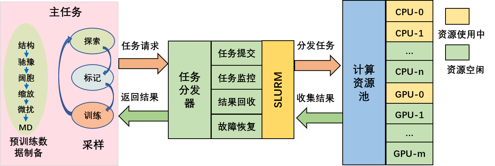
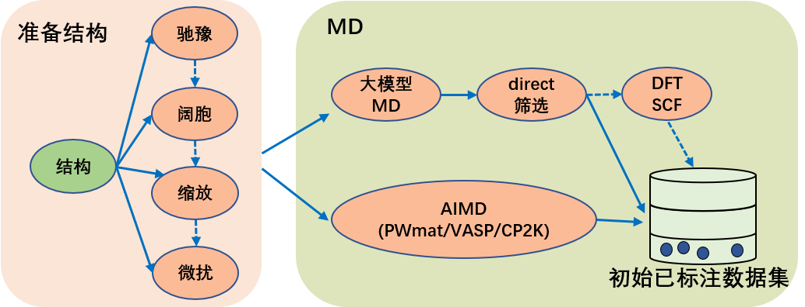
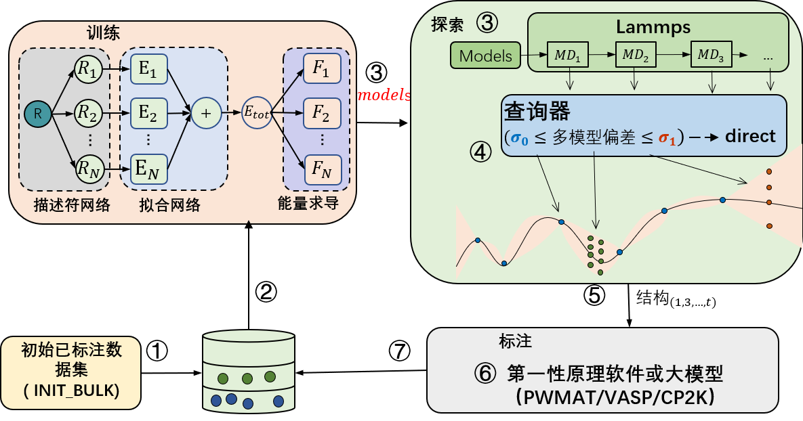

# PWact Active Learning
## PWact Platform Overview
Machine-learning force fields can predict material properties and reaction mechanisms faster and more accurately than conventional approaches; state-of-the-art deep-learning molecular dynamics can now simulate systems containing tens of billions of atoms. However, because machine-learning models are fundamentally interpolative, an MLFF may be inaccurate in regions of phase space not represented by its training set. Training data are normally generated with expensive first-principles calculations, making large *ab initio* datasets difficult to obtain. Creating sufficiently representative data without relying on excessive first-principles calculations is therefore essential for improving extrapolation. [PWact](https://github.com/LonxunQuantum/PWact) (Active Learning Based on PWmat Machine Learning Force Fields) is an open-source, MatPL-based automated active-learning platform for efficient data sampling.

PWact consists of a primary workflow and a task dispatcher.



The primary workflow contains `pretraining-data preparation` and `active learning`. It generates computational tasks and collects their results. When the dispatcher receives a scheduling request, it assigns the task to a compute node according to current resource usage and the resources requested. After execution, it collects the results and returns them to the primary workflow.

### Pretraining-Data Preparation



The preparation workflow supports relaxation `(PWmat, VASP, and CP2K)`, supercell construction, lattice scaling, perturbation, and MD, and these operations can be combined. AIMD trajectories from PWmat, VASP, or CP2K can serve as pretraining data. PWact can also run MD with a foundation model and use DIRECT sampling to remove similar configurations. The filtered structures can then be labeled with PWmat, VASP, or CP2K through self-consistent calculations of energies and forces.

 - DIRECT sampling: Qi J, Ko T W, Wood B C, et al. Robust training of machine learning interatomic potentials with dimensionality reduction and stratified sampling[J]. npj Computational Materials, 2024, 10(1): 43.

### Active Learning



The active-learning workflow contains `training`, `configuration exploration`, and `labeling`. First, the training module trains a model and passes it to exploration. Exploration runs molecular dynamics with the force field and sends the resulting trajectories to a query engine for uncertainty estimation. Selected configurations are passed to labeling, which performs self-consistent calculations to obtain energy and force labels and adds the labeled structures to the database. This cycle repeats until convergence.

- Model training supports MatPL DP, compressed DP, type-embedding DP, and NEP models.

- For uncertainty estimation, PWact provides the widely used multi-model Committee Query method and our single-model Kalman Prediction Uncertainty (KPU) method. KPU approaches Committee Query accuracy while reducing model-training cost to $1/N$, where $N$ is the number of committee models. KPU currently applies only to DP models.
    
- **Optional:** Use DIRECT sampling to reduce the number of similar structures in the candidate set.

- Labeling supports PWmat, VASP, CP2K, or foundation-model inference.

### Dependencies

- PWact uses [Slurm](https://slurm.schedmd.com/documentation.html) for cluster and job scheduling, so Slurm must be installed on the compute cluster.

- DFT calculations support [PWmat](https://www.pwmat.com/gpu-download), [VASP](https://www.vasp.at/), and [CP2K](https://www.cp2k.org/). Install at least one of them on the cluster.

<!-- DFTB is integrated into PWmat. See the [`DFTB_DETAIL section of the PWmat manual`](http://www.pwmat.com/pwmat-resource/Manual_cn.pdf) for details and [`download the PWmat build with DFTB`](https://www.pwmat.com/modulefiles/pwmat-resource/mstation-download/cuda-11.6-mstation-beta.zip). -->

- Force-field models are trained with [MatPL](https://github.com/LonxunQuantum/MatPL). See the [MatPL installation guide](../install/README.md).

- LAMMPS molecular dynamics uses [lammps-MatPL](https://github.com/LonxunQuantum/lammps-MatPL). See the [MatPL installation guide](../install/README.md).

- DIRECT sampling and foundation-model sampling are preinstalled on [Lonxun Supercomputing Cloud](https://mcloud.lonxun.com/) (`Mcloud`), with support for DIRECT and the EquiformerV2 model. In other environments, install the required software and provide the processing scripts.

### Installation

PWact can be installed with `pip` or from source.

#### Install with pip
The package is available on PyPI and can be installed directly with `pip`.
```bash
pip install pwact

# Install PWact, or upgrade an existing installation
pip install pwact --upgrade

# List available versions
pip index versions pwact
# Example output:
# pwact (0.4.8)
# Available versions: 0.4.8, 0.4.7, 0.4.6, 0.4.5, 0.4.4, 0.4.2, 0.3.4, 0.3.3, 0.2.4, 0.1.28, 0.1.10

# Install a specific version
pip install pwact==n.m.o

```

#### Install from GitHub Source
Install from source only when you need to modify the code; otherwise, use `pip`.
Download the source:
```bash
git clone https://github.com/LonxunQuantum/PWact.git
or
git clone https://gitee.com/pfsuo/pwact.git
Gitee may update later than GitHub, so GitHub is recommended
```

After downloading, enter the source root containing `setup.py` and run:
```bash
pip install .
# Or use editable mode so changes to the source take effect immediately
# pip install -e .
# After installing from source, add PWact to PYTHONPATH if needed
# export PYTHONPATH=/the/path/pwact:$PYTHONPATH
```

PWact is written in Python and supports Python 3.9 or later. We recommend using MatPL's [Python environment](../install/README.md).

To create a separate virtual environment for PWact, install the following packages in a Python 3.9-or-later environment:
```bash
    pip install numpy pandas tqdm pwdata
```


### Command List

PWact commands begin with `pwact`. Subcommands are case-insensitive, so `INIT_BULK`, `Init_BUlk`, and `init_bulk` are equivalent.

#### List Available Commands

```bash
pwact  [ -h / --help / help ]

# List options for a specific cmd_name
pwact cmd_name -h
```

#### Prepare an Initial Training Set

```bash
pwact init_bulk param.json resource.json
```

#### Active Learning

```bash
pwact run param.json resource.json
```

You may rename the JSON files used by these commands, but the argument order of [`param.json`](#paramjson) and [`resource.json`](#resourcejson) must remain unchanged.


#### gather_pwdata Command

This command searches the active-learning directory for all explored structures and saves them under `final_pwdata` in the configured `data_format`. `final_pwdata_list.txt` lists the data directory for each iteration.
```txt
final_pwdata/
final_pwdata_list.txt  iter.0000  iter.0001  iter.0002 ...
```

```bash
pwact gather_pwdata -i .
```
Here, `-i` specifies the active-learning root, corresponding to the `run_iter` directory in the examples.

#### kill Command

Stop running `init_bulk` tasks such as relaxation and AIMD:

```bash
# Enter the directory from which pwact init_bulk was started
pwact kill init_bulk
```

Stop running `run` tasks, including training, exploration (MD), and labeling:
```bash
# Enter the directory from which pwact run was started
pwact kill run
```
You can perform the same operation manually by first terminating the primary `pwact init_bulk` or `pwact run` process and then canceling the associated Slurm jobs.

Because manual termination may affect unrelated processes, the `kill` command is recommended.

After stopping the workflow, inspect the command output and use Slurm commands to check for remaining jobs.

#### filter Command

Test structure selection with specified lower and upper thresholds:
```bash
pwact filter -i iter.0000/explore/md -l 0.01 -u 0.02 -s 
```
This command evaluates all trajectories under `iter.0000/explore/md` using a lower threshold of `0.01` and an upper threshold of `0.02`, as shown below. The optional `-s` flag saves detailed selection information.

```txt
Image select result (lower 0.01 upper 0.02):
 Total structures 972    accurate 20 rate 2.06%    selected 44 rate 4.53%    error 908 rate 93.42%

Select by model deviation force:
Accurate configurations: 20, details in file accurate.csv
Candidate configurations: 44
        Select details in file candidate.csv
Error configurations: 908, details in file fail.csv
```

### Input Files

PWact uses `param.json` and `resource.json` for initial-dataset preparation and active learning. JSON keys in both files are case-insensitive.

#### param.json

[Initial training-set preparation: init_param.json](./init_param_zh)

Configures relaxation, supercell construction, scaling, perturbation, and AIMD (PWmat, VASP, or CP2K) for VASP- or PWmat-format structures.

[Active learning: run_param.json](./run_param_zh)

Configures training (network architecture and optimizer), exploration (LAMMPS and selection strategy), and labeling (VASP/PWmat self-consistent calculations).

#### resource.json

[resource.json](./resource_zh#resourcejson)

Configures cluster resources for training, molecular dynamics, and DFT calculations (SCF, relaxation, and AIMD), including compute nodes, CPUs, GPUs, and software such as LAMMPS, VASP, PWmat, and MatPL.

### Active-Learning Examples

- [Active learning for silicon](./example_si_init_zh)

- [Active learning for silicon (foundation model + DIRECT)](./example_si_direct_bigmodel.md)

- [Active learning for an Au–Ag alloy](./example_auag_init_zh.md)
