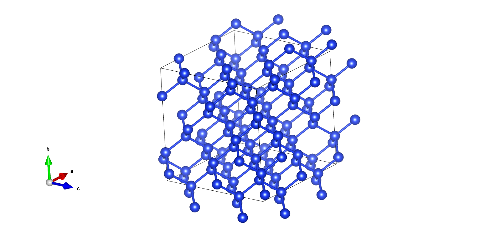

## Active-Learning Example for Silicon

This example demonstrates active learning for silicon and is located in [`pwact/example/si_pwmat/`](https://github.com/LonxunQuantum/PWact/tree/main/pwact/example/si_pwmat). Mcloud users can find it under `/share/public/PWMLFF_test_data/pwact_examples/25-pwact-demo`.

The example first constructs an initial training set with `init_bulk`, trains models on that dataset, and uses structures generated by perturbation during `init_bulk` as initial configurations for active-learning sampling at `300 K`, `500 K`, and `900 K`.

The supplied DFT settings are intended only to test the workflow and do not guarantee calculation accuracy.



### init_bulk Example

`Command`:

Enter `pwact/example/si_pwmat/init_bulk`:
```bash
pwact init_bulk init_param.json resource.json
```

### init_bulk Directory Structure

The [directory structure](#init_bulk-directory-structure) is shown below. `atom.config`, `POSCAR`, `resource.json`, `init_param.json`, `relax_etot.input`, `relax_etot1.input`, `aimd_etot1.input`, and `aimd_etot2.input` are input files; `collection` contains the results.

### init_bulk Directory Structure: collection

`datapath.txt` records the locations of the pretraining datasets.

`init_config_0` collects the results of relaxation, supercell construction, scaling, perturbation, and AIMD applied to `atom.config`.

`relax.config` is the relaxed structure; `super_cell.config` is the expanded structure; and `0.9_scale.config` and `0.95_scale.config` are lattice-scaled variants of `super_cell.config`.

`0.9_scale_pertub` contains 30 structures generated by perturbing the lattice and atomic positions of `0.9_scale.config`.

After AIMD is run on the perturbed structures with `aimd_etot1.input`, the trajectories are extracted to `train.xyz` in extxyz format. For `pwmlff/npy`, the output is a `PWdata` directory such as the one below. `atom_type.npy` stores atom types, `position.npy` stores atomic positions, and `energies.npy`, `forces.npy`, `ei.npy`, and `virials.npy` store total energies, Cartesian forces, atomic energies, and virials. `ei.npy` and `virials.npy` are optional and are omitted when the trajectory lacks those labels.
```txt
./init_config_0/PWdata/Si128
├── atom_type.npy
├── energies.npy
├── ei.npy
├── forces.npy
├── image_type.npy
├── lattice.npy
├── position.npy
└── virials.npy
```

### init_bulk Directory Structure: Tree

```
example/init_bulk
├──atom.config
├──POSCAR
├──resource.json
├──init_param.json
├──relax_etot.input
├──relax_etot1.input
├──relax_etot2.input
├──aimd_etot1.input
├──aimd_etot2.input
└──collection
    ├──datapath.txt
    ├──init_config_0
    │   ├──super_cell.config
    │   ├──0.9_scale.config
    │   ├──0.9_scale_pertub
    │   │       ├──0.9_scale.config
    │   │       ├──0_pertub.config
    │   │       ├──1_pertub.config
    │   │       ├──2_pertub.config
    │   │       ...
    │   │       └──30_pertub.config
    │   ├──0.95_scale.config
    │   ├──0.95_scale_pertub
    │   │       ├──0.95_scale.config
    │   │       ├──0_pertub.config
    │   │       ├──1_pertub.config
    │   │       ├──2_pertub.config
    │   │       ...
    │   │       └──30_pertub.config
    │   └──train.xyz
    ├──init_config_1
    ...
```

### run Active-Learning Example

The workflow uses the pretraining data and perturbed structures from `init_bulk` for active learning at 500 K, 800 K, and 1100 K.

`Command`:
After `init_bulk` completes, enter `pwact/example/si_pwmat/`:
```bash
pwact run param.json resource.json
```

### run Active-Learning Directory

The active-learning [directory structure](#run-active-learning-directory) is shown below.

`param.json` and `resource.json` are active-learning control files; `scf_etot.input` controls self-consistent labeling calculations.

`si.al` records the completed active-learning stages.

`iter_result.txt` records exploration and label selection for each iteration. In the example below, the first line summarizes selection: `Total structures = accurate + selected + error`. The next lines summarize MD trajectories, including successful and failed runs; failed trajectories are listed in `error_traj.log` and usually indicate that an inaccurate force field caused MD instability. Subsequent lines report converged and unconverged labeling calculations and list the paths of failures. Unconverged structures are not added to the training set.

```txt
iter.0000  Total structures 1296    accurate 6 rate 0.46%    selected 23 rate 1.77%    error 1267 rate 97.76%
A total of 16 MD trajectories were run. with 16 trajectories correctly executed and 0 trajectories normally completed. 
For detailed information, refer to File error_traj.log.

Number of converged files: 194, number of non-converged files: 3
List of non-converged files:
/share/public/PWMLFF_test_data/pwact_examples/25-pwact-demo/auag_vasp/run_iter_lmps/iter.0000/temp_run_iter_work/02.label/scf/md.002.sys.009/md.002.sys.009.t.001.p.001/3980-scf/OUTCAR
...

iter.0001  Total structures 12816    accurate 598 rate 4.67%    selected 2926 rate 22.83%    error 9292 rate 72.50%
A total of 16 MD trajectories were run. with 16 trajectories correctly executed and 0 trajectories normally completed. 
For detailed information, refer to File error_traj.log.

Number of converged files: 194, number of non-converged files: 3
List of non-converged files:
/share/public/PWMLFF_test_data/pwact_examples/25-pwact-demo/auag_vasp/run_iter_lmps/iter.0001/temp_run_iter_work/02.label/scf/md.002.sys.009/md.002.sys.009.t.001.p.001/3980-scf/OUTCAR
...
```

`iter.0000` is the first active-learning iteration, `iter.0001` is the second, and so on.

`00.train`, `01.explore`, and `02.label` contain the training, exploration, and labeling stages of an iteration.

### run 00.train Directory

This example uses a four-model committee. The models differ only in their initial network parameters. `0-train.job` through `3-train.job` are the four Slurm training scripts. Successful training produces four marker files (`0-tag.train.success` through `3-tag.train.success`) and four model directories (`train.000` through `train.003`).

In `train.000`, `train.json` is the MatPL training input, `std_input.json` summarizes the resolved training settings, and `model_record` stores the model. `dp_model.ckpt` is the checkpoint, `epoch_train.dat` records average training error for each epoch, and `epoch_valid.dat` records average validation error after each epoch.

`torch_script_module.pt` is produced by compiling `dp_model.ckpt` with TorchScript and serves as the force field for subsequent LAMMPS simulations.

### run 01.explore Directory

`01.explore` contains `md` and `select`.

`md` contains the input files and trajectories for MD exploration of the initial structures under different temperatures, pressures, and other conditions.

The resulting trajectories are filtered using the Committee Query thresholds, and selection results are saved under `select`.

### run 01.explore Directory: md

MD directories follow the pattern `md.***.sys.***/md.***.sys.***.t.***`, such as `md.000.sys.000/md.000.sys.000.t.000`. In `md.000.sys.000`, `md.000` refers to the first [`md_jobs`](./run_param_zh.md#md_jobs) entry, and `sys.000` refers to the structure at index 0 in [`sys_index`](./run_param_zh.md#sys_idx). Subdirectories such as `md.000.sys.000.t.000` and `md.000.sys.000.t.001` represent simulations at temperature indices 0 and 1 in [`temps`](./run_param_zh.md#temps).

Each `md.*.sys.*` directory contains `model_devi_distribution.png`, which plots the deviation distribution across its trajectories.

The deepest subdirectories contain the MD settings and trajectory files:
```txt
0_torch_script_module.pt, 1_torch_script_module.pt, 2_torch_script_module.pt, 3_torch_script_module.pt, atom_type.txt, in.lammps, lmp.config, log.lammps, md.log, model_devi.out, tag.md.success

model_devi.out format:
#    step       avg_devi_f       min_devi_f       max_devi_f       avg_devi_e       min_devi_e       max_devi_e
        0      0.008682422      0.000574555      0.014187865      0.030333196      0.011702489      0.043806718
       10      0.016611307      0.000627126      0.027185410      0.031661788      0.005340899      0.048241921
       20      0.028689107      0.000811486      0.040269587      0.036761117      0.000214928      0.059791462
       30      0.046457606      0.001416745      0.063635973      0.049553956      0.000165127      0.081012839
       40      0.065051169      0.000681319      0.089395358      0.065790218      0.000036582      0.103522832
```

In `model_devi.out`, columns 1–4 are the step, mean force deviation, minimum force deviation, and maximum force deviation. The maximum force deviation is

$$\varepsilon_{t} = \max_i \sqrt{ \left\langle \sum_{w=1}^{W} \| F_{w,i}(R_t) - \hat{F_{i}} \|^2 \right\rangle }, \quad \hat{F_{i}} = \frac{1}{W} \sum_{w=1}^{W} F_{w,i}$$

where $W$ is the number of models, $i$ indexes atoms, and $\langle\cdot\rangle$ denotes an average.

The final three columns are the mean, minimum, and maximum atomic-energy deviations. PWact uses the `maximum force deviation in column 4` for active learning.

### run 01.explore Directory: select

The `.csv` files below contain `devi_force`, `config_index`, and `file_path` columns.

`accurate.csv` lists structures below the configured [lower force-deviation threshold](./run_param_zh.md#lower_model_devi_f).

`fail.csv` lists structures above the configured [upper force-deviation threshold](./run_param_zh.md#upper_model_devi_f).


If the number of candidates between the lower and upper thresholds exceeds [`max_select`](./run_param_zh.md#max_select), PWact randomly selects `max_select` structures for `candidate.csv` and writes the remainder to `candidate_delete.csv`.

`model_devi_distribution-md.*.sys.*.png` files link to deviation-distribution plots for explored structures.

`error_traj.log` lists interrupted MD trajectories, usually caused by force-field inaccuracies that lead to lost atoms, unphysically short distances, or similar failures.

`select_summary.txt` summarizes the number of selected structures:

```
Total structures 862    accurate 0 rate 0.00%    selected 616 rate 71.46%    error 246 rate 28.54%

Select by model deviation force:
Accurate configurations: 0, details in file accurate.csv
Candidate configurations: 616, randomly select 27, delete 589
        Select details in file candidate.csv
        Delete details in file candidate_delete.csv.
Error configurations: 246, details in file fail.csv

A total of 10 MD trajectories were run. with 8 trajectories correctly executed and 2 trajectories normally completed. 
For detailed information, refer to File error_traj.log.

```

### run 02.label Directory

`02.label` contains `scf` and `result`. `scf` holds self-consistent calculations for structures selected during exploration. After labeling, structures and their energies, forces, atomic energies, and virials are extracted to PWdata under `result` for training in later iterations.

### run 02.label Directory: scf

The first- and second-level `md.*.sys.*/md.*.sys.*.t.*` directories under `scf` have the same naming scheme as the [md directory](#run-01explore-directory-md). Their children contain individual SCF calculations. For example, `scf/md.000.sys.000/md.000.sys.000.t.000/820-scf` labels the structure at step 820 of that trajectory. `820.config` is the input structure, `etot.input` is the control file, and `REPORT` and `OUT.MLMD` are PWmat outputs. `OUT.MLMD` contains atomic positions, energy, forces, and related data.

### run 02.label Directory: result

`result` collects the labeled dataset. With `data_format: extxyz`, it contains `train.xyz`; with `pwmlff/npy`, it contains a `PWdata` directory.

### run Active-Learning Directory Tree

```
example
├──param.json
├──resource.json
├──scf_etot.input
├──si.al
├──iter_result.txt
├──iter.0000
│    ├──00.train
│    │   ├──0-train.job
│    │   ├──1-train.job
│    │   ├──3-train.job
│    │   ├──2-train.job
│    │   ├──train.000
│    │   │    ├──train.json
│    │   │    ├──std_input.json
│    │   │    ├──model_record
│    │   │    │    ├──dp_model.ckpt
│    │   │    │    ├──epoch_train.dat
│    │   │    │    └──epoch_valid.dat
│    │   │    ├──torch_script_module.pt
│    │   │    └──tag.train.success
│    │   ├──train.001
│    │   │    └──...
│    │   ├──train.002
│    │   │    └──...
│    │   ├──train.003
│    │   │    └──...
│    │   ├──0-tag.train.success
│    │   ├──1-tag.train.success
│    │   ├──2-tag.train.success
│    │   └──3-tag.train.success
│    ├──01.explore
│    │   ├──md
│    │   │    ├──md.000.sys.000
│    │   │    │     ├──md.000.sys.000.t.000.p.000
│    │   │    │     ├──...
│    │   │    │     └──model_devi_distribution.png
│    │   │    ├──md.000.sys.001
│    │   │    ├──md.001.sys.000
│    │   │    └──md.001.sys.003
│    │   └──select
│    │        ├──accurate.csv
│    │        ├──candidate.csv
│    │        ├──candidate_delete.csv
│    │        ├──fail.csv
│    │        ├──error_traj.log
│    │        ├──select_summary.txt
│    │        ├──model_devi_distribution-md.000.sys.000.png
│    │        └──...
│    └──02.label
│    │   ├──scf
│    │   │    ├──md.000.sys.000
│    │   │    │    ├──md.000.sys.000.t.001
│    │   │    │    │    ├──820-scf
│    │   │    │    │    │    ├──820.config
│    │   │    │    │    │    ├──etot.input
│    │   │    │    │    │    ├──REPORT
│    │   │    │    │    │    └──OUT.MLMD
│    │   │    │    │    ├──200-scf
│    │   │    │    │    └──...
│    │   │    │    └──md.000.sys.000.t.000
│    │   │    │         └──...
│    │   │    ├──md.000.sys.001
│    │   │    ├──...
│    │   │    ├──md.001.sys.000
│    │   └──result
│    │        └──train.xyz

├──iter.0001
│    └──...
├──...
```


