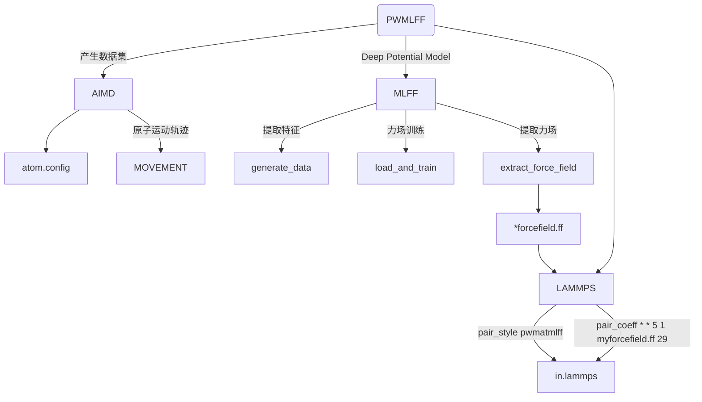
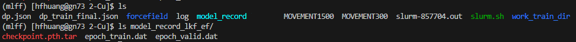

# Bulk Cu system

下文将以 Cu 系统为例，介绍如何使用 **PWMLFF Deep Potential Model** 进行训练及 lammps 模拟。

整个程序运行逻辑大致分为：



## 1. 产生数据集

以 PWmat AIMD 模拟得到的 Cu 数据为例，数据文件为`MOVEMENT300`, `MOVEMENT1500`，各包含 100 个结构，每个结构包含 72 个 Cu 原子。

**etot.input**输入文件示例：

```bash
8  1
JOB = MD
MD_DETAIL = 2 100 1 300 300
XCFUNCTIONAL = PBE
ECUT = 60
ECUT2 = 240
MP_N123 = 2 2 3 0 0 0 3
IN.ATOM = atom.config
IN.PSP1 = Cu.SG15.PBE.UPF
ENERGY_DECOMP = T
OUT.STRESS = F
```

- 可选项`ENERGY_DECOMP`：是否将总 DFT 能量分解为属于每个原子的能量（原子能量）。结果输出在`MOVEMENT`文件中。如需使用或训练原子能量，需要将其设置为`T`。
- 可选项`OUT.STRESS`：是否输出应力信息，如需训练`Virial`，则需要将其设置为`T`。
- 其他参数含义参考[PWmat manual](http://www.pwmat.com/pwmat-resource/Manual.pdf)。

## 2. 训练力场

### 2.1 准备数据集

新建目录，放置`MOVEMENT*`文件。或者`MOVEMENT*`文件也可以放置在其他目录下，只需要通过修改输入文件`*.json`中的`train_movement_path`路径进行训练。

### 2.2 输入文件

当前目录下，新建`*.json`文件(如`dp_cu.json`)，该文件包含一系列需要传入的参数。

输入文件示例 ([输入文件其他参数说明](#4-输入文件其他参数说明))：

```json
{   
    "train_movement_file":["0_300_MOVEMENT", "1_500_MOVEMENT"],
    "model_type": "DP",
    "atom_type":[29]
}

```

- `train_movement_file`: `MOVEMENT`文件存放名。可以设置同时多个文件。请根据实际情况进行修改。
- `model_type`：模型类型，现在训练所使用的模型。其他模型类型的训练及参数配置参考[参数细节](Parameter%20details.md)。
- `atom_type`：原子类型，Cu 的原子序数为 29。

### 2.3 运行

以下 slurm 示例脚本适用于 Mcloud,提交任务时确保已经加载必要的环境和模块。

```bash
#!/bin/sh
#SBATCH --partition=3090
#SBATCH --job-name=mlff
#SBATCH --nodes=1
#SBATCH --ntasks-per-node=1
#SBATCH --gres=gpu:1
#SBATCH --gpus-per-task=1

PWMLFF train dp_cu.json > log
```

交互式运行：

```bash
$ srun -p 3090 --pty /bin/bash
$ PWMLFF train dp_cu.json
```

:::tip
产生feature与train可以单独运行：

- `PWMLFF gen_feat dp_cu.json` - 仅用于产生特征。
- `PWMLFF train dp_cu.json` - 用于加载特征,对特征进行处理后开始训练。直接运行`train`会自动调用`gen_feat`。如果`gen_feat`已经运行过，可以在`.json`文件中设置`train_feature_path`来指定feature所在路径，同时注释掉`train_movement_file`

:::

---

在训练期间，可以通过检查训练模型文件存放的目录(`model_record`)的日志来查看训练情况。

该目录下存在以下三个文件:



- `checkpoint.pth.tar` 为模型文件，用于继续训练。对应于最后一次训练的模型。
- `epoch_train.dat` 和 `epoch_valid.dat` 日志文件中包含每个 epoch 的训练误差和验证误差。

:::info epoch_train.dat&epoch_valid.dat


- `loss` 对应训练总误差
- `RMSE_Etot_per_atom` 对应训练能量误差，建议达到 ~$10^{-3} eV/atom$ 数量级
- `RMSE_F` 对应训练力误差， 建议达到 ~$10^{-2} eV/\text{\AA}$ 数量级

<font color='red'>如果训练集的误差比验证集的误差明显偏小,表明训练过拟合,可适当增加训练集的大小或调整 batch_size 的数量。</font>

:::

## 3. Lammps 模拟

将训练完成后生成的`*.ff`力场文件用于 lammps 模拟。（需使用经过修改的[版本](https://github.com/LonxunQuantum/Lammps_for_PWMLFF)重新编译）

为了使用 PWMLFF 生成的力场文件，需要在 lammps 的输入文件中设置以下内容：

```bash
pair_style      pwmatmlff
pair_coeff      * * 5 1 forcefield.ff 29
```

其中`5`表示使用 DP 模型产生的力场，`1`表示读取 1 个力场文件，`forcefield.ff`为 PWMLFF 生成的力场文件名称，`29`为 Cu 的原子序数。

以下是lammps输入文件示例(nvt系综)：

```bash
units           metal
boundary        p p p
atom_style      atomic
processors      * * *
neighbor        2.0 bin
neigh_modify    every 10 delay 0 check no

read_data       POSCAR.lmp

pair_style      pwmatmlff
pair_coeff      * * 5 1 forcefield.ff 29
velocity        all create 1500 206952 dist gaussian
timestep        0.001
fix             1 all nvt temp 1500 1500 0.1
thermo_style    custom step pe ke etotal temp vol press
thermo          1
dump            1 all custom 1 traj.xyz id type x y z  vx vy vz fx fy fz
run             1000 
```
:::info
如果有多个力场文件（如[主动学习](./Si)时），(例如 4 个)可以修改为：

```bash
pair_style      pwmatmlff
pair_coeff      * * 5 4 ./1.ff ./2.ff ./3.ff ./4.ff 29
```

:::

## 4. 输入文件其他参数说明

```json
{
    "recover_train":false,
    "work_dir":"./work_train_dir",
    "reserve_work_dir": false,

    "train_movement_file":["0_300_MOVEMENT", "1_500_MOVEMENT"],

    "forcefield_name": "forcefield.ff",
    "forcefield_dir": "forcefield",

    "train_valid_ratio":0.8,

    "model_type": "DP",
    "atom_type":[29],
    "max_neigh_num":100,
    "seed": 1234,
    "model":{
        "descriptor": {
            "Rmax":6.0,
            "Rmin":0.5,
            "M2":16,
            "network_size":[25, 25, 25]
        },

        "fitting_net": {
            "network_size": [50, 50, 50, 1]
        }
    },

    "optimizer":{
        "optimizer":"LKF",
        "block_size":5120,
        "kalman_lambda":0.98,
        "kalman_nue":0.99870,
        "nselect":24,
        "groupsize":6,

        "batch_size": 4,
        "epochs":20,
        "start_epoch":1,

        "print_freq":10,

        "train_energy":true,
        "train_force":true,
        "train_ei":false,
        "train_virial":false,
        "train_egroup":false,

        "pre_fac_force":2.0,
        "pre_fac_etot":1.0,
        "pre_fac_ei":1.0,
        "pre_fac_virial":1.0,
        "pre_fac_egroup":0.1
        }
}

```

- `recover_train`: 是否从上次训练中断/完成处继续训练。如果为`true`，读取默认`model_load_path`和`model_name`，程序则会从上次训练中断/完成处继续训练。见[参数细节](Parameter%20details.md)。
- `work_dir`: 训练过程中的中间文件保存目录。训练完成后自动删除。`reserve_work_dir`为`true`时，训练完成后不删除该目录。
- `train_movement_file`: `MOVEMENT`文件存放名。可以设置同时多个文件。请根据实际情况进行修改。
- `forcefield_name`: 生成的力场文件名称。
- `forcefield_dir`: 生成的力场文件存放的目录。
- `train_valid_ratio`: 训练集和验证集的比例。`0.8`表示训练集占`80%`，验证集占`20%`。
- `model_type`：模型类型，现在训练所使用的模型。其他模型类型的训练及参数配置参考[参数细节](Parameter%20details.md)。
- `atom_type`：原子类型，Cu 的原子序数为 29。
- `max_neigh_num`：最大近邻原子数。
- `seed`: 随机数种子。
- `model`: 模型参数，具体参数配置参考[参数细节](Parameter%20details.md)。
- `optimizer`：优化器参数，推荐使用`LKF`和`ADAM`。通常情况下，对于大体系大网络，使用`LKF`优化器可以加速训练。其他优化器及更多的参数配置参考[参数细节](Parameter%20details.md)。
- `batch_size`：每批次用于训练的数据大小。如 1, 2, 5, 10。
- `n_epoch`：训练迭代次数。根据`MOVEMENT`总的 images 数量修改,images 少时可适当增加,如 50。