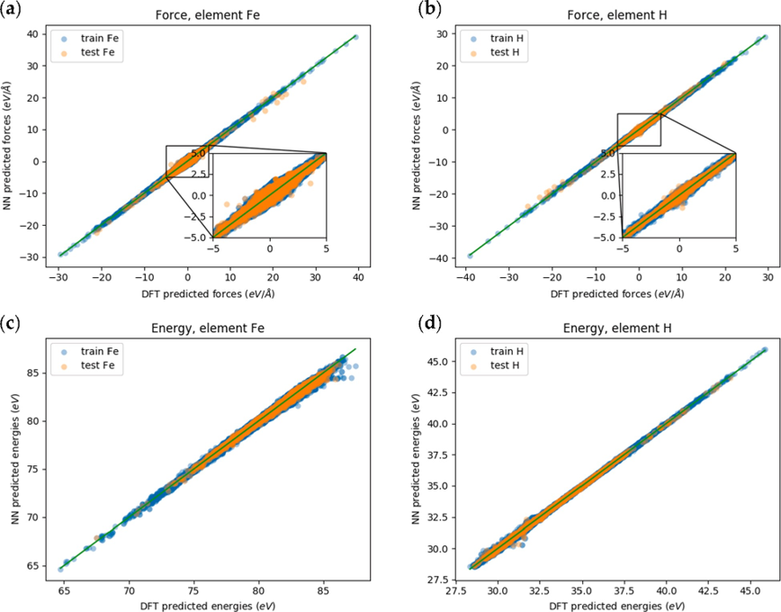

# 6. MLFF for Fe-H system
[[Revealing Morphology Evolution of Lithium Dendrites by Large-Scale Simulation Based on Machine Learning Force Field]](https://onlinelibrary.wiley.com/doi/abs/10.1002/aenm.202202892) 

The artical mainly discusses the use of machine learning force fields to study the effects of hydrogen on crack propagation in α-iron. The specific content includes:

1. **Development of MLFF for Fe-H System**: Based on density functional theory (DFT) calculations, a machine learning force field for the iron-hydrogen system was constructed using a neural network model, which was trained on atomic energies. This force field exhibited good statistical and dynamic properties.

2. **Molecular Dynamics Simulations**: The influence of hydrogen concentration on crack propagation in an α-iron sample with a crack was studied through molecular dynamics simulations. It was found that higher hydrogen concentration at the crack tip resulted in faster crack propagation, indicating that hydrogen promotes crack growth.

3. **Observation of Microvoid Formation**: In samples containing grain boundaries, microvoids were observed to form at the crack tip, which helped relieve the tensile stress at the crack tip and thus promoted crack propagation. However, the formation of microvoids did not seem to be significantly related to the presence of hydrogen.

4. **Effect of Shorter Periodicity in x-Direction**: In structures with shorter periodicity in the x-direction, the crack propagation speed was faster, likely due to the synergistic effects in the x-direction.

5. **Comparison with Embedded Atom Method (EAM)**: The machine learning force field showed a significant impact of hydrogen on crack propagation compared to results obtained with the embedded atom method (EAM), highlighting the importance of accurately describing hydrogen-metal interactions in force fields.

6. **Hydrogen Accumulation and Brittle Fracture**: The study showed that hydrogen accumulation at the crack tip plays a crucial role in the propagation of hydrogen-induced brittle fractures, suggesting a need for further investigation into hydrogen embrittlement under various conditions.

### Model Fitting Accuracy

Accuracy of the model fitting.

### Molecular Dynamics Simulations of Systems with Tilt Grain Boundaries

Molecular dynamics simulations of systems with tilt grain boundaries. (a, a1) Initial and final frames of the system without hydrogen; (b, b1) Initial and final frames of the system with 0.709% total hydrogen concentration; (c, c1) Initial and final frames of the system with 1.097% total hydrogen concentration; (d, d1) Initial and final frames of the system with 1.856% total hydrogen concentration.

### Volume Strain Distribution

Volume strain distribution in the system with 1.097% total hydrogen concentration: (a) Initial frame; (b) Frame at approximately 6000 fs.

Volume strain distribution in the system with 1.097% total hydrogen concentration: (a) Initial frame; (b) Frame at approximately 6000 fs.

### More Experimental Results

For more experimental results, refer to the [paper "Revealing Morphology Evolution of Lithium Dendrites by Large-Scale Simulation Based on Machine Learning Force Field"](https://onlinelibrary.wiley.com/doi/abs/10.1002/aenm.202202892).