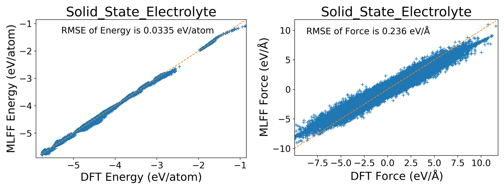
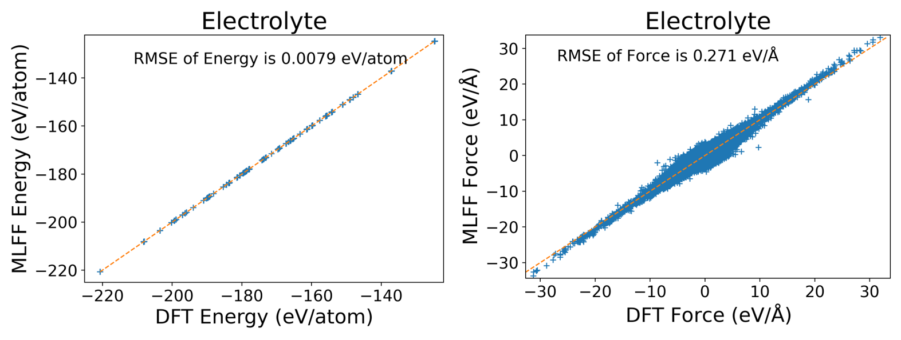
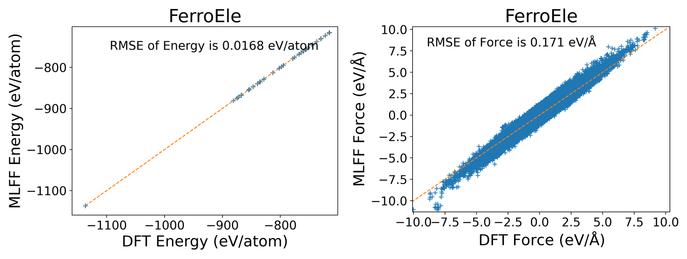
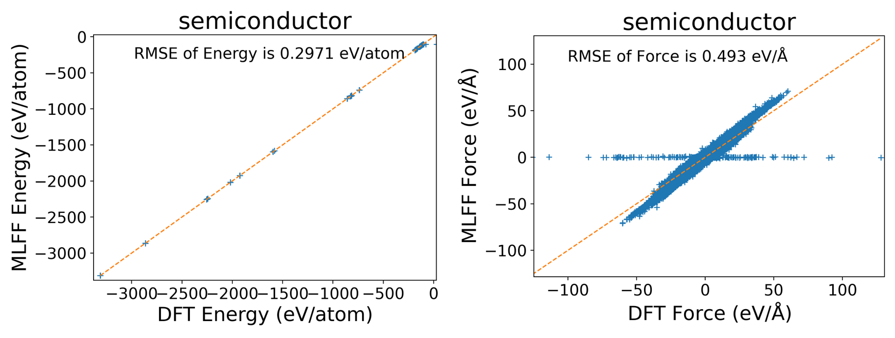

# 4. GNN (MACE)
Various general-purpose models based on Graph Neural Networks (GNN) are rapidly emerging. These general-purpose models can be "ready-to-use" or serve as "base models" that can be quickly applied to various specialized fields through fine-tuning, distillation, active learning, etc., significantly reducing the cost of force field construction. We performed some fine-tuning tests on the recently open-sourced [[MACE paper]](https://arxiv.org/abs/2401.00096).

### Solid Electrolytes

### Electrolyte Solutions

LiPF6, EC, PC, DEC, EMC, DMC systems

CP2K PBE+D3

### Perovskite Ferroelectric Materials

Structure-to-energy-force-virial labels for 19 ABO3 type perovskite oxides, namely PbTiO3, SrTiO3, BaTiO3, CaTiO3, BaxCa(1-x)TiO3, BaxSr(1-x)TiO3, CaxSr(1-x)TiO3, Bi0.5Na0.5TiO3, K0.5Na0.5NbO3, BaxPb(1-x)TiO3, CaxPb(1-x)TiO3, PbxSr(1-x)TiO3, Pb(Zr1-xTix)O3, Pb(Mg1/3Nb2/3)O3, Pb(Zn1/3Nb2/3)O3, Pb(In1/2Nb1/2)O3, xBi0.5Na0.5TiO3-(1-x)BaTiO3, xBa(Zr0.2Ti0.8)O3-(1-x)Ba0.7Ca0.3TiO3, and xBa(Hf0.2Ti0.8)O3-(1-x)Ba0.7Ca0.3TiO3.

Total number of structures: 11724

### Semiconductors

