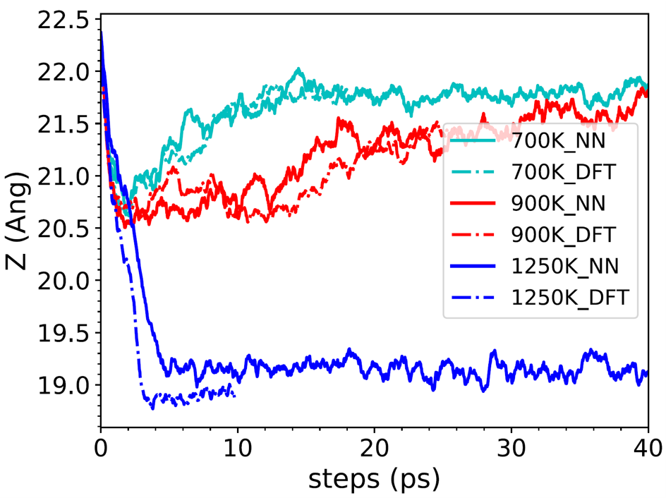

# 5. Liquid-to-crystal-Si-growth
[[Paper Liquid to crystal Si growth simulation using machine learning force field]](https://pubs.aip.org/aip/jcp/article/153/7/074501/1064762/Liquid-to-crystal-Si-growth-simulation-using) 

The paper used PWMLFF to simulate the growth process of silicon melt far from equilibrium. It was found that the MLFF constructed based on the atomic energy (`PWmat characteristics`) decomposed from first principles could accurately reproduce the growth process simulated by first principles. The results demonstrate that MLFF can accurately simulate the silicon melt growth process, providing evidence for using MLFF in simulations far from equilibrium.

### 

Comparison of total energy between NN and DFT, where (a) shows no bias, and (b) shows bias. The x-axis corresponds to molecular dynamics (MD) simulation images of crystal growth at different temperatures. The inset in (b) depicts the mean square displacement of the liquid phase at 1500 K; (c) and (d) show the pair distribution function of the crystal phase at 950 K and the liquid phase at 1500 K, respectively.

### 

(a) Supercell structure of a crystal silicon slab with a face-centered cubic (111) surface, comparing the local energy Eloc(t) between DFT and (b) neural network and SW potential (Stillinger-Weber classical force field).

### 

The growth of the Z length over time as calculated by DFT and the SANPP model ([feature 6](../Appendix-1.md#spectral-neighbor-analysis-potential-feature-6)).

### 

Growth curves (with error bars) showing the number of crystal atoms at different ΔT: (a) neural network, and (b) SW potential.