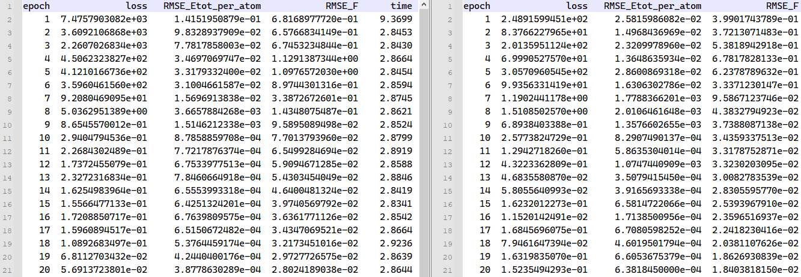

---

sidebar_position: 0
---

# Bulk Cu system

The following section provides an example of how to use the **PWMLFF Deep Potential Model** for training and LAMMPS simulation using a Cu system.

The overall program workflow is roughly divided into:


## 1. Generate Dataset

Using Cu data obtained from PWmat AIMD simulations as an example, the data files are `MOVEMENT300` and `MOVEMENT1500`, each containing 100 structures with 72 Cu atoms per structure.

**Example `etot.input` file:**

```bash
8  1
JOB = MD
MD_DETAIL = 2 100 1 300 300
XCFUNCTIONAL = PBE
ECUT = 60
ECUT2 = 240
MP_N123 = 2 2 3 0 0 0 3
IN.ATOM = atom.config
IN.PSP1 = Cu.SG15.PBE.UPF
ENERGY_DECOMP = T
OUT.STRESS = F
```

- Optional `ENERGY_DECOMP`: Whether to decompose the total DFT energy into atomic energies. Results are output in the `MOVEMENT` file. Set to `T` if atomic energies are needed for use or training.
- Optional `OUT.STRESS`: Whether to output stress information. Set to `T` if training `Virial` is required.
- For other parameter meanings, refer to the [PWmat manual](http://www.pwmat.com/pwmat-resource/Manual.pdf).

## 2. Training the Force Field

### 2.1 Processing Dataset

Create a new `*.json` file (e.g., `extract.json`) in the working directory. This file is used to call `pwdata` for processing molecular dynamics trajectory files and extracting labels.

Example:

```json
{
  "valid_shuffle": true,
  "train_valid_ratio": 0.8,
  "raw_files": ["./MOVEMENT300", "./MOVEMENT1500"],
  "format": "pwmat/movement"
}
```

Where:

- `valid_shuffle`: Whether to randomly shuffle all data. For example, if the molecular dynamics step size is 10 and there are 10 images, with `valid_shuffle` set to `true`, the 10 images will be shuffled randomly and then split into training and validation sets according to `train_valid_ratio`. If `valid_shuffle` is `false`, the data will be split sequentially according to `train_valid_ratio`. Default is `True`.
- `train_valid_ratio`: Ratio of training to validation sets.
- `raw_files`: Path to the raw data.
- `format`: Format of the raw data used for generating the training set. Supported formats include `movement`, `outcar`, `cp2k/md`.

Run the command <font color='red'>`pwdata extract.json`</font> to generate a `PWdata` folder in the current directory, containing `train` and `valid` subfolders with training and validation data.

Then, modify the force field training input control file `*.json` (e.g., `dp_cu.json`) to specify the `datasets_path` where the label files are located. (See below)

### 2.2 Input File

In the current directory, the force field training input control file includes several parameters.

Example input file ([Other parameters for input files](#4-输入文件其他参数说明)):

```json
{
  "raw_files": ["/Cu/PWdata/Cu72", "/Cu/PWdata/Cu72_1"],
  "model_type": "DP",
  "atom_type": [29]
}
```

- `datasets_path`: Path to the label files. Multiple paths can be specified, each containing training and validation subdirectories. Adjust as needed.
- `model_type`: Type of model used for training. For other model types and parameter configurations, refer to [Parameter Details](/en/next/PWMLFF/Parameter%20details).
- `atom_type`: Atomic type, where the atomic number of Cu is 29.

### 2.3 Running

The following slurm example script is suitable for Mcloud. Ensure that the necessary environment and modules are loaded before submitting the job.

```bash
#!/bin/sh
#SBATCH --partition=3090
#SBATCH --job-name=mlff
#SBATCH --nodes=1
#SBATCH --ntasks-per-node=1
#SBATCH --gres=gpu:1
#SBATCH --gpus-per-task=1

PWMLFF train dp_cu.json > log
```

For interactive running:

```bash
$ srun -p 3090 --pty /bin/bash
$ PWMLFF train dp_cu.json
```

:::tip
In most cases, you can use the `raw_files` parameter to directly call `pwdata` for data processing and training:

In this case, you can skip running `pwdata extract.json` separately and run `PWMLFF train dp_cu.json` directly. For example:

```json
{
  "raw_files": ["./MOVEMENT300", "./MOVEMENT1500"],
  "format": "pwmat/movement",
  "valid_shuffle": true,
  "train_valid_ratio": 0.8,
  "model_type": "DP",
  "atom_type": [29]
}
```

:::

---

During training, you can check the training status by looking at the logs in the directory where the model files are stored (`model_record`).

This directory contains the following files:

- `dp_model.ckpt` is the model file, which can be used to continue training or extract the force field. It corresponds to the most recent training model.
- `epoch_train.dat` and `epoch_valid.dat` log files contain training and validation errors for each epoch.

:::info epoch_train.dat & epoch_valid.dat



- `loss` corresponds to the total training error.
- `RMSE_Etot_per_atom` corresponds to the energy error in training, with a suggested target of around ~$10^{-3} eV/atom$.
- `RMSE_F` corresponds to the force error in training, with a suggested target of around ~$10^{-2} eV/\text{\AA}$.

<font color='red'>If the training error is significantly lower than the validation error, it indicates overfitting. Consider increasing the training set size or adjusting the batch size.</font>

:::

### 2.4 Extracting Force Field

:::tip
It is recommended to use the Libtorch version of the force field model. After training, manually execute the `PWMLFF script dp_model.ckpt` command to generate the `jit_dp_cpu.pt` or `jit_dp_gpu.pt` file. This file is used for LAMMPS simulation.

If your device includes a GPU environment, executing `PWMLFF script` will generate the `jit_dp_gpu.pt` file; otherwise, it will generate the `jit_dp_cpu.pt` file.

Note: `jit_dp_gpu.pt` can only run LAMMPS in a GPU environment; `jit_dp_cpu.pt` can only run LAMMPS in a CPU environment.

:::

After training is complete, the default behavior is to generate a `forcefield` folder in the current directory, containing `*.ff` force field files. This force field file should be used with the [specific version](https://github.com/LonxunQuantum/Lammps_for_PWMLFF/releases/tag/v0.1.0), [compiled](http://doc.lonxun.com/1.0/PWMLFF/Installation_v0.0.1#lammps_for_pwmlff%E5%AE%89%E8%A3%85), and [used](http://doc.lonxun.com/1.0/PWMLFF/Cu#3-lammps-%E6%A8%A1%E6%8B%9F) according to the previous manual.

## 3. LAMMPS Simulation

Use the `pt` force field file generated after training for LAMMPS simulation.

To use the force field file generated by PWMLFF, an example LAMMPS input file is as follows:

```bash
pair_style      pwmlff 1 ../model_record/jit_dp_gpu.pt
pair_coeff      * * 29
```

Where:

- `pair_style pwmlff 1` indicates using the PWMLFF generated force field file, with `1` indicating reading one force field file. `../model_record/jit_dp_gpu.pt` is the PWMLFF generated force field file; adjust the path as needed.
- `pair_coeff * * 29` specifies the atomic number for Cu.

Here is an example LAMMPS input file (NVT ensemble):

```bash
units           metal
boundary        p p p
atom_style      atomic
processors      * * *
neighbor        2.0 bin
neigh_modify    every 10 delay 0 check no

read_data       lmp.init


pair_style      pwmlff 1 ../model_record/jit_dp_gpu.pt
pair_coeff      * * 29
velocity        all create 1500 206952 dist gaussian
timestep        0.001
fix             1 all nvt temp 1500 1500 0.1
thermo_style    custom step pe ke etotal temp vol press
thermo          1
dump            1 all custom 1 traj.xyz id type x y z  vx vy vz fx fy fz
run             1000 #1ps
```

:::info

1. When running LAMMPS with GPU, use the executable `lmp_mpi_gpu`; when running with CPU, use `lmp_mpi`.

2. If there are multiple force field files (e.g., during [active learning](/en/next/PWMLFF/active%20learning/example_si_init_zh)), such as 4 files, you can modify it to:

   ```bash
   pair_style      pwmlff 4 1.pt 2.pt 3.pt 4.pt
   pair_coeff      * * 29
   ```

:::

## 4. Other Input File Parameters Explanation

```json
{
  "recover_train": false,

  "raw_files": ["0_300_MOVEMENT", "1_500_MOVEMENT"],
  "format": "pwmat/movement",
  "valid_shuffle": true,
  "train_valid_ratio": 0.8,

  "model_load_file": "./model_record/dp_model.ckpt",
  "model_type": "DP",
  "atom_type": [29],
  "max_neigh_num": 100,
  "seed": 1234,
  "model": {
    "descriptor": {
      "Rmax": 6.0,
      "Rmin": 0.5,
      "M2": 16,
      "network_size": [25, 25, 25]
    },

    "fitting_net": {
      "network_size": [50, 50, 50, 1]
    }
  },

  "optimizer": {
    "optimizer": "LKF",
    "block_size": 5120,
    "kalman_lambda": 0.98,
    "kalman_nue": 0.9987,
    "nselect": 24,
    "groupsize": 6,

    "batch_size": 4,
    "epochs": 20,
    "start_epoch": 1,

    "print_freq": 10,

    "train_energy": true,
    "train_force": true,
    "train_ei": false,
    "train_virial": false,
    "train_egroup": false,

    "pre_fac_force": 2.0,
    "pre_fac_etot": 1.0,
    "pre_fac_ei": 1.0,
    "pre_fac_virial": 1.0,
    "pre_fac_egroup": 0.1
  }
}
```

- `recover_train`: Whether to continue training from where it was last interrupted or completed. If set to `true`, the program will read from the default `model_load_path` and `model_name` to resume training from the last checkpoint. See [Parameter Details](/en/next/PWMLFF/Parameter%20details).
- `raw_files`: Path and names of the molecular dynamics trajectory files. Multiple files can be specified. Modify according to the actual situation.
- `train_valid_ratio`: Ratio of training set to validation set. `0.8` means 80% of the data is used for training and 20% for validation.
- `model_load_file`: Path to the model file. If specified, the program will read from this path and continue training/testing from the specified model file. See [Parameter Details](/en/next/PWMLFF/Parameter%20details).
- `model_type`: Type of model currently used for training. For training and parameter configurations of other model types, refer to [Parameter Details](/en/next/PWMLFF/Parameter%20details).
- `atom_type`: Atomic type, where the atomic number for Cu is 29.
- `max_neigh_num`: Maximum number of neighboring atoms.
- `seed`: Random number seed.
- `model`: Model parameters. For specific parameter configurations, refer to [Parameter Details](/en/next/PWMLFF/Parameter%20details).
- `optimizer`: Optimizer parameters, recommended are `LKF` and `ADAM`. Generally, for large systems and networks, using the `LKF` optimizer can speed up training. For other optimizers and more parameter configurations, refer to [Parameter Details](/en/next/PWMLFF/Parameter%20details).
- `batch_size`: Size of data used per batch for training. For example, 1, 2, 5, 10.
- `n_epoch`: Number of training iterations. Adjust according to the total number of dynamics trajectory images. For fewer images, the number of epochs can be increased, e.g., to 50.
