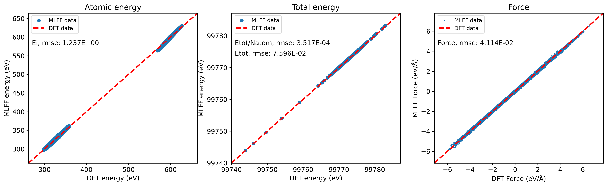

# Bulk SiC System

The following example will guide you through using the **PWMLFF Linear Model** to train on a Bulk SiC system and how to use the trained model for predictions.

The overall workflow can be outlined as follows:


## 1. Generate Dataset

Taking SiC data obtained from PWmat AIMD simulations as an example, the data file `MOVEMENT` contains 100 structures, each with 216 atoms.

**Sample input file `etot.input`:**

```bash
4  1
JOB = MD
MD_DETAIL = 3 1000 1 300 1000
#MD_DETAIL = 3 1000 1 300 300
XCFUNCTIONAL = PBE
Ecut = 50
ECUT2 = 200
MP_N123 = 2 2 2 0 0 0 3
E_ERROR = 0
wg_error = 0
RHO_ERROR = 1E-4
ENERGY_DECOMP = T
OUT.STRESS = F
IN.ATOM = atom.config
IN.PSP1 = Si.SG15.PBE.UPF
IN.PSP2 = C.SG15.PBE.UPF
```

- Optional `ENERGY_DECOMP`: Specifies whether to decompose the total DFT energy into atomic energies. The results are output in the `MOVEMENT` file. If you need to use or train on atomic energy, set this to `T`.
- Optional `OUT.STRESS`: Specifies whether to output stress information. If you need to train the `Virial`, set this to `T`.
- For other parameter meanings, refer to the [PWmat manual](http://www.pwmat.com/pwmat-resource/Manual.pdf).

## 2. Training Process

### 2.1 Feature Extraction

Create a new directory to place the `MOVEMENT*` files. Alternatively, the `MOVEMENT*` files can be placed in another directory; just update the `train_movement_path` in the `*.json` input file to reflect the correct path.

### 2.2 Training Input File

In the current directory, create a `*.json` file (e.g., `linear_sic.json`) containing a series of parameters to be passed.

**Sample Input File ([Detailed explanation of other input parameters](#5-input-file-additional-parameters))：**

```json
{   
    "train_movement_file":["./1_300_MOVEMENT", "./2_300_MOVEMENT"],
    "model_type": "Linear",
    "atom_type":[14, 6]
}
```

- `train_movement_file`: Specifies the name of the `MOVEMENT` files. Multiple files can be set simultaneously.
- `model_type`: Specifies the model type for training. For training with other models and parameter configuration, refer to [Parameter Details](/next/PWMLFF/Parameter%20details).
- `atom_type`: Specifies the atom types, where 14 and 6 are the atomic numbers for Si and C, respectively.

### 2.3 Execution

The following slurm script example is suitable for Mcloud. Ensure that the necessary environment and modules are loaded before submitting the task, such as `conda activate PWMLFF`.

```bash
#!/bin/sh
#SBATCH --partition=3080ti
#SBATCH --job-name=mlff
#SBATCH --nodes=1
#SBATCH --ntasks-per-node=1
#SBATCH --gres=gpu:1
#SBATCH --gpus-per-task=1

PWMLFF train linear_sic.json > log
```

Interactive execution:

```bash
$ srun -p 3080ti --gres=gpu:1 --pty /bin/bash
$ PWMLFF train linear_sic.json
```

---

After running the program, a `forcefield` directory will be generated in the execution directory:

```
forcefield
├── forcefield.ff
├── fread_dfeat            
│   ├── energyL*           
│   ├── forceL*            
│   ├── linear*            
│   ├── weight_feat.*      
│   ├── energyL*           
│   ├── ...           
│   ├── feat*          
│   ├── weight_feat.*          
│   └── linear_fitB.ntype     
├── input          
│   └── *feature.in     
├── (output)                     
    └── grid*   # Used for feature 1, 2
```

## 3. Validation/Testing

After training, the model can be validated/tested to determine its fit.

Create a new directory (e.g., `MD`), and copy another `MOVEMENT` file to this directory. Set the `test_movement_file` and `test_dir_name` parameters in the `.json` file.

```json
    "test_movement_file":["./MD/MOVEMENT"],
    "test_dir_name":"test_dir",
```

**Sample validation run:**

Change `train` to `test` in `PWMLFF train linear_sic.json`:

```bash
PWMLFF test linear_sic.json
```

After running the program, the validation results will be saved in the directory specified by `test_dir_name` (`test_dir/`).


:::caution
When `pre_fac_ei` is non-zero, i.e., when training atomic energy, if the `MOVEMENT` used for validation does not contain atomic energy, the `test` program will not automatically output atomic energy validation plots.
:::

## 4. LAMMPS Simulation

The `*.ff` force field file generated after training can be used for LAMMPS simulation. (Requires a modified [version](https://github.com/LonxunQuantum/Lammps_for_PWMLFF) to be recompiled.)

To use the force field file generated by PWMLFF, set the following in the LAMMPS input file:

```bash
pair_style      pwmatmlff
pair_coeff      * * 1 1 forcefield.ff 14 6
```

Here, `1` indicates the force field generated by the Linear model, `1` indicates reading 1 force field file, `forcefield.ff` is the force field file generated by PWMLFF, and `14` and `6` are the atomic numbers for Si and C, respectively.

Below is an example LAMMPS input file (NVT ensemble):

```bash
units           metal
boundary        p p p
atom_style      atomic
processors      * * *
neighbor        2.0 bin
neigh_modify    every 10 delay 0 check no

read_data       POSCAR.lmp

pair_style      pwmatmlff
pair_coeff      * * 1 1 forcefield.ff 14 6
velocity        all create 300 206952 dist gaussian
timestep        0.001
fix             1 all nvt temp 300 300 0.1
thermo_style    custom step pe ke etotal temp vol press
thermo          1
dump            1 all custom 1 traj.xyz id type x y z  vx vy vz fx fy fz
run             1000 
```

## 5. Input File Additional Parameters


```json
{
    "work_dir":"./work_dir",
    "reserve_work_dir": false,
    "train_movement_file":["MOVEMENT"],

    "forcefield_name": "forcefield.ff",
    "forcefield_dir": "forcefield",

    "test_movement_file":["./MD/MOVEMENT"],
    "test_dir_name":"test_dir",

    "model_type": "Linear",
    "atom_type":[14,6],
    "max_neigh_num":100, 

    "optimizer":{
        "pre_fac_force":0.5,
        "pre_fac_etot":0.5, 
        "pre_fac_ei":0.5        
    },
    
    "model":{
        "descriptor": {
            "Rmax":6.0, 
            "Rmin":0.5,
            
            "feature_type":[3,4],
            
            "1":{
                "numOf2bfeat": 24,
                "iflag_grid": 3,
                "fact_base": 0.2,
                "dR1": 0.5,
                "iflag_ftype": 3
            },
            "2":{
                "numOf3bfeat1" : 3,
                "numOf3bfeat2" : 3,
                "iflag_grid" : 3,
                "fact_base" : 0.2,
                "dR1" : 0.5,
                "dR2" : 0.5,
                "iflag_ftype" : 3
            },
            "3":{
                "n2b": 6,
                "w": [1.0, 1.5, 2.0]
            },
            "4":{
                "n3b": 20,
                "zeta": 2.0,
                "w": [0.5, 1.0, 1.5, 2.0, 2.5, 3.0, 3.5, 4.0, 4.5, 5.0]
            },
            "5":{
                "n_MTP_line":5
            },
            "6":{
                "J":3.0,
                "n_w_line":2,
                "w1":[0.9, 0.1, 0.8, 0.2, 0.7, 0.3, 0.6, 0.4],
                "w2":[0.1, 0.9, 0.2, 0.8, 0.3, 0.7, 0.3, 0.6]
            },
            "7":{
                "M":25,
                "M2":4,
                "weight_r":1.0
            },
            "8": {
                "M":8,
                "weight_r":1.0,
                "w":[1.0, 1.5, 2.0, 2.5]
            }
        }
    }
}

```

- `work_dir`: Directory where intermediate files from the training process are saved. This directory is automatically deleted after training is complete unless `reserve_work_dir` is set to `true`, in which case the directory will not be deleted.
- `train_movement_file`: Specifies the name of the `MOVEMENT` files. Multiple files can be set simultaneously.
- `forcefield_name`: Name of the generated force field file. This is optional.
- `forcefield_dir`: Directory where the generated force field file will be stored. This is optional.
- `test_movement_file`: `MOVEMENT` file used for model validation after training ([details in the validation and testing section](#3-validationtesting)).
- `test_dir_name`: Directory where the `MOVEMENT` file for model validation is stored after training.
- `model_type`: Type of model used for training. For other models and parameter configurations, refer to [Parameter Details](/en/next/PWMLFF/Parameter%20details).
- `atom_type`: Specifies the atom types, where 14 and 6 are the atomic numbers for Si and C, respectively.
- `max_neigh_num`: Maximum number of neighboring atoms.
- `etot_weight`: Weight of the total energy during training.
- `force_weight`: Weight of the atomic forces during training.
- `ei_weight`: Weight of the atomic energy during training; if set to 0, atomic energy is not trained.
- `model`: Model parameters; for specific parameter configurations, refer to [Parameter Details](/en/next/PWMLFF/Parameter%20details).
- `feature_type`: Type of feature; 3 and 4 correspond to 2-body and 3-body Gaussian features, respectively. See [Feature Types](/en/next/PWMLFF/Appendix-1) for more details.