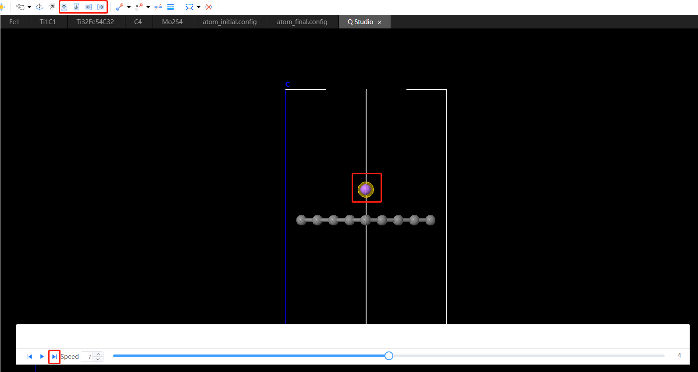

# Modeling of transition state structures

Take the migration of lithium atoms at the hollow position on graphene as an example:

1. The initial and final structure of the completed structure optimization will be imported.
   
<table><tr>
    <td> 
        

            
        

    </td>
        <td> 
        

            
        

        </td>
</tr></table>

1. Click `Modeling` → `Transition State Structure Modeling`, select the initial and final state structure in the pop-up window, click `Auto Match`, set the number of interpolation points to 5, and click `Preview`.
   

2. Click `Play` to observe the path, confirm that it is correct, and then click `Load`.

3. Fine-tune the position of lithium atoms frame by frame within the new window
   

