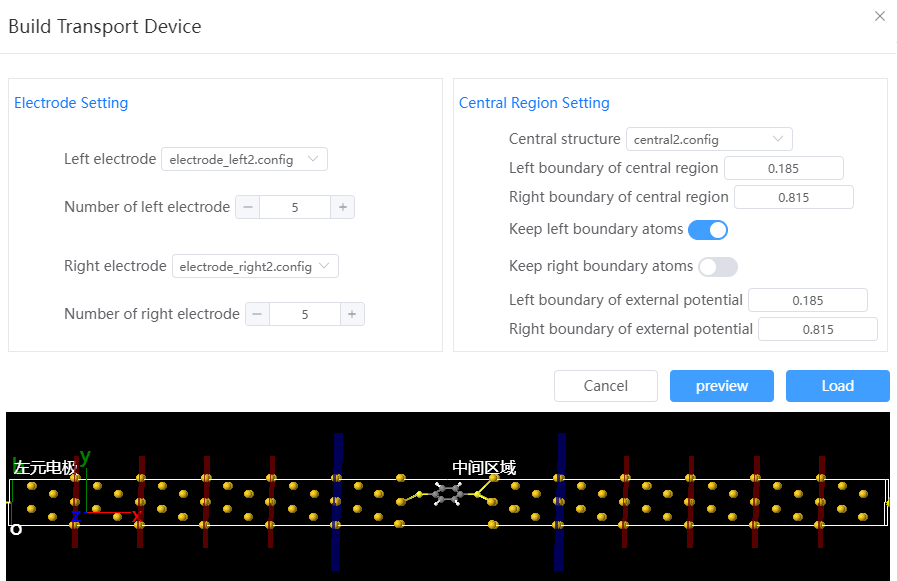

# Modeling quantum transport devices

Take a device composed of terephthalate thiol (DTB) and two gold electrode surfaces as an example:

1. The left and right element electrodes and central region structures were constructed and named electrode_left.config, electrode_right.config, and central.config. The construction of the structure of the intermediate region can refer to molecular modeling and heterostructure modeling examples.
<table><tr>
    <td> 
        

            
        

    </td>
        <td> 
        

            
        

    </td>
        <td> 
        

            
        

    </td>
</tr></table>

2. Click `Modeling` → `Shipping Device Modeling` in the menu bar to open the Shipping Device Modeling window. Select the left and right element electrode structure and the center zone structure respectively. The device is built in the x direction and the current is transmitted from right to left. Click the preview button to view the spliced device structure in advance, and click the load button to load the device model into the Q-Studio interface after confirming that it is correct.

3. The central region is used in subsequent calculations to generate the potential energy function in the middle region of the device, and the boundary is where the potential energy function is truncated. The boundary of the applied potential cannot cross the boundary of the central zone.

4. After loading, the overall structure of the device is displayed by default. Click  tool on the main interface, you can switch to the middle zone structure.
   

5. Export the device in PWmat format to the Q-Flow structure library, which can be used for subsequent transport device calculations.