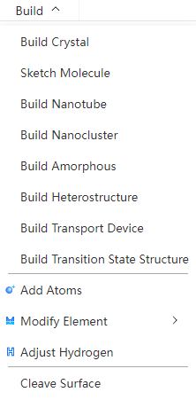
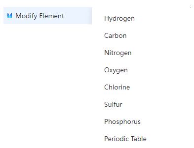

# Modeling menu
<!--  -->

- [Create a new crystal](./qstudio_manual_build_crystal.md)
- [Build molecules](./qstudio_manual_build_molecule.md)
- [Build nanotubes](./qstudio_manual_build_nanotube.md)
- [Construction of nanoclusters](./qstudio_manual_build_nanocluster.md)
- [Build an unordered structure](./qstudio_manual_build_packmol.md)
- [Build heterogeneous structures](./qstudio_manual_build_hetero.md)
- [Modeling of transport devices](./qstudio_manual_build_transport.md)
- [Modeling of transition state structures](./qstudio_manual_build_neb.md)
  
:::tip NOTE：
For specific modeling operations, see [Modeling Examples section](./qstudio_example.md)
:::

---

- [Add atoms](./qstudio_manual_build_addatom.md)
- Modify Elements: Modify the elements of the selected atom, and support the selection of elements from the periodic table

- Automatic hydrogenation: Automatically adds hydrogen atoms to the selected atom based on elemental and geometric position information

---

- Supercell establishment: Supercell construction of structures with lattice according to periodic boundary conditions

- [Cut the surface](./qstudio_manual_build_cleavesurface.md)

